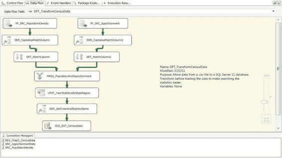

# 第三章  HELLO WORLD——您的第一个 SSIS 2012 包

*图 3-23. SQL_TruncateCensusStatistics——配置*

### 数据流任务

`数据流` 任务可执行文件是 `RealWorld.dtsx` 的核心。它从平面文件中提取数据，连接两个文件中的数据，并以规范化格式输出数据。这个过程可以通过将数据直接拉入 SQL Server 的暂存表中，然后使用 SQL 将数据转换为所需形式来完成。严格从 I/O 角度来看，这第二种方法通常是低效的，因为它需要对数据进行两遍处理。第一遍从平面文件源提取，第二遍从暂存表提取。我们实现的过程仅需对文件进行一遍扫描，而且由于 SSIS 针对逐行操作进行了优化，动态转换数据并不会带来额外的开销。此方法唯一的风险是使用了 `排序` 组件对来自平面文件的数据进行排序。`DFT_TransformCensusData` 的工作流如图 3-24 所示。左侧流代表人口密度数据，右侧流代表分配数据。

[www.it-ebooks.info](http://www.it-ebooks.info/)

