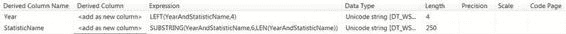
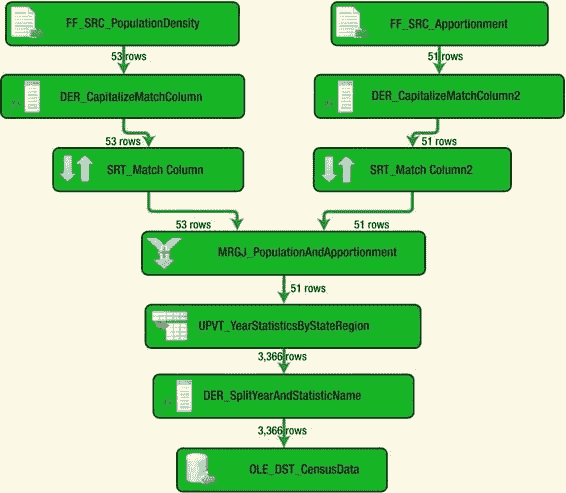

# 第三章  你好世界——你的第一个 SSIS 2012 包

由于透视键结合了两个值——年份和统计名称，我们利用一个派生列将数据拆分成两列。图 3-29 展示了我们如何拆分该列。我们基于存储在 `YearAndStatisticName` 列中的数据添加了两列。我们使用以下表达式分别生成 `Year` 列和 `StatisticName` 列：

`LEFT(YearAndStatisticName,4)` 和 `SUBSTRING(YearAndStatisticName,6,LEN(YearAndStatisticName))`。

因为我们知道该列值的前四个字符必须是年份，所以可以使用 `LEFT()` 字符串函数提取年份并将其存储到名为 `Year` 的新列中。对于统计名称，我们需要使用除了前五个字符之外的整个字符串。`SUBSTRING()` 字符串函数允许我们定义字符串的起始和结束位置。第六个位置是下划线后的第一个字符，而我们想要获取字符串的剩余部分，因此使用 `LEN()` 字符串函数来定义字符串最后一个字符的位置。

[www.it-ebooks.info](http://www.it-ebooks.info/)



#### 图 3-29. DER_SplitYearAndStatistics

将原始列拆分为更细粒度的数据后，我们可以将这些数据插入到具有清单 3-3 所定义结构的表中。我们利用 `OLE DB 目标组件` 的功能，根据输入生成了建表脚本。由于不再需要，我们从建表脚本中移除了 `YearAndStatisticName` 列。在 `OLE DB 目标组件` 的映射中，我们忽略了 `YearAndStatisticName` 列。派生列的数据类型是 Unicode，但源自平面文件的列保持其代码页。

#### 清单 3-3. 人口普查数据的建表脚本

```sql
CREATE TABLE dbo.CensusStatistics
(
    [STATE_OR_REGION] varchar(50),
    [Year] nvarchar(4),
    [StatisticName] nvarchar(250),
    [Statistic] varchar(50)
);
GO
```

执行结果如图 3-30 所示。正如我们之前讨论的，`Unpivot 运算符` 的输出行数直接关系到被忽略列的唯一记录数与取消透视的列数。`合并连接` 还从左侧输入流中省略了两条记录，因为它们不包含在分配数据集中。哥伦比亚特区和波多黎各的数据不包含在分配数据中，因为这两个地区在美国国会中没有代表。因为我们执行的是内连接，所以只允许两组数据共有的数据继续沿管道向下流动。

[www.it-ebooks.info](http://www.it-ebooks.info/)



#### 图 3-30. RealWorld.dtsx 执行结果

清单 3-4 中的查询向我们展示了以这种方式转换数据的好处。如果没有 `Unpivot 组件`，我们就必须在 `SELECT` 子句中包含所有需要的列。使用这个组件，我们只需定义适当的 `WHERE` 子句即可只查看我们需要的数据。反规范化形式使我们能够包含更多的统计项和更多的年份，而无需担心修改表结构以容纳新列。

#### 清单 3-4. 反规范化数据的查询

```sql
SELECT cs.STATE_OR_REGION,
       cs.Year,
       cs.StatisticName,
       cs.Statistic
FROM dbo.CensusStatistics cs
WHERE cs.Year = '2010'
  AND cs.STATE_OR_REGION = 'New York';
```

清单 3-4 中的查询向我们展示了 2010 年纽约州的所有统计数据。如果没有进行反规范化，我们将不得不包含六列来说明年份和不同的统计项。如果我们想查看自数据收集开始以来纽约州的所有数据，我们将不得不包含 66 列，而不是简单地省略限制年份的 `WHERE` 子句。

### 总结


