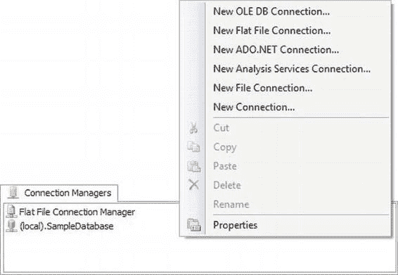
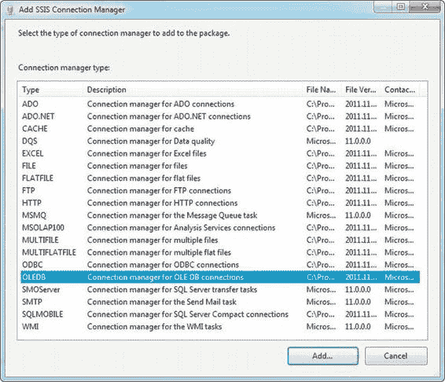
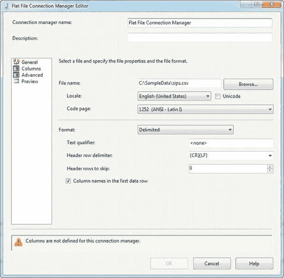
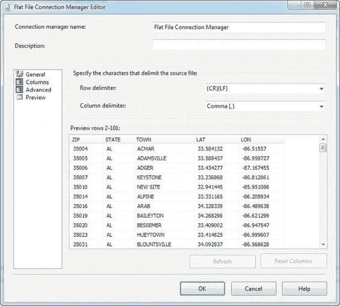
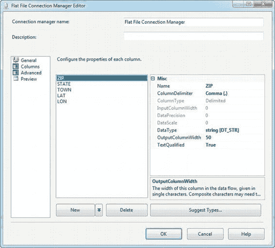
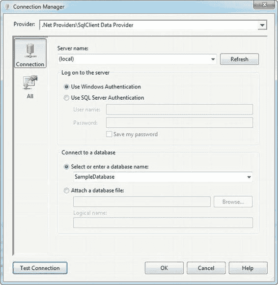
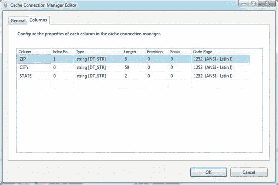
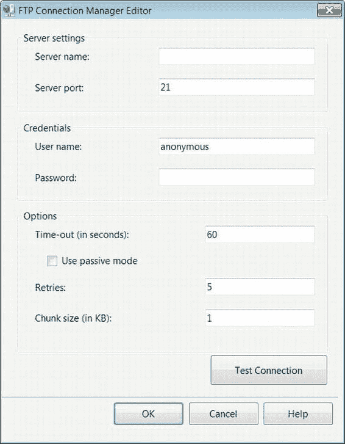

# 第四章：连接管理器

SSIS 12 使您能够从多种源提取数据并将其加载到多种目标中。

在本章中，我们向您介绍了一个简单的包，该包提取数据并在没有任何转换的情况下加载数据。这展示了 SSIS 12 包可以执行的最简单的 ETL 任务。然后，我们提高了难度，向您介绍了一个稍微复杂一些的包，该包在提取数据时对其进行了转换。这个包展示了现实世界对 ETL 流程的一些要求。我们引导您完成了将可执行文件和组件添加到包设计器的过程。在下一章中，我们将向您展示 SSIS 12 中可用的所有连接管理器。

[www.it-ebooks.info](http://www.it-ebooks.info/)

> *最终，一切都会连接起来——人、想法、物品。*
>
> *连接的质量是质量本身的关键。*
>
> ——美国设计师查尔斯·伊姆斯

SSIS 使用 `连接管理器` 来封装、管理和抽象掉物理数据存储。

连接管理器允许您读取和写入几乎任何拥有驱动程序和访问权限的数据存储。例如，您可以使用连接管理器从平面文件、数据库或 Excel 电子表格中提取数据，并将数据推送到数据库、自定义文件格式或网站。在本章中，您将首先了解一些最常用的连接管理器，然后继续了解 SSIS 支持的更高级、较少使用的连接管理器。一些不常用的连接管理器可用于连接到 Web 服务器、FTP 服务器，甚至 Windows 事件等。

### 常用连接管理器

SSIS 首次引入了连接管理器的概念，作为一种封装和管理几乎任何类型数据存储的连接信息的方法，前提当然是您有适合数据存储的驱动程序。您可以创建连接管理器来定义对固定宽度和分隔符平面文件、二进制文件、Excel 电子表格、网站和 SQL Server Analysis Services 多维数据集等的连接。您还可以连接到各种数据库服务器，包括 SQL Server、Oracle、Teradata、DB2、MySQL 以及任何其他您能找到开放数据库连接 (`ODBC`) 或 OLE DB 驱动程序的数据库管理系统 (`DBMS`)。每个连接管理器可以被多个任务以及数据源和目标使用。创建连接管理器后，无论采用何种创建方法，它们都集中位于 `控制流` 和 `数据流` 设计器窗口底部的 `连接管理器` 窗格中。本节介绍一些最常用的连接管理器。

> **注意：** 对于某些 `DBMS`，例如 Oracle、Teradata 和 MySQL，您需要在开发计算机和服务器上从 `DBMS` 供应商或第三方供应商下载并安装相应的 `ODBC` 或 `OLE DB` 驱动程序。

[www.it-ebooks.info](http://www.it-ebooks.info/)

`BIDS` 设计器中的 `连接管理器` 部分始终位于 `控制流` 和 `数据流` 设计器窗口的底部。在此部分中，您可以看到 SSIS 包可用的所有连接管理器。您还可以通过右键单击此部分来创建新的连接管理器，如图 4-1 所示。

*图 4-1. BIDS 设计器窗口的连接管理器部分，带有弹出上下文菜单* 通过在该区域右键单击可访问 `连接管理器` 部分的弹出上下文菜单。上下文菜单包含创建常用连接管理器的选项，包括用于数据库的 `OLE DB` 连接、用于分隔符和固定宽度文件的平面文件连接、`ADO.NET` 托管数据库连接等。选择 `新建连接` 选项将显示 SSIS 支持的完整连接管理器列表，如图 4-2 所示。

[www.it-ebooks.info](http://www.it-ebooks.info/)

*图 4-2. 列出所有可用连接管理器的添加 SSIS 连接管理器对话框* 以下部分描述了连接管理器及其提供的连接功能。连接管理器的 `类型` 可能无法清楚地描述其连接能力。要获得更清晰的描述，请参阅 `添加 SSIS 连接管理器` 的 `描述` 列。在以下部分中，连接管理器按类型分类，因为这是 Visual Studio 和调试器引用它们的方式。

### OLE DB 连接管理器

`OLE DB` 代表 `对象链接与嵌入，数据库`。它本质上是一个基于组件对象模型 (`COM`) 的 API，支持各种数据源。`OLE DB` 被设计为较旧的 `开放数据库连接` (`ODBC`) 的后继者。`OLEDB` 是一个基于组件的规范，支持连接到关系型和非关系型数据源。使用 `OLE DB`，您可以连接到 SQL Server 和 Oracle 等数据库、Microsoft Access 数据库、电子邮件服务器、文件系统、层次数据库等。

[www.it-ebooks.info](http://www.it-ebooks.info/)

一般来说，用于关系数据库的 `OLE DB` 提供程序有两种类型：本机版本和 `OLE DB for ODBC` 版本。本机 `OLE DB` 提供程序比 `OLE DB for ODBC` 版本更快，因为它们直接与底层数据库 API 通信以获得最佳性能。`OLEDB for ODBC` 提供程序是位于 `ODBC` 之上的 `OLE DB` 提供程序，因此在 `OLE DB` 和数据库之间还有另一层抽象。使用这些类型的提供程序的性能通常不如本机 `OLE DB` 提供程序。

> **注意：** 有些人将 `OLE DB` 拼写为 `OLEDB`，还有些人使用 `OLE-DB`。如您在本节图片中看到的，Microsoft 选择使用多种拼写方式。这些都被认为是正确的。在本书中，我们将始终使用 `OLE DB`。

当您创建新的 `OLE DB 连接管理器` 时，您将从图 4-3 所示对话框顶部的列表中选择一个 `OLE DB` 提供程序。

*图 4-3. 在 OLE DB 连接管理器对话框中选择提供程序* 和我们一样，您可能会发现自己选择 `Microsoft OLE DB Provider for SQL Server` 的次数比其他任何提供程序都多，但当您需要连接到 Access 数据库（`Jet OLE DB` 提供程序）、Oracle RDBMS 服务器，甚至 `Microsoft 目录服务` 时，SSIS 也能做到。

[www.it-ebooks.info](http://www.it-ebooks.info/)

#### OLE DB 与 ODBC

我们之前提到过，本机 `OLE DB` 提供程序往往比 `ODBC` 提供程序更快。它们之间还有其他区别。

`OLE DB` 是一个基于组件的规范，提供了一组面向对象的接口，抽象了数据的来源。您可以创建一个 `OLE DB` 提供程序，以表格格式从几乎任何数据源检索数据。

另一方面，`ODBC` 是一个较旧的程序化 API，定义了您可以对数据库执行的少数操作。由于其谱系，`ODBC` 与关系数据库紧密相连，而 `OLE DB` 在其数据源定义上更为抽象。`ODBC` 在功能上也往往更加“普通”，而 `OLE DB` 为供应商特定的扩展（例如性能增强功能）提供了灵活性。大多数时候，您可能会使用 `OLE DB` 或托管提供程序之一进行数据访问。

### 文件连接管理器

### SSIS 中的连接管理器

### SSIS 支持的文件类型

ETL 过程中经常使用各种格式的文件。无论你是从分隔符或固定宽度的平面文件、二进制文件、Excel 电子表格文件，还是文件的组合中提取数据，SSIS 都能应对自如。以下是 SSIS 原生支持的文件类型快速解析：

#### 平面文件 (FLATFILE)

平面文件是结构为分隔符文件、固定宽度文件或右侧参差不齐文件的文本文件。平面文件可以使用逗号 (`.csv`)、Tab 键或管道符 (`|`) 字符 (`.txt`)，或者你决定使用的任何其他分隔符进行分隔。

#### 文件 (FILE)

`文件连接管理器` 允许你选择任何文件作为输入或输出，包括文本文件、二进制文件、XML 文件或你偏好的任何其他格式。请注意，如果你选择结构化文件作为输入，例如分隔符文本文件或 XML 文件，你需要负责识别和管理数据流中的结构化数据。

#### EXCEL

`Excel 文件连接管理器` 将你的数据流连接到 Excel 工作簿。

#### 多文件 (MULTIFILE)

如果你有多个格式相同的文件，`多文件连接管理器` 非常有用。如果你想将其用于多个格式不同的文件，则会稍微复杂一些，需要进行一些数据流处理的技巧。

#### 多平面文件 (MULTIFLATFILE)

`多平面文件连接管理器` 可以连接到多个格式相同的平面文件。如果你的文件格式不同，通过使用不同的业务逻辑尝试处理文件，你的数据流很容易被消耗掉。

### 文件连接管理器的通用信息

凭借这多种多样的文件连接管理器，你几乎可以从任何格式的任何文件中检索数据。对于 SSIS 数据流原生不支持的文件格式，例如二进制文件，你将需要编写自定义代码来处理该文件格式。如图 4-4 所示，`平面文件连接管理器编辑器` 的“常规”页面允许你选择源文件的名称、格式和代码页。你还可以选择源数据的区域设置、源数据是否为 Unicode 以及其他选项，包括要跳过的标题行数（如果有）。

[www.it-ebooks.info](http://www.it-ebooks.info/)

*图 4-4. 在编辑器中为平面文件连接管理器设置属性*

`平面文件连接管理器编辑器` 允许你查看源文件中的列，并可选择行尾分隔符和列分隔符。如图 4-5 所示，编辑器还显示源文件中数据的预览。

[www.it-ebooks.info](http://www.it-ebooks.info/)

*图 4-5. 平面文件连接管理器编辑器的“列”页面，含数据预览*

`平面文件连接管理器编辑器` 的“高级”页面为你提供了更改列级属性的机会，例如列的数据类型和大小。图 4-6 显示了“高级”页面上的列属性。

[www.it-ebooks.info](http://www.it-ebooks.info/)

*图 4-6. 平面文件连接管理器编辑器的“高级”页面，含列属性配置*

### ADO.NET 连接管理器

`ADO.NET 连接管理器` 使用托管的 .NET 提供程序来访问你的数据。托管连接管理器的最大优势之一是，你可以轻松地从托管代码（例如控制流中的脚本任务或数据流中的脚本组件）内部访问此类连接管理器。最常用的 .NET 提供程序之一是 `SqlClient` 数据提供程序，它专用于 SQL Server。其他托管提供程序选项包括 `OracleClient`、`Odbc` 和 SQL Server Compact Edition。

`OleDb` 选项的 .NET 提供程序让你可以通过托管代码访问多个 OLE DB 提供程序。使用这些提供程序时，SSIS 使用 .NET COM 互操作在你的 OLE DB 提供程序周围创建一个托管包装器。这使得这些连接管理器在 .NET 代码中更易于访问，但可能会影响性能，因为在托管包装器和非托管 OLE DB 提供程序之间存在额外的通信层。图 4-7 显示了 `ADO.NET 连接管理器` 可用的提供程序。

*图 4-7. 在 ADO.NET 连接管理器编辑器中选择 .NET 提供程序*

`ADO.NET 连接管理器编辑器` 允许你编辑连接的属性。对于常用的 `SqlClient` 提供程序，选项很简单：服务器名称、要连接的数据库和身份验证凭据。在“全部”页面上，你可以设置包括加密和复制支持在内的高级功能。图 4-8 显示了 `SqlClient` 提供程序的连接编辑器属性。

[www.it-ebooks.info](http://www.it-ebooks.info/)

*图 4-8. ADO.NET SqlClient 连接管理器编辑器*

### 缓存连接管理器

`缓存连接管理器` 是在 SQL Server 2008 中引入的。此类连接管理器允许你预先将查找数据缓存到内存中。考虑这样的场景：你有两个查找组件，且两者都从同一张表中读取大量相同的行。你可以使用 `缓存连接管理器` 预先缓存查找数据，并将两个查找组件都连接到使用同一个 `缓存连接管理器`。这意味着你只需读取数据一次，并且它比两个独立的、缓存相同数据的查找组件消耗更少的内存。

`缓存连接管理器` 可以通过缓存文件 (`.caw`) 填充，也可以通过缓存转换（我们将在本章后面介绍）填充。图 4-9 显示了 `缓存连接管理器编辑器` 的“常规”选项卡。此选项卡允许你设置连接管理器的名称，并在你选择时，选择一个缓存文件作为连接管理器的源。

*图 4-9. 缓存连接管理器编辑器“常规”选项卡选项*

`缓存连接管理器编辑器` 的“列”选项卡允许你设置 `缓存连接管理器` 各列的属性。例如，你可以设置每列的数据类型、长度、精度/小数位数或代码页。图 4-10 显示了“列”选项卡属性。

[www.it-ebooks.info](http://www.it-ebooks.info/)

*图 4-10. 缓存连接管理器编辑器“列”选项卡属性*

### 其他连接管理器

在上一节中，你了解了一些最常用的连接管理器。SSIS 还提供了其他几种连接管理器（例如，FTP 和 HTTP 连接管理器、Analysis Services 连接管理器和 Data Quality Services 连接管理器），以便访问那些不一定支持直接数据访问的系统。例如，FTP 服务器通常不包含原始数据，但它们可能存储文件，而这些文件又可能包含所需数据。这些连接管理器允许你访问这些不同的存储系统，从而检索数据。

#### FTP 连接管理器

`FTP 连接管理器` 允许你连接到文件传输协议 (FTP) 服务器。连接编辑器允许你定义超时、端口和若干其他属性，如图 4-11 所示。

[www.it-ebooks.info](http://www.it-ebooks.info/)

*图 4-11. FTP 连接管理器编辑器*

