# 第四章 — 连接管理器

#### FTP 连接管理器

`Server Name`（服务器名称）和 `Server Port`（服务器端口）字段用于定义连接所指向的 FTP 服务器以及服务器监听的端口。`Credentials`（凭据）部分存储身份验证信息。默认情况下，其值为 `Anonymous`（匿名）。`Time-Out`（超时）字段定义了任务在超时前可能花费的时间段，单位为秒。值 `0` 表示连接不会超时。启用被动模式的复选框表示数据包将启动连接。默认情况下，活动模式由服务器启动连接。`Retries`（重试次数）字段设置重试次数；`0` 表示无限次重试。`Chunk Size`（块大小）表示传输数据时块的大小。`Test Connection`（测试连接）按钮允许您测试连接参数。

[www.it-ebooks.info](http://www.it-ebooks.info/)

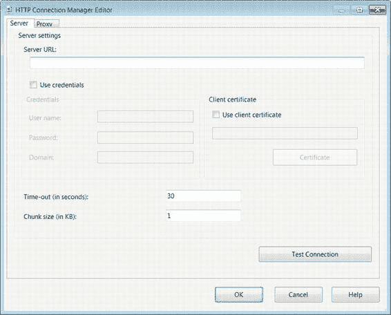

**注意：** FTP 连接管理器仅支持匿名和简单身份验证。不支持 Windows 身份验证。

#### HTTP 连接管理器

正如 FTP 可用于存储文件，超文本传输协议（`HTTP`）也可用于存储数据。`HTTP` 连接允许您连接到 Web 服务器以执行任务。此连接使您能够向 Web 服务器上传文件以及从中下载文件。此连接管理器与 `Web Service`（Web 服务）任务协同工作。`图 4-12` 显示了用于配置此连接管理器的选项。

`图 4-12. HTTP 连接管理器编辑器—服务器页面`

`Server URL`（服务器 URL）存储目标 Web 服务器的 URL。如果您打算在 `Web Services` 任务上使用 Web 服务描述语言（`WSDL`），则 URL 应以 `?wsdl` 结尾。`Use Credentials`（使用凭据）选项允许您指定连接到 Web 服务器所需的登录信息。

`User Name`（用户名）、`Password`（密码）和 `Domain`（域）是服务器识别凭据的关键元素。`Use Client Certificate`（使用客户端证书）选项允许您指定一个证书来验证连接。启用后，`Certificate`（证书）按钮允许您选择要使用的证书。`Time-Out`（超时）设置允许您定义连接到 Web 服务器的分配时间。`Chunk Size`（块大小）选项决定要写入的数据大小。`Test Connection`（测试连接）按钮允许您测试连接管理器的当前配置，如 `图 4-13` 所示。

`图 4-13. HTTP 连接管理器编辑器—代理页面`

`Proxy`（代理）页面允许您使用代理服务器连接到定义的 URL。`Proxy URL`（代理 URL）需要所用代理服务器的 URL。`Bypass Proxy on Local`（本地地址绕过代理）选项允许您对本地地址绕过使用代理服务器。`Use Credentials`（使用凭据）复选框允许您提供连接到代理服务器可能需要的身份验证信息。`User Name`（用户名）、`Password`（密码）和 `Domain`（域）是访问代理服务器必要的关键组件。`Add`（添加）和 `Remove`（删除）按钮允许您修改定义的要绕过代理服务器的地址列表。

[www.it-ebooks.info](http://www.it-ebooks.info/)

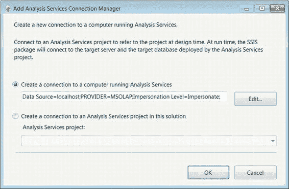

#### MSOLAP100 连接管理器

`Analysis Services`（分析服务）连接管理器 `MSOLAP100` 允许您连接到 `Analysis Services` 引擎，并在设计时连接到 `Analysis Services` 项目。在运行时，连接将仅连接到部署了 `Analysis Services` 项目的服务器和数据库。`图 4-14` 展示了如何添加 `Analysis Services` 连接管理器。

`图 4-14. 添加分析服务连接管理器`

创建到 `Analysis Services` 实例的连接与提供服务器名称一样简单。默认情况下，此连接管理器的提供程序设置为 `Microsoft Online Analytical Processing (MSOLAP)`（Microsoft 联机分析处理），将 `OLAP` 引擎定义为 `Analysis Services` 引擎。`Impersonation Level`（模拟级别）允许您定义要使用的身份验证。不同的 `Impersonation Levels`（模拟级别）在以下列表中定义。`Analysis Services Execute DDL`（分析服务执行 DDL）任务和 `Analysis Services Processing`（分析服务处理）任务利用此连接访问 `Analysis Services` 数据库。`Data Mining Model Training`（数据挖掘模型训练）目的地组件可利用此连接将模型应用于数据。在此解决方案中创建到 `Analysis Services` 项目的选项仅将项目用于元数据。在运行时，任务将需要利用此连接连接到现有数据库。

-   `Anonymous`（匿名）：服务器在访问期间看不到有关客户端的任何信息。
-   `Identify`（识别）：服务器知道客户端的身份，并且可以使用客户端的访问控制列表。
-   `Impersonate`（模拟）：服务器可以模拟客户端，其能力取决于服务器和客户端的位置。如果服务器和客户端在同一台机器上，服务器可以访问客户端的网络资源。如果它们位于不同的机器上，服务器只能访问其自身机器上的可用资源。
-   `Delegate`（委派）：服务器可以模拟客户端，而不受机器的限制。

[www.it-ebooks.info](http://www.it-ebooks.info/)

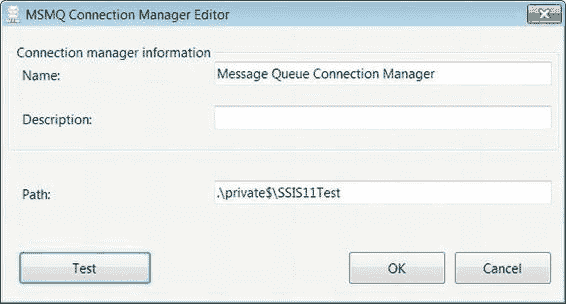

#### DQS 连接管理器

`Data Quality Services (DQS)`（数据质量服务）连接管理器允许您连接到 `Data Quality Services` 服务器和数据库。`Data Correction`（数据更正）转换任务利用此连接在将一组数据更正规则应用于数据流之前访问它们。

#### MSMQ 连接管理器

`Microsoft Message Queuing, MSMQ`（Microsoft 消息队列）连接管理器允许您连接到使用消息队列的消息队列。连接管理器将把 `Message Queue`（消息队列）任务连接到指定的队列，以触发消息服务。`图 4-15` 演示了如何设置此管理器。

`图 4-15. MSMQ 连接管理器编辑器`

根据消息队列的类型，有两种定义路径的方法。对于专用队列，格式为 `<computername>\Private$\<queuename>`。也可以使用句点（`.`）表示本地计算机，如 `图 4-15` 所示。对于公共队列，格式只需省略专用路径：`<computername>\<queuename>`。

**注意：** 默认情况下，Windows 安装上消息队列服务是关闭的。您必须启用该服务并创建自己的队列，以便 `SSIS` 能够使用它。

[www.it-ebooks.info](http://www.it-ebooks.info/)

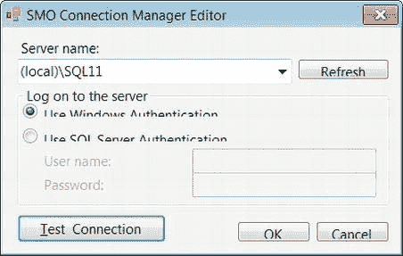

#### SMO 连接管理器

`SQL Server Management Object (SMO)`（SQL Server 管理对象）连接管理器使包能够与 `SQL Management Object`（SQL 管理对象）服务器建立连接。此连接管理器由 `SSIS 12` 中默认存在的传输任务使用。`图 4-16` 显示了此连接管理器的编辑器。

`图 4-16. SMO 连接管理器编辑器`

`SMO Connection Manager Editor`（SMO 连接管理器编辑器）仅需要服务器名称和访问服务器的身份验证模式。`Refresh`（刷新）按钮重新加载可用服务器列表。`Test Connection`（测试连接）按钮将检查编辑器中提供的当前配置。不同的传输可执行文件允许您执行 `Data Access Language (DAL)`（数据访问语言）、移动和复制数据库以及其他功能。

根据您使用的任务，您需要定义数据库，但所有传输任务都将利用此连接连接到服务器。

#### SMTP 连接管理器

`SMTP` 连接管理器允许您连接到 `Simple Mail Transfer Protocol (SMTP)`（简单邮件传输协议）服务器。

## 第 4 章 连接管理器

发送邮件任务利用此连接管理器，在包执行满足特定条件时发送电子邮件。图 4-17 展示了连接管理器编辑器中可用的选项。

[www.it-ebooks.info](http://www.it-ebooks.info/)

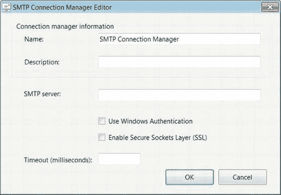

**图 4-17. SMTP 连接管理器编辑器**

`名称`字段唯一标识此连接。应填写`描述`以帮助其他开发人员理解此连接的用途。`SMTP 服务器`字段用于指定服务器名称。默认情况下，连接管理器使用`匿名`身份验证，但允许您通过复选框选择`Windows 身份验证`。选择`启用安全套接字层(SSL)`选项可在发送电子邮件时加密数据。`超时`字段以毫秒为单位定义连接服务器的时限。

**注意：** 连接到 Microsoft Exchange 时，请使用`Windows 身份验证`，因为 Exchange 服务器可能会拒绝未经身份验证的 SMTP 连接。

#### SQLMOBILE 连接管理器

SQLMOBILE 连接管理器允许您连接到 SQL Server Compact 数据库。SQL Server Compact 目标使用此连接管理器将数据加载到 SQL Server Compact 数据库中。图 4-18 和图 4-19 展示了该连接管理器的配置。

[www.it-ebooks.info](http://www.it-ebooks.info/)

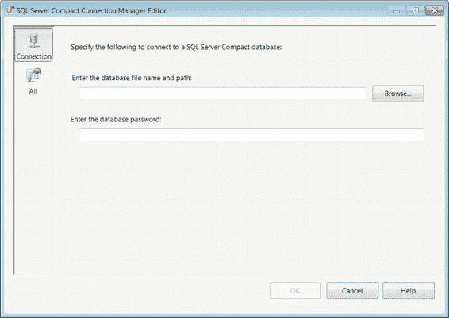

**图 4-18. SQL Server Compact 连接管理器编辑器—连接页**

**注意：** 支持连接到 SQL Server Compact 数据库的提供程序仅在 32 位模式下可用。如果您在 64 位机器上开发或执行，则必须使用 32 位模式。

数据库文件名和路径指示了 SQL Server Compact 数据库的位置。`浏览`按钮将打开 Windows 资源管理器以帮助查找文件位置。数据库密码可以存储在`输入数据库密码`字段中。图 4-19 中的`全部`页面显示了使用此连接管理器时所有可用的选项。

[www.it-ebooks.info](http://www.it-ebooks.info/)

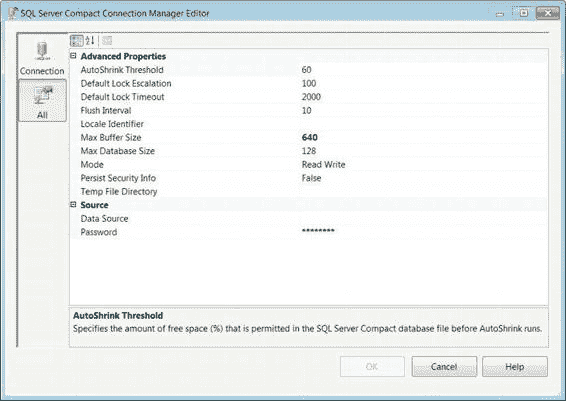

**图 4-19. SQL Server Compact 连接管理器编辑器—全部页**

`全部`页面公开的属性允许您配置连接管理器的细微细节。其中一些属性包括增长大小和超时设置。所有属性如下所示：

*   `自动收缩阈值`：允许执行自动收缩之前所需的剩余空间百分比。
*   `默认锁升级`：SQL Server Compact 升级锁之前所允许的锁数量。
*   `默认锁超时`：事务等待锁的间隔时间。以毫秒为单位。
*   `刷新间隔`：已提交事务刷新到磁盘的间隔时间。以秒为单位。
*   `区域设置标识符`：指定 SQL Server Compact 数据库的区域设置 ID。
*   `最大缓冲区大小`：指定 SQL Server Compact 在将数据刷新到磁盘前使用的内存量。以千字节(KB)为单位。
*   `最大数据库大小`：定义 SQL Server Compact 数据库的最大大小。以兆字节(MB)为单位。
*   `模式`：指定 SQL Server Compact 数据库的访问模式。默认设置为`读/写`。`读/写`赋予您读取和写入数据库的权限。`只读`指定您只能读取数据库。`独占`提供对数据库的独占访问。`共享读取`允许多个用户同时读取数据库。
*   `保持安全信息`：允许将连接信息作为连接字符串的一部分存储。
*   `临时文件目录`：指定 SQL Server Compact 数据库的临时数据库文件位置。
*   `数据源`：指定要访问的 SQL Server Compact 数据库的名称。
*   `密码`：指定 SQL Server Compact 的密码。

#### WMI 连接管理器

WMI 连接管理器支持访问 Windows 管理规范。Web 服务任务使用此连接管理器。图 4-20 显示了 WMI 连接管理器编辑器的配置。

[www.it-ebooks.info](http://www.it-ebooks.info/)

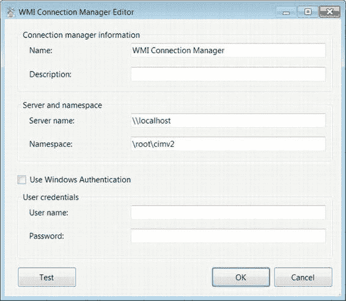

**图 4-20. WMI 连接管理器编辑器**

`名称`字段唯一定义连接管理器。应使用`描述`，以便其他开发人员了解连接管理器的确切用途。`服务器名称`表示管理规范的位置。`命名空间`定义要使用的 WMI 命名空间。复选框将启用`Windows 身份验证`的使用。如果使用此选项，则无需提供用户名和密码。`测试`按钮将测试编辑器中设置的当前配置。

### 小结

SSIS 可以访问的连接管理器是包执行的 ETL 过程的支柱。它们允许数据的提取和插入。某些连接管理器的配置相当简单，而另一些则具有更复杂的属性集。在本章中，您详细研究了最常用的连接。还介绍了一些较少使用的连接管理器。下一章将指导您了解控制流可用的可执行文件、容器和优先级约束。

[www.it-ebooks.info](http://www.it-ebooks.info/)

## 第 5 章 控制流基础

*你无法总是控制外界发生什么，但你总能控制内心发生什么。*
—自助倡导者 韦恩·戴尔

前一章向您介绍了 SQL Server 12 的连接管理器。本章的目的是介绍一些基本的控制流项，使您能够利用这些连接管理器。在 Visual Studio 的设计器窗口中，控制流有自己的设计器页面。在本章中，我们将详细介绍您日常最有可能使用的控制流任务。第 6 章涵盖了较少使用的可执行文件。控制流定义了包执行的操作，以及执行这些操作所需的顺序和条件。

### 什么是控制流？

*控制流*是任何 SQL Server Integration Services 12 包的核心。它由可执行文件、容器和优先级约束组成。*可执行文件*是 SSIS 包中最通用的组件。它们包括诸如`执行 SQL 任务`、`数据流任务`和`脚本任务`等任务。这些任务可用于启动存储过程、提取和加载数据以及更改变量的状态。

*容器*用于对任务进行逻辑组织。容器可用于简单地组织任务或循环遍历任务。*优先级约束*决定了执行路径或流程。它们允许您确定任务的执行顺序。通过不定义某些约束，您可以利用并发任务执行。

控制流设计器窗格具有缩放工具，允许您放大和缩小以查看所有组件。SSIS 工具箱也会随之更改，允许您仅访问上下文相关的项。数据流组件在控制流中不可用。向控制流添加项时，您有两个选择：可以单击并将项从 SSIS 工具箱拖到控制流上，也可以双击该项。

根据要添加到控制流中的项类型，我们建议在添加项之前先放置好引用的对象。例如，如果您要添加"执行 SQL 任务"，请先创建到数据库的连接管理器；或者如果您要添加"循环容器"，请先创建它可能依赖的变量。明确流程需求对于高效开发 SSIS 包至关重要。临时以相反顺序创建对象，这几乎是您在 SSIS 中所能遇到的最接近"面条代码"的做法。利用自动格式化选项，可以最大限度地减少复杂的优先级约束流。

[www.it-ebooks.info](http://www.it-ebooks.info/)

## 第 5 章 控制流基础

**注意：** 由于控制流代表包本身，因此通过右键单击控制流设计器背景可以访问包属性。控制流中的每个组件都有自己独特的一套属性，但控制流的属性即是包的属性。

### 用于控制流的 SSIS 工具箱

控制流的组件包含在 Visual Studio 中一个可折叠/关闭的窗口中，称为 `SSIS 工具箱`。此窗口提供了对控制流所有可用组件的访问。需要注意，此窗口是上下文相关的，因此当您使用不同的设计器窗口时，它将显示该设计器可用的工具。不同的组件按图 5-1 所示的组进行分类。

[www.it-ebooks.info](http://www.it-ebooks.info/)

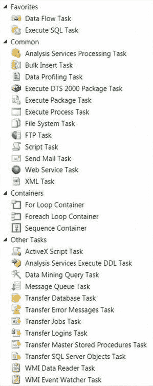

*图 5-1. 控制流 SSIS 工具箱*

这些分组允许您以能够快速访问最常用组件的方式组织 `SSIS 工具箱`，具体如下：

*   **收藏夹** 代表最常用的组件。此类别将组件组织在 `SSIS 工具箱`顶部易于查找的位置。默认情况下，`数据流` 任务和 `执行 SQL` 任务位于此类别中。
*   **常用** 组织 SSIS 开发中常用的组件。这些组件对于 ETL 过程的非 ETL 方面非常有用。这些组件允许您操作数据的源或目标，以便更轻松地提取或加载。
*   **容器** 将不同的任务容器分组在一起。这些容器根据优先级约束执行任务。
*   **其他任务** 存放不常使用的任务。这些任务更多地与数据库管理和非功能性需求相关，而非 ETL 本身。

您对 `SSIS 工具箱`的自定义设置将适用于所有项目，并可随时修改。如果要恢复默认设置，可以右键单击并选择 `还原工具箱默认设置` 选项。使 `SSIS 工具箱`在开发中高效的关键特性之一是每个组件的独特图标。这些图标以一种有意义的方式代表每个任务的目的。这些图标在组件被放置到控制流中后，也会出现在组件本身上。

**注意：** 在早期版本的 BIDS 中，窗口窗格的名称是 *工具箱*。从 SQL Server Integration Services 12 开始，名称已更改为 `SSIS 工具箱`。如果您为控制流创建自己的自定义组件，则必须将其添加到计算机的程序集文件夹以及 SQL Server 安装的相应组件文件夹中。第 21 章将进一步介绍自定义组件。

`SSIS 工具箱` 包含许多协助满足 ETL 需求的组件。在本书中，我们将列表分为基本组件和高级组件。本章涵盖的基本任务很可能成为您设计的大多数解决方案的一部分。其中一些任务将有各自的章节，因此本章不会详细描述它们。

### 收藏夹任务

`收藏夹` 组中的默认任务列表是 `执行 SQL` 任务和 `数据流` 任务。您可以修改此组以包含您经常使用的任务。本节详细介绍默认列表。该组方便地显示在控制流的 `SSIS 工具箱`的最顶部。

### 数据流任务

`数据流` 任务可以描述为 ETL 过程的核心与灵魂。此可执行文件包含从不同源提取数据的组件、可以在数据流中清理和修改数据的转换组件，以及可以提交数据目标组件。SSIS 中的数据流称为管道。`数据流` 任务有自己的设计器窗口，因此您可以根据需要自定义该过程。我们将在第 7 章和第 8 章进一步讨论 `数据流` 任务及其所有组件。图 5-2 显示了添加到控制流时该可执行文件的外观。

[www.it-ebooks.info](http://www.it-ebooks.info/)

*图 5-2. 数据流任务*

此可执行文件的图标显示两个圆柱体，一个绿色箭头从其中一个指向另一个。第一个圆柱体代表数据的源，绿色箭头代表转换，第二个圆柱体代表数据的目标。图标可能暗示数据只能来自一个源，但 `数据流` 任务可以同时从多个源提取数据。同样，它也支持同时将数据输出到多个目标。

如前所述，此组件将在后面的章节中更详细地介绍。其部分属性包括：

*   `DelayValidation` 将元数据的验证延迟到运行时。
*   `Disable` 防止在运行时执行 `数据流` 任务。
*   `MaximumErrorCount` 定义 `数据流` 任务可容忍的错误数量。
*   `Description` 提供 `数据流` 任务的简短描述。
*   `Name` 显示 `数据流` 任务的唯一名称。
*   `DefaultBufferMaxRows` 定义缓冲区可以容纳的最大行数。此属性与 `DefaultBufferSize` 属性相辅相成。它们共同可以解决 `数据流` 任务性能不佳的一些问题。
*   `DefaultBufferSize` 定义 `数据流` 任务中缓冲区的大小（以字节为单位）。`数据流` 任务中的某些转换会创建现有缓冲区的副本。这将在第 7 章和第 8 章中更详细地介绍。
*   `RunInOptimizedMode` 通过不为未使用的列分配空间来优化数据流路径。即使此属性设置为 `True`，它仍会发出有关从数据流路径中移除列的警告。
*   `TransactionOption` 允许您定义可执行文件是否支持事务。如果可执行文件由父项调用并且启用了事务，则该可执行文件将成为父事务的一部分。主要出于性能原因，我们建议您将此选项保留为默认设置。

#### 执行 SQL 任务

`执行 SQL` 任务允许您使用各种连接管理器针对 RDBMS 运行 SQL 语句或执行存储过程。`执行 SQL` 任务可以利用的连接管理器包括 `Excel 连接管理器`、`OLE DB 连接管理器`、`ODBC 连接管理器`、`ADO 连接管理器`、`ADO.NET 连接管理器` 和 `SQL Server Compact Edition 连接管理器`。图 5-3 显示了在控制流中出现的该可执行文件。图标显示一个圆柱体，其右下角叠加着一个卷轴。圆柱体代表数据库系统，而卷轴代表脚本。在此特定情况下，脚本是 SQL 脚本。

[www.it-ebooks.info](http://www.it-ebooks.info/)

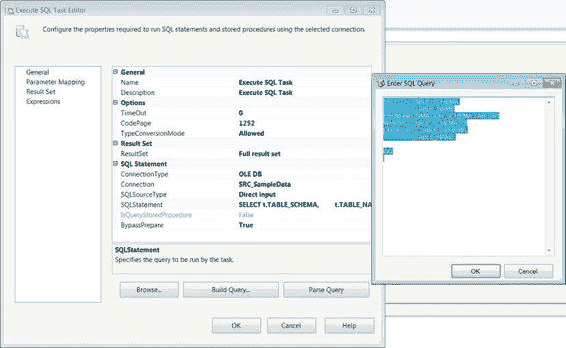

*图 5-3. 执行 SQL 任务*

### 执行 SQL 任务编辑器—常规页

#### 执行 SQL 任务

#### 通用页面

执行 SQL 任务可用于在数据加载前截断表，或在数据加载后创建约束以验证数据完整性（DDL 语句）。执行 SQL 任务也可用于检索数据并将其存储在 SSIS 变量中（DML 语句）。检索到的数据可以是单行数据，也可以是表格数据集。通过“执行 SQL 任务编辑器”，您可以设置该可执行文件以执行不同的功能。图 5-4 展示了“执行 SQL 任务编辑器”的通用页面。

*图 5-4. 执行 SQL 任务编辑器——通用页面*

以下列表讨论了通用页面上的一些关键属性：

-   `名称` 是任务在控制流中的唯一标识符。同一类型的两个任务不能拥有相同的名称。此名称是控制流设计器中显示的标签。
-   `描述` 是一个文本字段，用于简要说明任务在包中的功能。修改此属性不是必须的，但可以帮助不熟悉该包的人员更容易地理解流程。
-   `连接` 是一个必需的属性，默认为空。此值应指示应针对哪个连接管理器执行 SQL 语句。
-   `结果集` 允许您定义查询将返回的结果类型。结果集有四种类型：单行、完整结果集、XML 或 无。“单行”可用于单个标量值或仅返回一行的表格数据集。“完整结果集”选项允许您将表格数据存储在 SSIS 对象类型变量中。如果 SQL 语句中定义了 `ORDER BY` 子句，变量将按排序列表维护数据。XML 结果集允许您将 XML 数据存储在变量中。“无”表示不返回结果集。SQL 语句的成功执行会返回指示此类情况的值。可在编辑器的“结果集”页面中将结果集映射到相应的变量。
-   `连接类型` 表示您将用于连接到数据库的连接管理器类型。
-   `连接管理器` 是将允许您连接到数据库的连接管理器的名称。
-   `SQL 源类型` 定义了向执行 SQL 任务传递 SQL 语句的方法。选项包括：直接输入、文件连接和变量。“直接输入”允许您将 SQL 语句直接键入 `SQL 语句` 文本字段。“文件连接”选项允许您指定一个包含要执行的查询的特定文件。“变量”允许您将查询分配给字符串变量并将其传递给任务。
-   `SQL 语句` 包含要在指定数据库上执行的 SQL 语句。仅当选择“直接输入”作为查询源类型时，此字段才会出现。
-   `文件连接` 允许您选择一个连接管理器作为 SQL 语句的源。仅当使用“文件连接”作为源类型时，此选项才可用。
-   `源变量` 是可以存储 SQL 语句的变量列表。仅当选择“变量”作为源类型时，此下拉列表才可用。
-   `SQL 语句` 包含需要执行的 DDL、DML 或 DAL 语句。当您修改语句时，会打开一个文本编辑器，您可以在其中键入语句。如果没有文本编辑器，您将无法将 `GO` 放在新的一行，因此在执行包时会出现错误。

`注意：` 为了执行 DDL 和数据控制语言（DCL）语句，您需要确保使用的凭据具有适当的权限。如果您有多个语句，则只允许第一个语句返回结果集。

`注意：` 如果您打算在单个执行 SQL 任务中执行多个语句，我们建议使用分号 (`;`) 作为语句终止符。在语句末尾，您可以在文本编辑器中将 `GO` 批处理指令添加到新的一行。在设置结果集时，请确保返回结果集的查询是 `SQL 语句` 字段中的最后一个查询。

底部的 `浏览` 按钮允许您将查询从文件导入到 `SQL 语句` 字段。它将打开一个 Windows 资源管理器窗口，帮助导航到所需文件。`生成查询` 按钮打开一个图形化工具，帮助您构建查询。此选项仅适用于“直接输入”源类型。`解析查询` 按钮用于验证已定义 SQL 查询的语法。

#### 参数映射页面

参数允许您将变量传递给要执行的 SQL 查询。根据 SQL 连接的不同，参数使用不同的标记和名称进行映射。表 5-1 显示了不同的标记、与标记关联的名称以及每种连接的示例查询。图 5-5 中的参数映射页面演示了如何对 SQL 语句进行参数化。

*表 5-1. 参数标记和名称*

| **连接** | **参数标记** | **参数名称** | **示例** |
| :--- | :--- | :--- | :--- |
| ADO | `?` | `Param1`, `Param2`, … | `SELECT t.TABLE_SCHEMA, t.TABLE_NAME FROM INFORMATION_SCHEMA.TABLES t WHERE t.TABLE_SCHEMA = ? ORDER BY t.TABLE_SCHEMA, t.TABLE_NAME;` |
| ADO.NET | `@<ParamName>` | `@<ParamName>` | `SELECT t.TABLE_SCHEMA, t.TABLE_NAME FROM INFORMATION_SCHEMA.TABLES t WHERE t.TABLE_SCHEMA = @tableSchema ORDER BY t.TABLE_SCHEMA, t.TABLE_NAME;` |
| ODBC | `?` | `1`, `2`, `3`, `4`, … | `SELECT t.TABLE_SCHEMA, t.TABLE_NAME FROM INFORMATION_SCHEMA.TABLES t WHERE t.TABLE_SCHEMA = ? ORDER BY t.TABLE_SCHEMA, t.TABLE_NAME;` |
| Excel, OLE DB | `?` | `0`, `1`, `2`, `3`, … | `SELECT t.TABLE_SCHEMA, t.TABLE_NAME FROM INFORMATION_SCHEMA.TABLES t WHERE t.TABLE_SCHEMA = ? ORDER BY t.TABLE_SCHEMA, t.TABLE_NAME;` |

*图 5-5. 执行 SQL 任务编辑器——参数映射页面*

可以在整个查询中使用多个标记。ADO、ODBC、Excel 和 OLE DB 连接的标记是问号 (`?`)。ADO 和 ODBC 的枚举器从 1 开始。但是，参数必须以 `Param` 为前缀加上序数位置来命名。Excel 和 OLE DB 连接的枚举器从 0 开始。ADO.NET 连接是唯一使用限定符 (`@`) 和名称组合进行参数映射的连接类型。同一个变量可以多次传递给同一条 SQL 语句。

要为 SQL 语句中的参数添加映射，您需要单击参数映射页面上的 `添加` 按钮。映射页面上的列指定了每个映射的所有详细信息。`删除` 按钮仅用于移除选定的映射。属性如下：

-   `变量名称` 提供了将传递给 SQL 语句中参数的特定变量。变量的命名空间很重要，因为它允许多个变量拥有相同的名称。
-   `方向` 指示变量是输入参数、输出参数还是返回代码。
-   `数据类型` 为参数分配数据类型。它不会自动使用为 SSIS 变量定义的数据类型。下拉列表列出了 SSIS 可用的所有数据类型。
-   `参数名称` 给参数一个名称。根据连接类型，您必须适当地命名参数，并确保查询中标记的序数位置与名称相符。在使用某些连接类型时，此列的序数位置起着重要作用。
-   `参数大小` 定义了可变长度数据类型的大小。这允许

供程序为参数值分配适当的空间。

#### 执行 SQL 任务编辑器—结果集页面

对于结果需要被 SSIS 访问的 SQL 语句，我们可以将这些结果集分配给 SSIS 变量。最常用的结果集类型之一是`完整结果集`。这允许你将整个结果（如果 SQL 语句中指定了排序顺序，则包含该顺序）直接存储在一个数据类型定义为`object`的变量中。根据变量的作用域，这个`object`可以被`Foreach 循环`容器访问用作枚举器，可以被控制流中的`脚本`任务访问，或者被`数据流`任务访问。图 5-6 演示了如何为查询的结果集定义映射。

[www.it-ebooks.info](http://www.it-ebooks.info/)

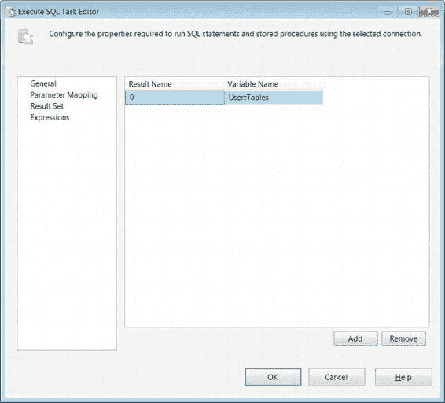

第 5 章  控制流基础

`图 5-6. 执行 SQL 任务编辑器—结果集页面`

要将查询的值分配给变量，如果结果集是`单行`，你需要知道每列的序号位置或名称；否则，将`结果名称`设置为`0`。要添加此分配，你需要使用`添加`按钮。`完整结果集`的结果将自动定义`object`中的列。对于`单行`结果，你需要确保每列的数据类型与映射的 SSIS 变量兼容。

#### 执行 SQL 任务编辑器—表达式页面

`表达式`页面允许你定义可以更改组件属性值的表达式。可以为每个组件定义多个表达式。第 9 章将更详细地介绍表达式。图 5-7 演示了`执行 SQL 任务编辑器`的`表达式`页面。

[www.it-ebooks.info](http://www.it-ebooks.info/)

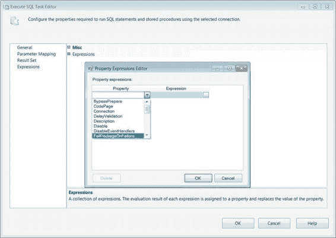

第 5 章  控制流基础

`图 5-7. 执行 SQL 任务编辑器—表达式页面`

**注意：** 今后，我们将不再显示任务编辑器的`表达式`页面。可以通过表达式访问的属性对于特定的任务类型可能是唯一的，但也有一些重叠，包括`名称`和`描述`。

### 常用任务

`SSIS 工具箱`中的`常用`分组包含一些更常用的任务。这些任务执行的操作主要支持 ETL 的非功能性需求。它们的操作可能有所不同，从为 ETL 流程准备文件到作为包执行的一部分发送电子邮件。

[www.it-ebooks.info](http://www.it-ebooks.info/)

第 5 章  控制流基础

#### Analysis Services 处理任务

`Analysis Services 处理任务`允许你处理 SQL Server Analysis Services (SSAS) 对象。这些对象包括多维数据集、维度和数据挖掘模型。图 5-8 演示了该任务在控制流中的样子。这个特定示例显示了当任务未连接到多维数据集时返回的错误消息。创建`Analysis Services 处理任务`时，必须将其指向一个 SSAS 数据库并添加需要处理的对象。如果没有向列表中添加对象，你将收到错误消息。

`图 5-8. Analysis Services 处理任务`

此任务的图标是一叠多维数据集，外面有一个单独的多维数据集。这些多维数据集代表 SSAS 数据库对象，特别是多维数据集。单个的多维数据集代表度量值，因为它们可以被不同的维度切片和切块。

添加的对象将以批处理方式执行。批处理本身可以按顺序或并行处理。通常，并行处理会加快整体处理速度。你可以选择定义可以同时处理的对象数量，也可以让任务决定处理对象。维度通常在事实之前处理，以防止任何缺失键错误。解决此问题的方法是允许即使有错误也继续处理。处理多维数据集时，不忽略错误是一种最佳实践。

#### Analysis Services 处理任务编辑器—常规页面

