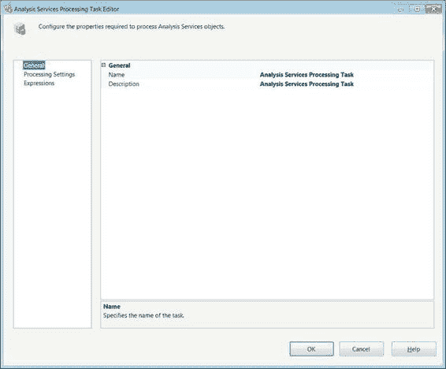
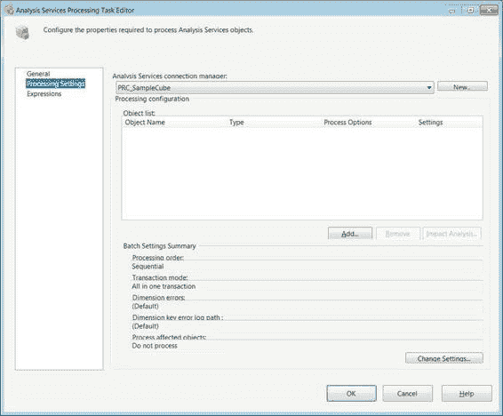

# 第五章 控制流基础

## Analysis Services 处理任务编辑器—常规页

**Analysis Services 处理**任务的**常规**页（如图 5-9 所示）非常直观。它允许你重命名可执行文件并为任务提供简短描述。`名称`和`描述`属性将自动反映在设计器或属性窗口中提供的值。只有`名称`属性可在设计器窗口中修改。

[www.it-ebooks.info](http://www.it-ebooks.info/)

*图 5-9. Analysis Services 处理任务编辑器—常规页*

> **注意：** 从现在起，除非可访问的属性除了简单的`名称`和`描述`外还包括其他属性，否则我们将不再展示任务编辑器的常规页。

#### Analysis Services 处理任务编辑器—处理设置页

**Analysis Services 处理**任务的**处理设置**页（如图 5-10 所示）允许你指定连接到 Analysis Services 数据库的连接管理器以及你需要处理的对象。它还使你能够精确配置每个对象的处理方式。

[www.it-ebooks.info](http://www.it-ebooks.info/)

*图 5-10. Analysis Services 处理任务编辑器—处理设置页*

`Analysis Services 连接管理器`下拉列表提供了包中所有现有的 Analysis Services 连接管理器。如果包中尚不存在连接管理器，`新建`按钮允许你创建一个。**对象列表**部分显示了设置为由该任务处理的所有对象。

示例如下：
*   `对象名称`指定要处理的对象的名称。
*   `类型`显示对象的类型。

[www.it-ebooks.info](http://www.it-ebooks.info/)

`处理选项`包含一个处理选项的下拉列表，其中包括`处理默认值`、`完全处理`、`取消处理`、`处理数据`、`处理索引`和`处理更新`。
`处理默认值`、`完全处理`和`取消处理`是唯一对所有对象类型都可用的选项。`处理默认值`仅执行初始化对象所必需的任务。引擎会分析对象的状态以确定要使用的最佳选项。`完全处理`会删除并重建对象，并在处理对象时更新元数据。`取消处理`对象包含的所有数据。只有维度、多维数据集、度量值组和分区可以使用`处理数据`和`处理索引`选项。`处理数据`将数据加载到对象中，但不构建索引或聚合。`处理索引`仅重建索引和聚合，而不修改现有数据。`处理更新`仅对维度可用。它对维度数据执行插入、更新和删除操作。

`设置`提供对象的处理设置。

`添加`按钮允许你将数据库中的对象添加到**对象列表**。`删除`按钮将它们从列表中删除。`影响分析`按钮显示处理选定对象所影响的所有对象。当任务执行分析时，它会考虑所选的处理选项。影响分析提供了其自身的受影响对象的**对象列表**，如下所示：
*   `对象名称`标识受已定义对象处理影响的对象。
*   `类型`显示受影响对象的类型。
*   `影响类型`显示处理选定对象的影响。显示以下影响：`对象将被清除(未处理)`、`对象将无效`、`聚合将被删除`、`灵活聚合将被删除`、`索引将被删除`和`非子对象将被处理`。除`对象将无效`外，所有影响都会提供错误消息。其余的仅是警告。
*   `处理对象`是一个复选框，允许你将此对象添加到处理对象列表中。

`更改设置`按钮打开如图 5-11 所示的对话框。它允许你更改**处理设置**页上显示的所有设置。

