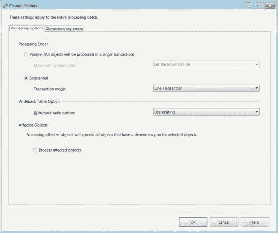
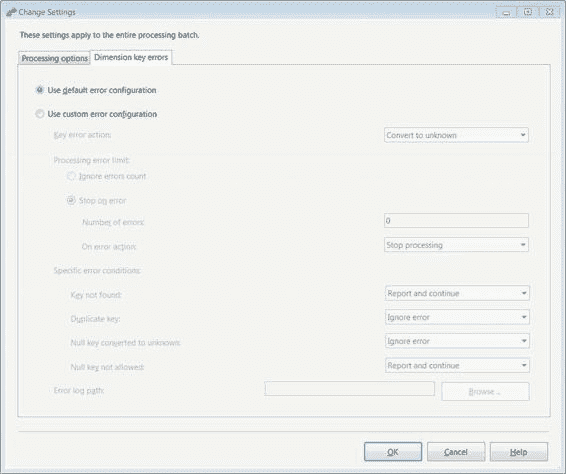

# 第五章 控制流基础

**图 5-11. “更改设置”对话框的“处理选项”选项卡**

在此对话框中，`处理顺序`的单选按钮可让您选择是同时处理对象还是按顺序处理。当同时处理对象时，您可以让服务器决定其能够并发处理的对象数量，也可以从下拉列表中选择一个数字。数字范围从 1 到 128，每个间隔翻倍。按顺序处理时，您可以选择将数据作为单个事务或多个事务（甚至是相关对象）进行处理。

`写回表选项`列表允许您选择写回表的处理方式。此选项旨在记录多维数据集在处理过程中发生的数据更改。写回表有三个可用选项：

- `创建`：如果写回表尚不存在则创建，如果已存在则抛出错误。
- `始终创建`：如果写回表不存在则创建，如果已存在则覆盖它。
- `使用现有`：使用已存在的写回表，如果不存在则抛出错误。

`受影响对象`部分允许您通过一个复选框来处理受影响的对象。这与`影响分析`按钮显示的对象列表相辅相成。

#### 维度键错误选项卡

**图 5-12. “更改设置”对话框的“维度键错误”选项卡**

`维度键错误`选项卡允许您更改处理操作的错误配置。`使用默认错误配置`选项将在处理时使用服务器的错误配置。我们建议您除非有特定需要，否则不要为处理配置自己的设置。修改此属性可能导致通过 SSIS 包处理多维数据集与通过管理工作室处理多维数据集产生不同的结果。

自定义错误配置分为可能的错误部分及其处理选项。不同部分如下：

`键错误操作`允许您处理无法从相应维度引用的新键。处理此错误的两个选项是`转换为未知成员`和`丢弃记录`。`转换为未知成员`将与此键关联的所有数据归入未知分组。此功能类似于 SQL 中的 `COALESCE()` 或 `ISNULL()`。第二个选项`丢弃记录`会完全删除对象中与此记录关联的所有数据。

`忽略错误计数`使您能够在处理过程中完全忽略错误。

`出错时停止`允许您定义任务可容忍的错误数量，以及达到容忍度后要采取的操作。`错误数量`字段指定任务将支持的错误数量。`出错时操作`在错误数量超限时为您提供两个选项：`停止处理`和`停止记录`。`停止处理`终止对象的处理。`停止记录`停止记录错误但继续处理数据。

`特定错误条件`为您提供了处理某些错误的灵活性。处理每个场景的选项是`忽略错误`、`报告并继续`和`报告并停止`。`忽略错误`简单地继续而不采取任何操作。`报告并继续`报告错误但继续处理。`报告并停止`报告错误并停止处理。

处理过程中导致错误的不同条件包括`键未找到`、`重复键`、`空键转换为未知成员`和`不允许空键`。`键未找到`错误表示在引用的数据（通常是维度）中找不到键。`重复键`错误在同一个键引用多个属性时抛出。

