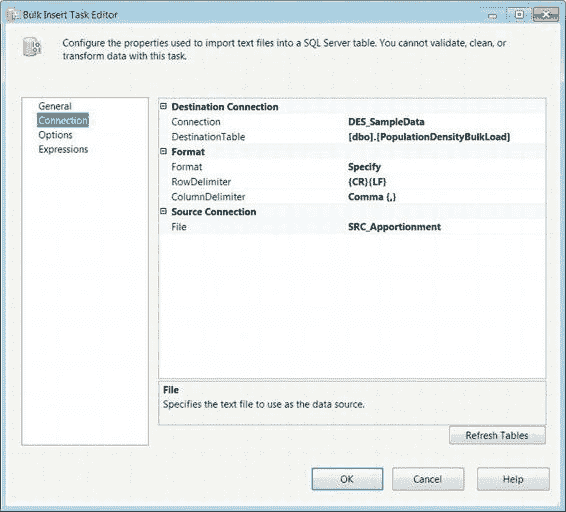
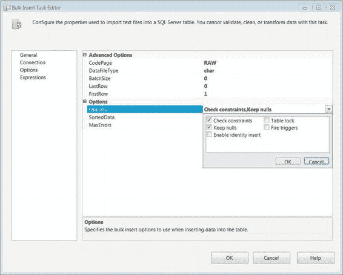

# 第 5 章  控制流基础

#### 大容量插入任务

`大容量插入任务`为 EL 处理提供了一种极其高效的选择。通过绕过数据流任务的转换功能，`大容量插入任务`可以快速地将大量数据从平面文件源加载到 SQL Server 表中。此任务提供的功能类似于 SQL Server 中的 `BCP` 命令，但仅将数据导入 SQL Server。图 5-13 展示了该组件在控制流中的外观。图标显示了一个数据库圆柱体，其上覆盖着一些二进制数据。

*图 5-13. 大容量插入任务*

`www.it-ebooks.info`

##### 使用大容量插入任务前的注意事项

源数据文件必须存在于宿主服务器可访问的服务器上，因为是由宿主服务器来执行`大容量插入任务`。访问远程服务器时，必须使用通用命名约定 (`UNC`) 来指定文件路径和名称。该任务将仅使用文件的连接管理器来定位文件。需要向任务指定分隔符信息和标题行信息。可以将格式文件与`大容量插入任务`结合使用，但该文件必须存在于服务器上。只能使用 `OLE DB 连接管理器`连接到目标数据库。

用于执行`大容量插入任务`的帐户需要对服务器拥有系统管理员 (`sysadmin`) 权限。`大容量插入任务`将根据源文件中的出现顺序和表定义中的序数位置来“映射”列。

##### 大容量插入任务编辑器 - 连接页

大容量插入任务编辑器的“连接”页允许您定义数据的源和目标，以及源数据文件的格式。目标的连接必须是 `OLE DB 连接管理器`。要指定格式信息，您可以直接在任务本身中定义，也可以让任务指向存储在文件系统上的格式文件。`格式`列表使您能够选择格式化选项。`行分隔符`提供标记数据行末尾的字符组合。`列分隔符`允许任务识别表示列末尾的字符组合。即使您已在文件连接管理器上定义了格式信息，`大容量插入任务`也会忽略它，如图 5-14 所示。`文件`是包中存在的所有文件连接管理器的下拉列表。

`www.it-ebooks.info`

*图 5-14. 大容量插入任务编辑器 - 连接页*

##### 大容量插入任务编辑器 - 选项页

大容量插入任务编辑器的“选项”页允许您定义实际处理本身的属性。该配置使您能够指定源以及目标的属性。如图 5-15 所示，这些选项分为两组：高级选项和选项。

`www.it-ebooks.info`

*图 5-15. 大容量插入任务编辑器 - 选项页*

以下是各选项及其控制的内容：

`代码页`标识文件中源数据的代码页。

`数据文件类型`定义加载到目标时要使用的数据类型。

`批大小`定义每批的行数。默认值 `0` 表示整个加载操作应作为单个批次的一部分。

