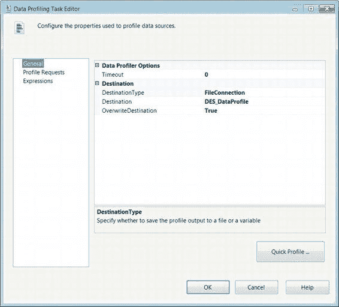
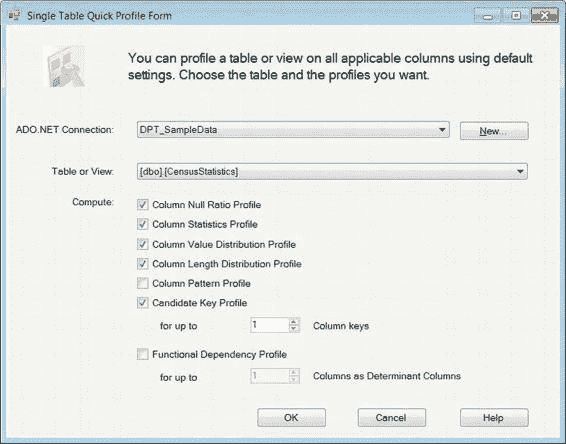

# 第五章 控制流基础

`LastRow` 指向要导入目标的最后一行。默认值`0`表示应以文件结尾（`EOF`）来确定最后一行。

`FirstRow` 指向要导入目标的第一行。此值允许您忽略标题行。如果第一行包含列名，则跳过它至关重要。

[www.it-ebooks.info](http://www.it-ebooks.info/)

`Options` 定义了在大容量插入期间可以执行的一些完整性检查。`Check Constraints`（检查约束）确保不违反为表定义的所有约束。`Keep Nulls`（保持 Null 值）将源中出现的 Null 值插入表列，忽略为表定义的任何默认值。`Enable Identity Insert`（启用标识插入）允许您向标识列插入值。`Table Lock`（表锁）在通过大容量插入加载表时对表执行锁定操作。`Fire Triggers`（激发触发器）允许执行为表定义的任何触发器。

`SortedData` 以逗号分隔的 `ORDER’ed BY` 子句形式提供列名，这些列名按其在目标表中出现的顺序排列。这指定了源中的值已排序。

`MaxErrors` 定义了大容量插入任务的错误容忍度。值`0`表示允许发生无限数量的错误。任何无法导入的行均被视为错误。

### 数据剖析任务

`数据剖析任务` 允许您快速获取数据库中表或视图的具有统计意义的信息。此任务可用于确定外键关系、候选键，甚至列的空值比率。关于数据的信息随后可以 XML 格式加载到平面文件或 `SSIS` 变量中。图 5-16 显示了该任务在控制流中的样子。条形图图标表示统计信息。`数据剖析任务` 包含统计信息，例如某个可能候选键的唯一性比率或某列中空数据的比率。

*图 5-16. 数据剖析任务*

##### 数据剖析任务编辑器—常规页

数据剖析任务编辑器的“常规”页要求您确定数据剖析信息的目标。在图 5-17 中，我们选择将信息存储在一个平面文件中，该文件在每次任务执行时都会被覆盖。我们想指出的是，与某些其他任务的“常规”页不同，此页不允许您提供 `名称` 和 `说明`。

[www.it-ebooks.info](http://www.it-ebooks.info/)

*图 5-17. 数据剖析任务编辑器—常规页*

数据剖析任务编辑器的“常规”页未提供修改 `名称` 和 `说明` 属性的功能，而是提供了以下可供修改的属性：

`超时` 允许您定义任务停止运行的时间量。

`目标类型` 提供一个下拉列表，允许您将数据剖析信息输入到变量或平面文件中。

`目标` 列出包中定义的所有 `平面文件连接管理器`。如果尚未创建或未连接到特定目标，您可以新建一个。

[www.it-ebooks.info](http://www.it-ebooks.info/)

`覆盖目标` 允许您在文件已存在时将其覆盖。默认值为`False`，表示将信息追加到文件。

`快速分析` 按钮打开如图 5-18 所示的对话框。它允许您快速定义需要在给定数据库上收集的信息。“快速分析”对话框窗口每次仅允许选择一个表或视图。选择所有需要计算的信息后，所选项将导入到 `剖析请求` 列表中。数据剖析任务使用 `ADO.NET` 连接连接到数据库。选择连接后，您可以指定要剖析的表或视图。

