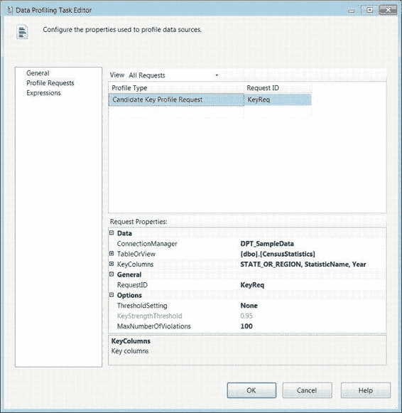
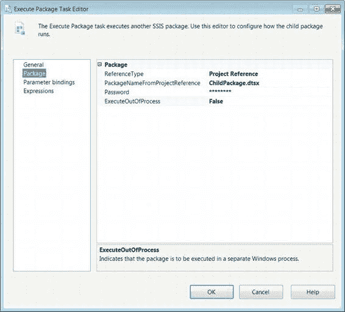
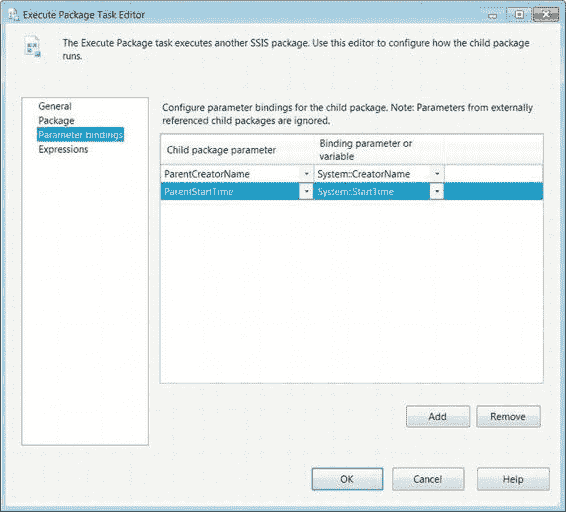
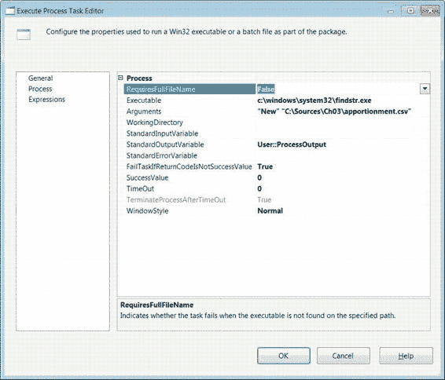
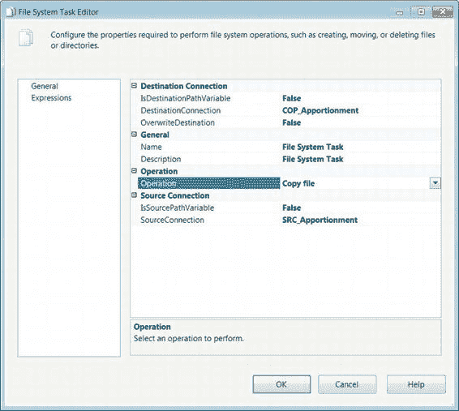
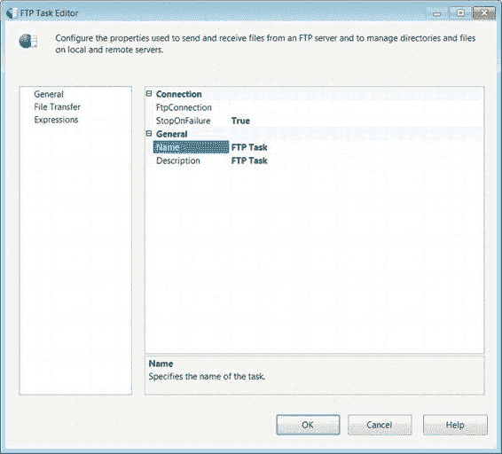
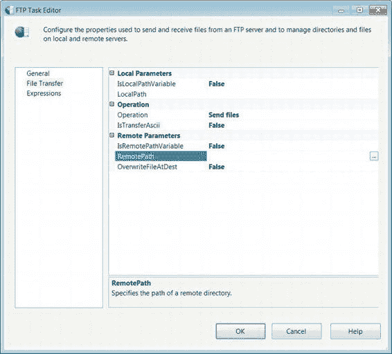

# 第 5 章 控制流基础

##### 数据配置文件任务编辑器 — 配置文件请求页面

这些复选框允许你配置要分析的具体信息。我们将在第 12 章讨论每个选项的细节。

**图 5-18. 单表快速配置文件表单对话框**

如图 5-19 所示的数据配置文件任务编辑器的“配置文件请求”页面，允许你为每个配置文件请求配置选项。“所有请求”列表显示每个请求的配置文件类型和请求 ID。“视图”下拉菜单允许你按配置文件类型筛选请求。

[www.it-ebooks.info](http://www.it-ebooks.info/)



诸如 `ConnectionManager` 和 `TableOrView` 值等信息是从“单表快速配置文件表单”导入的。`RequestID` 是自动生成的，但在添加到“配置文件请求”页面后可以修改。`ThresholdSetting` 选项允许你设置所需的阈值类型，作为配置文件的成功标准。使用此字段可以帮助你发现近乎唯一的键。`MaxNumberOfViolations` 属性可以定义你希望容忍的键重复或失败的次数。

**图 5-19. 数据配置文件任务编辑器 — 配置文件请求页面**

[www.it-ebooks.info](http://www.it-ebooks.info/)


#### 执行包任务

最灵活的 ETL 设计模式之一是使用一个包来调用其他包。这种设计需要使用 `执行包任务`，这是一个可执行组件，允许一个包在执行过程中调用另一个包。原始包的变量可以被被调用的包访问。原始包还可以传递任何可访问它的参数。图 5-20 显示了控制流中的这个组件。其图标是一个带有蓝色方块的文件——三个在文件上，一个在文件外。三个蓝色方块代表文件本身包含的可执行文件，文件外的一个方块表示可以访问当前包之外的可执行文件。

**图 5-20. 执行包任务**

##### 执行包任务编辑器 — 包页面

执行包任务编辑器的“包”页面允许你指定包的位置和名称。可以通过访问当前包所属的项目来指示包的位置。这将使用当前项目中包含的所有包来填充 `PackageNameFromProjectReference` 列表。图 5-21 显示了该任务利用项目引用包的情况。这种 ETL 设计模式被称为 `父子设计`。我们将在第 16 章更详细地介绍它。

[www.it-ebooks.info](http://www.it-ebooks.info/)



**图 5-21. 执行包任务编辑器 — 包页面**

根据所需的 `ReferenceType`，出现在“包”页面上的属性会有所不同，但 `ExecuteOutOfProcess` 和 `Password` 除外。属性如下：

-   `ReferenceType` 允许你选择包的位置。`Project Reference` 表示子包作为对象存在于当前项目中。`External Reference` 允许你访问文件系统或 SQL Server 上的包。
-   `PackageNameFromProjectReference` 列出当前项目中包含的所有包。此属性仅适用于 `Project Reference` 类型。
-   `Password` 是用于加密子包的密码。尽管在图 5-21 中看起来有密码，但包并未加密。默认情况下，SSIS 会填写此字段。点击该字段会打开一个对话框，要求你指定并验证密码。
-   `ExecuteOutOfProcess` 指定该包可以作为一个新的 Windows 进程执行。
-   `Location` 定义包存在于文件系统还是 SQL Server 上。此属性仅适用于 `External Reference` 类型。


“连接”指定用于访问包的连接管理器。对于文件系统位置，该连接会列出包中定义的所有文件连接管理器。SQL Server 位置则列出包中创建的所有 `OLE DB 连接管理器`。

`PackageName` 仅对存储在 SQL Server 上的包显示。它会打开一个对话框，允许您选择服务器上存在的某个包。

`PackageNameReadOnly` 从用于连接到包的文件连接管理器导入值。

##### 执行包任务编辑器 — 参数绑定页面

为支持新的部署模型，允许在父包和子包之间传递参数。图 5-22 显示了 `参数绑定` 页面，您可以在该页面指定要传递给子包的参数。`添加` 按钮向任务添加绑定。父包将连接到指定的包并读入所有已定义的参数。对于图 5-22 中的示例，我们在 `ChildPackage.dtsx` 中创建了两个参数：`ParentCreatorName` 和 `ParentStartTime`。

可以在 `参数和变量` 窗口中添加参数。与变量类似，您必须为参数指定名称和数据类型。参数不具备像变量那样的命名空间。

这是此版本 SSIS 新增的功能。在之前的版本中，必须向子包添加配置才能以引用方式传递变量值。使用参数，您无需向子包添加显式配置即可将值从父包传递给子包。参数是子包执行的一部分。这在将包部署到不同环境且每个环境需要一组不同的变量值或连接管理器的连接字符串时非常有用。

[www.it-ebooks.info](http://www.it-ebooks.info/)



**图 5-22.** `执行包任务编辑器参数绑定` 页面

> **提示：** 如果 `执行包任务编辑器` 未能自动检测子包中定义的参数，我们建议您保存更改、关闭 Visual Studio 并重新打开父包。当父包处于打开状态时，若您向子包添加了新参数，就可能出现这种无法自动检测的情况。

[www.it-ebooks.info](http://www.it-ebooks.info/)


#### 执行进程任务

SSIS 最有用的功能之一是其能够执行并非严格意义上的 ETL 的任务。`执行进程任务` 就是实现此功能的任务之一。此可执行文件允许您从包内部调用批处理文件或应用程序。此任务还可以运行命令行实用工具或其他应用程序。它甚至提供了属性来接受调用进程时应使用的参数。图 5-23 在控制流中演示了此任务。此任务的图标是一个应用程序窗口，表明此任务的用途是运行其他程序。此任务可用于运行 `dtexec.exe` 来调用另一个包，但这些包不会在 Visual Studio 调试模式下运行。

**图 5-23.** `执行进程任务`

> **注意：** 如果通过 `SQL Server Agent` 执行包时需要用户输入，包将会失败。

`执行进程任务编辑器` 的 `进程` 页面（如图 5-24 所示）允许您传入运行外部进程所需的所有相关信息。它还允许您将执行输出传递到 SSIS 变量。在图 5-24 所示的示例中，我们简单地使用 Windows 中的 `findstr` 实用工具来提取包含字符串 `New` 的行，并将结果存储在 `User::ProcessOutput` 变量中。`执行进程任务` 的可修改属性如下：`RequireFullFileName` 允许您在指定文件路径中不存在可执行文件时使任务失败。我们强烈建议您定义路径并


```
不要依赖 Windows 路径的设置。这将避免在不同环境中出现部署问题。路径本身可以通过表达式页面根据你的需要修改变量来设置。

`Executable` 指定你需要运行的进程。你可以在此字段中指定完整路径。

`Arguments` 会传递给可执行文件。

`WorkingDirectory` 定义可执行文件所在的文件夹路径。单击“浏览”按钮将打开 Windows 资源管理器对话框，帮助你定义路径。如果路径可能会因环境而异，我们建议使用表达式来设置此属性。

`StandardInputVariable` 使用一个变量来为可执行文件提供输入。

`StandardOutputVariable` 指定一个变量来存储进程的标准输出。

`StandardErrorVariable` 指定一个变量来存储进程的错误输出。

`FailTaskIfReturnCodeIsNotSuccessValue` 指定如果进程的返回值与 `SuccessValue` 属性不匹配，是否使任务失败。

[www.it-ebooks.info](http://www.it-ebooks.info/)



## 第五章  控制流基础

`SuccessValue` 是进程将返回以表示成功执行的值。

`TimeOut` 表示进程执行所允许的秒数。默认值 `0` 表示进程无时间限制。

`TerminateProcessAfterTimeOut` 仅在指定了 `TimeOut` 值时可用。如果设置为 `True`，则当达到 `TimeOut` 值时，进程将终止。

`WindowStyle` 表示执行期间窗口的样式。样式选项有 `Normal`、`Maximized`、`Minimized` 和 `Hidden`。

*图 5-24. 执行进程任务编辑器—进程页*

[www.it-ebooks.info](http://www.it-ebooks.info/)




## 第五章  控制流基础

#### 文件系统任务

对于某些 ETL 项目，会使用来自文件系统的文件作为数据源或项目控制器。为了能够在 SSIS 中操作文件系统以恰当处理这些文件，SSIS 提供了 `文件系统任务`。此任务（如图 5-25 所示）执行对文件和目录的操作。该任务的图标显示了两个文件，代表了此任务操作的元素。

*图 5-25. 文件系统任务*

文件系统任务编辑器的“常规”页（如图 5-26 所示）允许你配置需要该任务执行的操作。该任务将根据所选操作动态更改可供编辑的属性。在我们演示的示例中，我们只是简单地将一个文件复制到另一个位置。

*图 5-26. 文件系统任务编辑器—常规页*

[www.it-ebooks.info](http://www.it-ebooks.info/)

## 第五章  控制流基础

`文件系统任务` 的可用属性如下：

`IsDestinationPathComponent` 指定操作目标的路径是静态的还是存储在 SSIS 变量中。

`DestinationConnection` 使用文件连接管理器的连接字符串来指定目标位置。仅当 `IsDestinationPathVariable` 设置为 `False` 时，此属性在编辑器中才可用。

`DestinationVariable` 使用 SSIS 变量来指定目标位置。仅当 `IsDestinationPathVariable` 设置为 `True` 时，此属性在编辑器中才可用。

`OverwriteDestination` 定义操作是否会覆盖目标目录中的现有文件。

`UseDirectoryIfExists` 定义当指定目录已存在时操作是否会失败。仅当所选操作为 `Create directory` 时，此属性在编辑器中才可用。

`IsSourcePathVariable` 指定操作源的路径是静态的还是存储在 SSIS 变量中。

`Name` 定义特定任务的名称。

`Description` 是一个文本字段，用于简要总结任务的目标。

`Operation` 列出任务可以执行的文件系统操作。`Copy directory`
```


#### 文件系统任务

复制整个源目录到目标路径。复制文件将源文件复制到指定目标路径。在指定位置创建目录。删除目录删除指定目录。删除目录内容删除指定位置的所有内容。删除文件删除指定文件。移动目录将源目录移动到指定目标。移动文件将源文件移动到目标路径。重命名文件将源文件重命名为指定目标名称。

设置属性允许修改指定源文件的属性。

隐藏属性允许指定源文件是否应设置为隐藏。

只读属性允许设置指定文件的只读属性。存档属性允许文件被存档。系统属性允许将文件设置为系统文件。

#### FTP 任务

*FTP 任务*允许您连接到 FTP 服务器，下载或上传您的 ETL 过程所需的文件。此外，它还允许您执行与文件系统任务相同的一些操作，但是是在服务器上而不是在本地文件系统上执行。图 5-27 显示了该任务在控制流中的样子。该任务的图标是一个前面带有服务器塔的地球仪，表示可以远程访问的文件系统。

[www.it-ebooks.info](http://www.it-ebooks.info/)




##### 图 5-27. FTP 任务

##### FTP 任务编辑器—常规页

FTP 任务使用 FTP 连接管理器或包含服务器信息的变量来连接到 FTP 服务器。有关 FTP 连接的更多信息，请参阅第 4 章。该任务将在运行时连接到服务器并执行指定的操作。图 5-28 显示了 FTP 任务编辑器的常规页面。

##### 图 5-28. FTP 任务编辑器—常规页

[www.it-ebooks.info](http://www.it-ebooks.info/)



常规页面上可用的所有属性描述如下：

*   `FtpConnection` 列出包中定义的所有 FTP 连接管理器。此管理器将用于连接到服务器。
*   `StopOnFailure` 允许在 FTP 过程失败时使任务失败。
*   `Name` 允许指定 FTP 任务的名称，以便其唯一定义。
*   `Description` 允许提供任务目标的简要摘要。

##### FTP 任务编辑器—文件传输页

FTP 任务编辑器的文件传输页面（如图 5-29 所示）允许您定义执行所选操作所需的属性。此页面与文件系统任务编辑器的常规页面非常相似，它会根据所选操作动态更改可供编辑的属性。

##### 图 5-29. FTP 任务编辑器—文件传输页

[www.it-ebooks.info](http://www.it-ebooks.info/)


以下是可能属性的完整列表：

*   `IsLocalPathVariable` 定义本地文件的位置是存储在变量中，还是可以通过已定义的文件连接管理器访问。
*   `LocalPath` 列出包中创建的所有文件连接管理器。
*   `LocalVariable` 列出存储文件路径的变量。
*   `Operation` 列出 FTP 任务可以执行的操作。`Send files` 将本地位置指定的文件发送到远程位置。`Receive files` 将远程位置指定的文件下载到本地位置。`Create local directory` 在本地位置指定的路径中创建目录。`Create remote directory` 在远程位置指定的路径中创建目录。`Remove local directory` 删除本地位置指定的目录。`Remove remote directory` 删除远程位置指定的目录。`Delete local directory` 删除本地位置指定的文件。`Delete remote directory` 删除远程位置指定的文件。


#### IsTransferAscii 与远程路径属性

`IsTransferAscii` 指定本地与远程位置之间的传输是否采用 ASCII 模式。

`IsRemotePathVariable` 指定远程文件路径是否在变量或 FTP 连接管理器中定义。

`RemotePath` 列出在包中创建的所有 FTP 连接管理器。

`RemoteVariable` 列出存储远程位置的变量。

### 脚本任务

操作包中对象的最佳方法之一是使用`脚本任务`。`脚本任务`可以使用 Visual Basic 或 C#来扩展 SSIS 包的功能，超越所提供的任务和连接管理器。控制流中的`脚本任务`与数据流任务中的`脚本任务`不同，前者修改包级别的对象，而后者在行级别处理数据。图 5-30 展示了控制流中的`脚本任务`。它的图标看起来像“执行 SQL 任务”的图标，但没有代表数据库的圆柱体。卷轴图标表明该任务的目的是处理脚本。我们有一整章专门讨论脚本，即第 9 章。

**图 5-30. 脚本任务**

如前所述，`脚本任务`允许您扩展 SSIS 组件原生提供的流程。其中一个优势是能够访问.NET 库。某些库可以让您访问文件系统，并执行超出“文件系统任务”或“执行进程任务”功能的任务。图 5-31 展示了`脚本任务编辑器`的“脚本”页面。在这个特定的示例中，我们只是简单地打开一个消息框，显示运行时某个变量的值。当您跟踪问题并不确定某个变量的值时，这种技术很有帮助。

**图 5-31. 脚本任务编辑器—脚本页面**

以下属性可在“脚本”页面上进行配置：

`ScriptLanguage` 允许您在 Visual Basic 和 C#之间选择一种作为您的脚本语言。第 9 章权衡了使用每种语言的利弊。

`EntryPoint` 定义了 SSIS 在运行时调用的初始方法。默认情况下，它是`ScriptMain`类中的`main()`方法。因为主要代码块在您最初创建任务时会自动生成，所以您不必担心基本的引用。

`ReadOnlyVariables` 是一个逗号分隔的列表，包含所有您希望脚本具有只读访问权限的变量。如果没有指定所有变量，当您尝试在脚本中引用其属性时，将会遇到错误。点击省略号，可以打开一个对话框，显示`脚本任务`作用域内可用的所有变量。选择要在脚本中访问的变量后，可以将它们导入到此属性中。

`ReadWriteVariables` 是一个逗号分隔的列表，包含所有您希望脚本具有读/写访问权限的变量。您可以像填充`ReadOnlyVariables`一样填充此字段。

`编辑脚本` 按钮打开脚本编辑器。第一次打开脚本时，它会自动包含正确的程序集并创建一些默认的类和方法。脚本编辑器基于 Visual Studio Tools for Applications (VSTA)。图 5-32 显示了包含一些预填充代码和注释的脚本编辑器。初始代码块提供了对所有必要程序集的访问。我们对此代码的唯一修改是在`main()`方法中。我们添加了一行代码，弹出一个消息框显示特定变量的值。这行代码是：
```
MessageBox.Show(Dts.Variables["System::TaskName"].Value.ToString());
```
`MessageBox.Show()`方法创建消息框。该方法的参数 `Dts.Variables["System::TaskName"].Value.ToString()` 访问包的`Variables`集合。

重要的是要确保该变量在`脚本任务`的作用域内，并且至少作为`ReadOnly`变量提供，如前面的图 5-31 所示。

**图 5-32. Visual Studio Tools for Applications—脚本编辑器**

当我们在 Visual Studio 调试模式下执行此包时，我们会收到一个消息框，显示变量的原始值，因为未对其执行任何更改。`System::TaskName`变量包含当前任务的名称。我们可以使用 C#或 Visual Basic 赋值操作为`ReadWrite`变量赋值。我们将在第 9 章详细讨论脚本编写。

#### 发送邮件任务

经理和数据库管理员通常希望在进程意外失败时得到通知。ETL 流程也不例外。SSIS 提供了一个可以使用邮件服务发送电子邮件的任务。它需要一个 SMTP 连接管理器才能连接到邮件服务器。SSIS 仅允许 Windows 身份验证和匿名身份验证。有关连接管理器的更多信息，请参阅第 4 章。在图 5-33 中，我们展示了控制流中的任务。图标是一个带有回信地址和邮寄地址的已盖邮戳信封，表示任务所需的所有组件。

**图 5-33. 发送邮件任务**

如图 5-34 所示的`发送邮件任务编辑器`的“邮件”页面，允许您配置发送电子邮件所需的所有属性。此任务的一个关键特性是能够附加文件。

您可以将日志输出到文件，在发送电子邮件之前将其附加，以便为失败提供上下文。

**图 5-34. 发送邮件任务编辑器—邮件页面**

以下列表描述了所有可配置的属性：

`SMTPConnection` 指定用于发送电子邮件的 SMTP 连接管理器。

`From` 定义发件人的电子邮件地址。

`To` 列出电子邮件的收件人，使用分号分隔不同的电子邮件地址。

`Cc` 定义电子邮件的抄送收件人。此列表使用分号分隔每个电子邮件地址。

`Bcc` 列出电子邮件的密送收件人。此列表也使用分号分隔。

`Subject` 提供要发送的电子邮件的主题。

`MessageSourceType` 列出邮件正文的选项。三个选项是：直接输入、文件连接和变量。“直接输入”允许您直接键入消息。“文件连接”选项让您选择一个文件连接管理器，指向包含邮件正文的文件。“变量”选项允许您选择一个包含邮件正文的 SSIS 变量。

`MessageSource` 根据所选的源类型进行填充。“文件连接”和“变量”选项会打开一个对话框，让您可以选择要作为邮件正文包含的连接管理器或变量。使用“直接输入”时，您可以直接键入消息。

`Priority` 定义电子邮件的优先级。选项为低、中、高。

`Attachments` 列出要附加到电子邮件的不同文件。文件使用管道字符分隔。与其他实例不同，此字段不使用文件连接管理器，而是使用执行机器文件系统上的文件路径。

#### Web 服务任务


