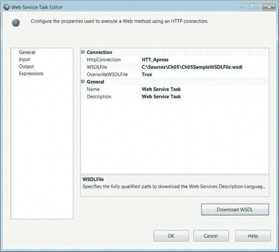
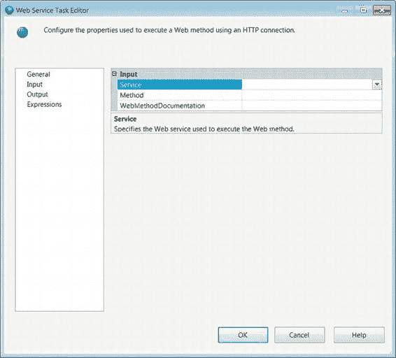
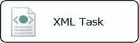

# SSIS 多样性的另一关键要点

SSIS 多样性的另一个关键要点是其能够连接到 Web 服务器并使用 Web 服务执行相应方法。`Web 服务任务`利用 `HTTP 连接管理器`来实现此类需求。图 5-35 展示了控制流中的此任务。该任务的图标与 `FTP` 任务的图标相似，区别在于 `Web 服务任务`图标上没有一个服务器叠加在地球上的图像。

地球图标表明该任务的操作是针对远程服务执行的。

*图 5-35. Web 服务任务*

##### Web 服务任务编辑器 — 常规页

`Web 服务任务`的“常规”页允许您定义连接到 Web 服务器所需的连接信息。这主要通过 `HTTP 连接管理器`完成，在设置任务的其余属性之前需要先定义它。图 5-36 显示了该任务编辑器的“常规”页。

[www.it-ebooks.info](http://www.it-ebooks.info/)

*图 5-36. Web 服务任务编辑器 — 常规页*

可用属性如下：

`HTTPConnection` 列出包中已定义的所有 `HTTP 连接管理器`。就像 `FTP` 连接一样，`HTTP` 连接仅支持 Windows 身份验证和匿名身份验证。

`WSDLFile` 提供用于针对 Web 服务器执行方法所需的 Web 服务描述语言文件的完整路径。该文件包含 Web 服务可用的方法及其参数。文件必须在运行时存在于定义的路径中。在设计时，您可以创建一个扩展名为 `.wsdl` 的新文件，并使用覆盖属性从 Web 服务下载它。

[www.it-ebooks.info](http://www.it-ebooks.info/)

`OverwriteWSDLFile` 指定是否应覆盖来自 Web 服务器的文件。此选项允许您从 Web 服务器下载最新文件并覆盖其本地副本。

`Name` 指定 `Web 服务任务`的名称。

`Description` 提供关于任务目标的简短说明。

`Download WSDL` 使用 `HTTP 连接管理器`从 Web 服务器下载 `WSDL` 文件。仅当提供了本地文件路径时，此按钮才可用。

##### Web 服务任务编辑器 — 输入页

`Web 服务任务`的“输入”页允许您指定 Web 服务器上的方法及其参数。任务将使用指定的 `HTTP 连接管理器`来调用该方法。它将使用 `WSDL` 文件来填充如图 5-37 所示的下拉列表。

*图 5-37. Web 服务任务编辑器 — 输入页*

[www.it-ebooks.info](http://www.it-ebooks.info/)

可在“输入”页上配置以下属性：

`Service` 是一个可用 Web 服务的下拉列表。选择执行方法所需的服务。

`Method` 从 Web 服务可执行的方法列表中选择一个方法。

`WebMethodDocumentation` 提供关于被调用的 Web 服务方法的描述。省略号按钮允许您输入多行描述。

`Name` 列出方法参数的名称。

`Type` 列出方法参数的数据类型。`Web 服务任务`支持基本数据类型，如整数和字符串。

`Variable` 列出将存储输入参数值的变量。

`Value` 允许您直接键入值。

#### XML 任务

SSIS 可用于对可扩展标记语言 (`XML`) 数据进行各种操作。数据可以以变量或文件的形式存储，甚至可以直接输入。提供的用于处理这些操作的任务是 `XML 任务`。操作的结果可以输出到文件中以供查看或进一步处理。图 5-38 显示了控制流中的此任务。其图标是一个包含在表示语言标记格式的标签内的地球。

*图 5-38. XML 任务*

