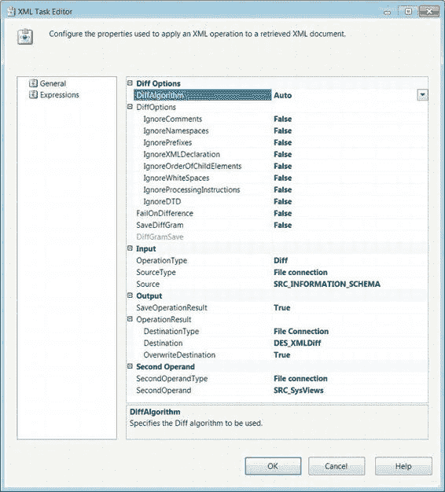
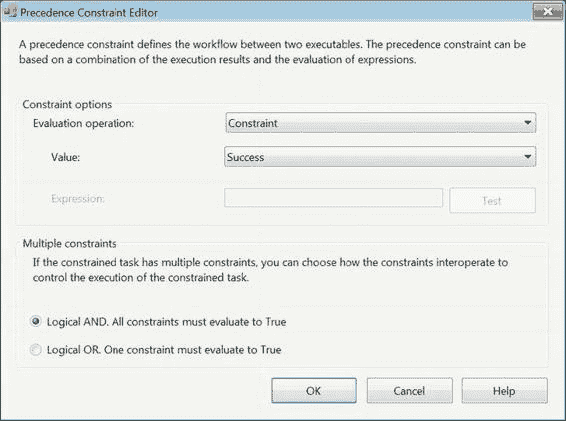

# XML 任务与优先级约束

#### XML 任务常规页面

如图 5-39 所示的 XML 任务常规页面允许您配置所有必要的属性。根据操作类型的不同，编辑器会动态变化，仅显示必要的属性。任务的一个必要组件是 XML 输入。

[www.it-ebooks.info](http://www.it-ebooks.info/)

*图 5-39. XML 任务编辑器—常规页面*

可用属性如下：

`OperationType` 定义了任务将执行的操作类型。选项包括 `Validate`、`XLST`、`XPATH`、`Merge`、`Diff` 和 `Patch`。`Validate` 可以将源输入与文档类型定义 (DTD) 或 XML 模式定义进行比较。`XLST` 将对源执行可扩展样式表语言转换。`XPATH` 将对源执行 XPath 查询。`Merge` 将比较两个输入，取第一个输入，然后将第二个输入的内容添加到第一个中。`Diff` 比较两个输入并将它们的差异写入 XML 差异文件 (`XML diffgram file`)。`Patch` 获取一个 XML 差异文件并将其应用于源输入，生成一个包含差异文件内容的新文档。

`SourceType` 定义了 XML 是通过直接输入 (`Direct input`)、文件连接 (`File connection`) 还是变量 (`Variable`) 来检索。

如果 `SourceType` 设置为直接输入 (`Direct input`)，则 `Source` 允许您将 XML 直接输入到文本字段中。对于文件连接或变量源，此选项是一个连接或变量的下拉列表，可供使用。

`SaveOperationResult` 允许您保存对 XML 源执行操作的结果。

`DestinationType` 允许您将操作结果保存在由连接管理器指向的文件中，或保存在变量中。

`Destination` 根据所选的目标类型，列出所有可用的文件连接或变量来存储输出。

`OverwriteDestination` 指定您是否希望用新输出覆盖目标的现有值。

`SecondOperandType` 定义了第二个 XML 输入是直接输入 (`Direct input`)、文件连接 (`File connection`) 还是变量 (`Variable`)。

`SecondOperand` 根据所选的操作数类型，列出所有可用的连接或变量。

`ValidationType` 允许您在 `DTD` 和 `XSD` 之间进行选择。`DTD` 将使用文档类型定义，而 `XSD` 允许您使用 XML 模式定义作为第二个操作数。此属性仅在 `Validate` 操作中可用。

`FailOnValidationFail` 将在执行返回失败时使任务失败。此属性仅在 `Validate` 操作中可用。

`PutResultSetInOneNode` 允许您将 XPath 操作的结果放入一个节点中。此属性仅在 `XPATH` 操作中可用。

`XPathOperation` 允许您选择 XPath 结果集类型。不同的结果集类型是 `Evaluation`、`Node list` 和 `Values`。`Evaluation` 返回 XPath 函数的结果。`Node list` 以 XML 形式返回某些节点。`Values` 仅将所选节点的值作为一个连接字符串返回。

`XPathStringSourceType` 定义了将标识第一个 XML 输入中合并位置的源类型。选项是直接输入 (`Direct input`)、文件连接 (`File connection`) 和变量 (`Variable`)。此属性仅在 `Merge` 操作中可用。

`XPathStringSource` 指向将标识 XML 输入合并位置的字符串。此属性仅在 `Merge` 操作中可用。

`DiffAlogrithm` 列出了可用于生成差异文件 (`Diffgram`) 的算法类型。`Auto` 选项允许 XML 任务确定操作的最佳算法。`Fast` 允许快速但准确性较低的比较。`Precise` 选项以性能为代价提供更准确的结果。此属性仅在 `Diff` 操作中可用。

`DiffOptions` 表示尝试执行 `Diff` 操作时可用的选项。`IgnoreXMLDeclaration` 允许您忽略 XML 声明。`IgnoreDTD` 允许您忽略 DTD。`IgnoreWhiteSpaces` 在比较文档时忽略空白字符的数量。`IgnoreNamespaces` 允许您忽略 XML 的统一资源标识符 (URI)。`IgnoreProcessingInstructions` 允许您比较多个处理指令。`IgnoreOrderOfChildElements` 允许您比较子元素的顺序。`IgnoreComments` 定义任务是否忽略注释节点。`IgnorePrefixes` 定义是否比较元素和属性名称的前缀。

`FailOnDifference` 定义任务在遇到 XML 输入之间的差异时是否失败。

`SaveDiffGram` 允许您保存作为比较操作结果生成的差异文件 (`Diffgram`)。

`DiffGramDestinationType` 允许您选择通过文件连接 (`file connection`) 或变量 (`variable`) 来保存生成的差异文件 (`Diffgram`)。

`DiffGramDestination` 允许您在包中定义的文件连接管理器或变量之间进行选择以存储差异文件 (`Diffgram`)。

#### 优先级约束

将可执行文件添加到控制流后，您可以定义执行顺序。执行顺序由您定义的*优先级约束*决定。当您未定义任何约束时，可执行文件将同时执行，例如 `Execute Process` 任务和 `Data Profiling` 任务的情况。要添加优先级约束，请单击任务，然后单击并拖动箭头到应接下来执行的任务。在任务之间有箭头连接后，您可以右键单击箭头并从菜单中选择一种类型；默认约束是 `Success`。约束可以在任务、容器和事件处理程序上定义。

有三种类型的优先级约束。第一种约束由绿色箭头表示，是*成功约束* (`Success constraint`)。它仅当先前的可执行文件成功完成时，才允许受约束的可执行文件运行。第二种约束由蓝色箭头表示，是*完成约束* (`Completion constraint`)。完成约束仅当优先可执行文件完成其执行时，才允许受约束的可执行文件运行。完成约束不区分成功执行和返回错误的执行。第三种约束由红色箭头表示，是*失败约束* (`Failure constraint`)。失败约束仅当先前的可执行文件返回错误时，才会运行受约束的可执行文件。优先级约束也可以配置为使用表达式。图 5-40 显示了优先级约束编辑器。

[www.it-ebooks.info](http://www.it-ebooks.info/)

*图 5-40. 优先级约束编辑器*

优先级约束编辑器允许您专门配置有关受约束可执行文件执行的属性。以下是可配置属性：

`Evaluation Operation` 指定受约束可执行文件的约束元素。此属性的选项是 `Expression`、`Constraint`、`ExpressionAndConstraint` 和 `ExpressionOrConstraint`。`Expression` 表示仅当表达式计算结果为 `True` 时，受约束的可执行文件才会执行。`Constraint` 选项将允许可执行文件仅受约束值的约束。`ExpressionAndConstraint` 将要求约束的结果和表达式的评估都允许可执行文件的执行。`ExpressionOrConstraint` 选项将要求约束或表达式和表达式计算结果为 `True` 或 `FALSE`。

`Value` 定义可执行文件的约束元素。先前可执行文件的执行必须评估为此值，受约束的可执行文件才能执行。此属性的选项是 `Completion`、`Success` 和 `Failure`。

#### 多重约束

多重约束指定当可执行文件被多次约束时，其执行所需的条件。两个选项是逻辑与（Logical AND）和逻辑或（Logical OR）。

这些选项将对指定的所有约束执行逻辑与或逻辑运算，以决定受约束的可执行文件是否执行。

[www.it-ebooks.info](http://www.it-ebooks.info/)

