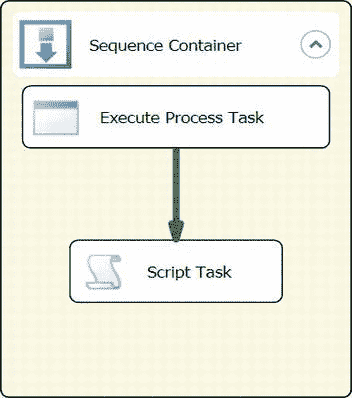

# 第 5 章 控制流基础

对于图 5-41 所示的示例，执行进程任务和数据剖析任务将同时执行。只有当执行进程任务成功执行时，脚本任务才会执行。批量插入任务将在执行进程任务完成其操作后执行。

只有当执行进程任务在执行过程中失败时，发送邮件任务才会执行。在任何一次执行中，你将会看到脚本任务和批量插入任务的组合，或者发送邮件任务和批量插入任务的组合同时执行，因为这些任务仅受执行进程任务约束。

**注意：** 一个可执行文件可以约束多个可执行文件，也可以被多个可执行文件约束。

约束的类型也可以变化。这将允许一个可执行文件仅在达成特定执行结果时运行。一个可执行文件不能约束或优先于自身。

*图 5-41. 优先级约束与并行任务*

### 基本容器

向控制流添加大量任务可能会使阅读 SSIS 包变得困难。避免控制流混乱的方法之一是使用容器。*容器* 允许你将多个任务甚至其他容器分组在一起。SSIS 提供了三种类型的容器：For Loop 容器、Foreach Loop 容器和 Sequence 容器。本节介绍 Sequence 容器。另外两种容器我们留到第 6 章介绍。SSIS 中还存在另一种组织方法，即分组。它并不是严格意义上的容器，但它使包在视觉上更易读。

### 容器

默认情况下，所有三种容器都组织在 SSIS 工具箱的“容器”文件夹中。它们可以被移动到“收藏夹”和“常用”组中。容器将 SSIS 包模块化。它们可用于限制变量的作用域，以便你可以定义变量，使其仅能由父容器内包含的任务和容器访问。变量的作用域是变量定义的一部分，并存在于“参数和变量”窗口的变量列表列中。容器内的可执行文件在包内创建了一个子例程。在容器内定义的任务无法启动容器外的任务或容器的执行。容器名称右侧的箭头允许你折叠容器内容以便配置。

[www.it-ebooks.info](http://www.it-ebooks.info/)

