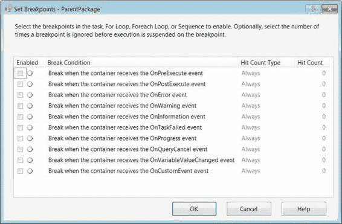

# 第 5 章 控制流基础

**提示：** 在包中频繁使用容器，使你能够在 Visual Studio 的调试模式下执行容器内的所有对象。你不能执行整个包，而只能执行容器内的可执行文件。为此，只需右键单击容器并选择“执行容器”。为了进入调试模式，需要将包作为项目的一部分打开。

图 5-42 展示了 Sequence 容器的一个潜在用途。容器的图标是一个蓝色方形轮廓，内含一个实心蓝色方块和一个蓝色箭头。该图标显示了几个可能被容器包含的可执行文件。执行进程任务是第一个执行的任务，然后受其约束的脚本任务仅在第一个任务成功执行时才会执行。

**注意：** 序列容器支持事务属性，允许执行 SQL 任务作为单个事务执行。

*图 5-42. Sequence 容器*

### 分组

SSIS 控制流中的*分组*不是容器，但它们提供了一些容器所具备的组织优势。我们不建议使用分组，因为它们可能导致 SSIS 意大利面条式代码（杂乱无章的代码）。

与容器不同，分组不会隔离其内部的可执行文件。它们允许在分组内部和外部对象之间创建优先级约束，如图 5-43 所示。在此示例中，我们有一个执行 SQL 任务优先于一个数据流任务。看起来数据流任务和文件系统任务应该一起执行，但实际上执行 SQL 任务和文件系统任务将同时执行。与容器类似，分组可以折叠它们包含的对象。

**注意：** 分组不允许你执行它们包含的对象。它们仅仅允许你进行视觉上的组织。

*图 5-43. 分组*

### 断点

在包中对象执行期间，每个可执行文件都会触发事件。Visual Studio 的调试模式允许你创建*断点*，这些断点将侦听这些事件并暂停执行。

断点可以在控制流中的任务、容器和整个包上定义。要创建断点，必须右键单击对象并选择“编辑断点”。此选项将打开如图 5-44 所示的对话框。

[www.it-ebooks.info](http://www.it-ebooks.info/)

