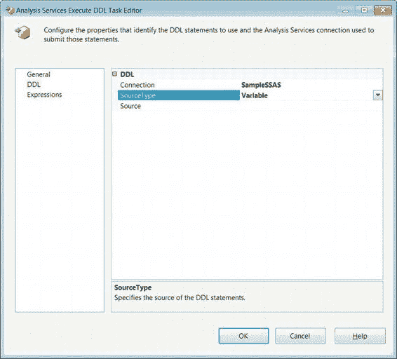

# 第六章：高级控制流任务

本章介绍了基本的控制流项，这些项将使您能够利用第四章介绍的一些连接管理器。控制流设计器窗口使用 SSIS 工具箱来添加可执行文件。这些可执行文件和容器按可自定义的组进行组织，以适应您的开发习惯。本章介绍了“收藏夹”和“常用”组。优先约束定义了对象执行的顺序和条件。容器可用于使包模块化。本章介绍了序列容器。断点可在调试模式下使用，具体取决于目标对象引发的事件。第六章涵盖了剩余的任务和容器。

[www.it-ebooks.info](http://www.it-ebooks.info/)

> 阻止历史重演是徒劳的，因为人的本性总会让重复变得无法避免。
> ——作者 马克·吐温

第五章向您介绍了 SQL Server 12 中最广泛使用的可执行文件、容器和优先约束。这些可执行文件和容器在 SSIS 工具箱中按可配置的组进行组织。

我们已经介绍了“收藏夹”和“常用”组，以及其中一种容器。本章将介绍“其他任务”组中的剩余任务以及剩余的容器。这些任务和容器通常为数据库对象执行管理任务。容器被设计为重复执行其中包含的进程。正如前面的引言所暗示的，多次执行某些进程可能是 ETL 设计的必要组成部分。本章讨论的容器支持对某些进程进行受控的、重复的执行。

### 高级任务

前一章详细介绍的任务帮助我们为 ETL 过程准备源和目标。剩余的“其他任务”组由执行管理目标的任务组成。大部分任务处理在数据库之间传输数据库对象。

> 注意：由于 DTS 包将来不再受 SQL Server 支持，ActiveX 脚本任务和执行 DTS 2000 包任务已被弃用。

#### Analysis Services 执行 DDL 任务

*Analysis Services 执行 DDL 任务*允许您针对 SQL Server Analysis Services (SSAS) 数据库执行 DDL 语句。此任务能够创建、删除和更改 Analysis Services 数据库上的数据挖掘对象以及多维对象。图 6-1 展示了此任务在控制流设计器窗口中的外观。图标是一个带有绿色箭头指向的立方体，显示了 SSIS 任务访问 Analysis Services 对象的能力。

**图 6-1. Analysis Services 执行 DDL 任务**

修改此任务主要通过 `Analysis Services Execute DDL Task Editor` 的 DDL 页面处理，如图 6-2 所示。需要一个指向 SSAS 数据库的连接管理器来使用此任务。可以在“连接”下拉列表中指定该连接管理器。`SourceType` 允许您在“直接输入”、“文件连接”和“变量”之间进行选择。此字段指定了要执行的 DDL 的位置。“直接输入”允许您直接在任务中填写 DDL。“文件连接”指定一个指向包含 DDL 文件的连接。“变量”选项将 DDL 存储在 SSIS 字符串变量中。使用“直接输入”选项时，`SourceDirect` 字段允许您键入 DDL。“文件连接”和“变量”选项会将字段名称更改为 `Source`，并允许您从下拉列表中选择已定义的文件连接或 SSIS 变量。“常规”页面允许您修改任务的 `Name` 和 `Description`。“表达式”页面允许您定义可以修改任务属性值的表达式。

