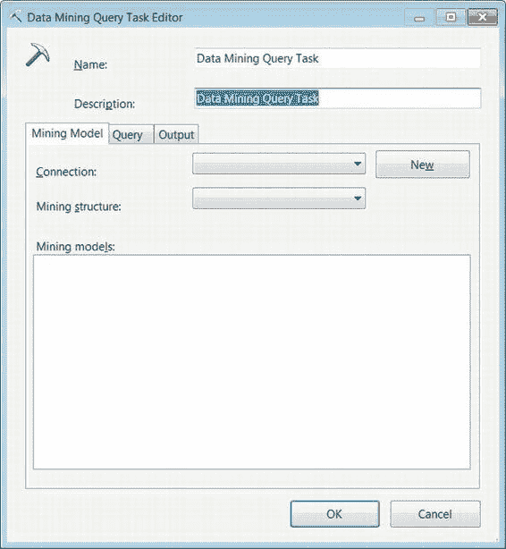
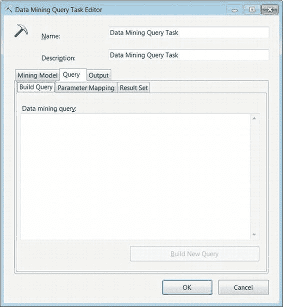

# 第 6 章 - 高级控制流任务

任务的数据定义语言（DDL）是用 Analysis Services 脚本语言（`ASSL`）编写的。`ASSL` 包含定义 Analysis Services 数据库及数据库对象的信息。这包括登录信息和其他敏感信息。`ASSL` 存储在 Analysis XML（`XMLA`）命令的 XML 中。`XMLA` 命令用于在服务器上创建、删除和更改对象。

**提示：** 如果你将 DDL 直接放入包中，你可能需要考虑使用 `EncryptAllWithUserKey` 或 `EncryptAllWithPassword` 保护级别。因为 `XMLA` 可能包含敏感信息，建议对其进行加密。

#### 数据挖掘查询任务

`数据挖掘查询任务` 允许你运行基于 Analysis Services 数据库上定义的数据挖掘模型的数据挖掘扩展（`DMX`）语句。这些查询的输出通常是基于所提供数据的预测分析。`DMX` 语句可以引用多个模型，每个模型使用其自己的预测算法。图 6-3 显示了该任务在控制流设计器窗口中的样子。其图标——一把鹤嘴锄和后面的一些文件——展示了数据挖掘背后的基本思想，即挖掘可用数据以找到有意义的部分。此任务利用 `ADO.NET` 连接管理器来连接到 Analysis Services 数据库。

*图 6-3. 数据挖掘查询任务*

##### 数据挖掘查询任务编辑器——挖掘模型选项卡

数据挖掘任务编辑器的“挖掘模型”选项卡允许你为特定查询指定要使用的数据库和挖掘模型。图 6-4 显示了该编辑器此页面上的可用选项。这个特定任务编辑器的用户界面（UI）与你目前遇到的其他编辑器不同。它不是将页面列在字段选项的左侧，而是以选项卡的形式显示页面。

[www.it-ebooks.info](http://www.it-ebooks.info/)

*图 6-4. 数据挖掘任务编辑器——挖掘模型选项卡*

以下是“挖掘模型”选项卡中可修改的属性：

- `名称` 唯一地定义数据挖掘任务。
- `描述` 简要概述任务的用途。
- `连接` 允许你选择一个已定义的到 Analysis Services 数据库的连接。
- `新建` 创建一个新的 SQL Server Analysis 连接。
- `挖掘结构` 列出在 Analysis Services 数据库上定义的所有挖掘结构。
- `挖掘模型` 列出在所选挖掘结构上创建的所有挖掘模型。

[www.it-ebooks.info](http://www.it-ebooks.info/)

##### 数据挖掘查询任务编辑器——查询选项卡

数据挖掘任务编辑器的“查询”选项卡允许你手动键入查询或使用图形工具来创建所需的查询。该查询接受 `SSIS` 变量作为参数。它也可以将查询结果存储到 `SSIS` 变量中。第 5 章中显示的参数映射规则也适用于此任务。参数的命名约定取决于所使用的连接管理器类型，在此情况下是用于 Analysis Services 的 `ADO.NET` 连接管理器。这些修改中的每一个在“查询”选项卡内都有其自己的选项卡，如图 6-5 所示。

*图 6-5. 数据挖掘查询任务编辑器——查询选项卡*

以下属性在“查询”选项卡中是可配置的：

- `构建查询` 包含一个文本字段，允许你键入数据挖掘查询。
- `构建新查询` 按钮打开一个图形工具，该工具将协助你生成数据挖掘查询。查询生成后，它将从工具导入到文本字段中。在它进入字段后，你可以进一步修改它。
- `参数名称` 列出数据挖掘查询使用的参数。

