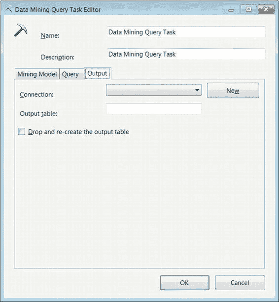
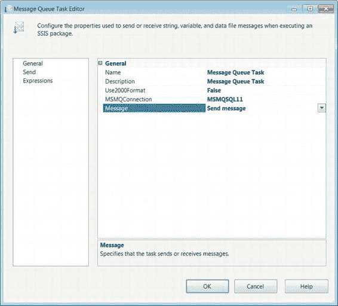
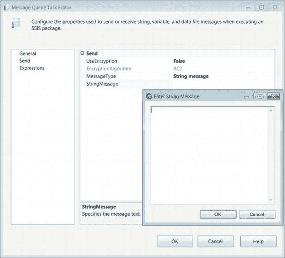
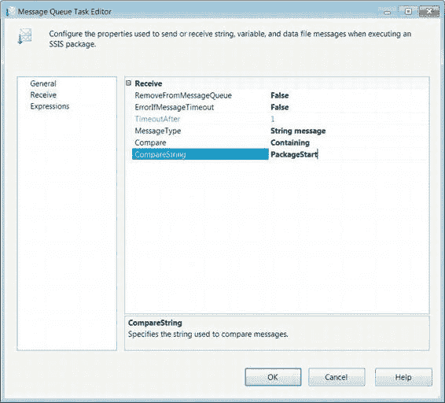
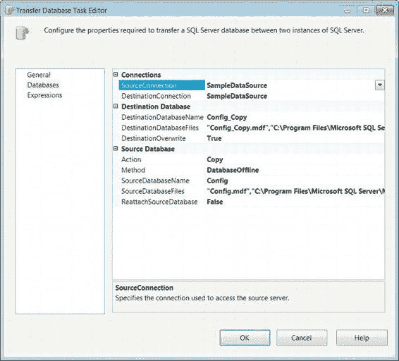

# 第六章 - 高级控制流任务

##### 数据挖掘查询任务编辑器 - 输出选项卡

`变量名`列出了映射到特定参数的 SSIS 变量。

`添加`按钮向参数列表添加一个映射。

`删除`按钮从参数列表中移除选定的映射。

`结果名称`是数据挖掘查询结果的名称。可以更改为查询提供的实际结果名称。

`变量名`指定用于存储结果集的变量。

`结果类型`允许您将结果定义为单行或数据集。

`添加`按钮允许您为结果值添加映射。

`删除`按钮允许您从结果列表中移除现有映射。

`数据挖掘查询任务编辑器`的`输出`选项卡允许您存储数据挖掘查询的输出。存储仅由 `ADO.NET` 和 `OLE DB` 连接处理。图 6-6 显示了`数据挖掘查询任务编辑器`的`输出`选项卡。数据可以插入到 SQL Server 表中以便进一步查询。

[www.it-ebooks.info](http://www.it-ebooks.info/)

*图 6-6. 数据挖掘查询任务编辑器 — 输出选项卡*

`输出`选项卡支持配置以下属性：

`连接`列出了包中已定义的所有 `ADO.NET` 和 `OLE DB` 连接。

`新建`按钮在所需连接尚不存在时创建一个新的 `ADO.NET` 或 `OLE DB` 连接。

`输出表`提供用于存储数据挖掘查询结果的表名。

[www.it-ebooks.info](http://www.it-ebooks.info/)

`删除并重新创建输出表`允许您通过删除并重建表来清除先前的数据。这使得可以无问题地加载元数据更新。

#### 消息队列任务

`消息队列任务`使用 Microsoft 消息队列 (`MSMQ`) 在 SSIS 包之间或在自定义应用程序之间发送消息。消息本身可以由文本组成，并且可以携带数据文件或 SSIS 变量值。在 ETL 解决方案中使用`消息队列任务`有一些主要原因。利用消息队列的一种方式是暂停包的执行，直到该包收到特定消息。这允许外部的、非 ETL 的进程完成，然后立即启动 ETL。除了可以挂起 SSIS 包之外，此任务还可以将文件作为其消息的一部分进行传输。该文件可以是 ETL 过程的输出，也可以是外部进程用来指示数据源文件已准备好供 SSIS 访问的信号。此任务还可用于跨系统传输文件。图 6-7 显示了该任务在控制流中的外观。图标包含两个重叠的信封，一个向下的蓝色箭头指定了有序传输。

**注意：** 默认情况下，Microsoft 消息队列服务在旧版本的 Microsoft 操作系统上未启动。在较新的操作系统（Vista 及更高版本，以及 Server 2008 及更高版本）上，您需要安装相应的 Windows 功能才能使用该服务。

*图 6-7. 消息队列任务*

##### 消息队列任务编辑器 - 常规页

`消息队列任务编辑器`的`常规`页面允许您定义任务是负责发送还是接收消息。根据任务的角色，可用页面会自动修改以允许`发送`或`接收`选项。图 6-8 显示了`消息队列任务编辑器`的`常规`页面。

[www.it-ebooks.info](http://www.it-ebooks.info/)

*图 6-8. 消息队列任务编辑器 — 常规页*

`常规`页面上可配置的属性如下：

`名称`为`消息队列任务`提供一个唯一的名称。

`描述`提供关于特定`消息队列任务`目标的简要说明。

`Use2000Format`指定是否使用 2000 版本的消息队列。

`MSMQ 连接`列出了所有已定义的 Microsoft 消息队列连接。

## 第六章  高级控制流任务

管理器。此字段还允许你在连接管理器不存在时创建一个。

[www.it-ebooks.info](http://www.it-ebooks.info/)

`Message` 允许你选择任务是发送还是接收消息。此选项将修改编辑器中可用的页面。

##### 消息队列任务编辑器 — 发送页面

消息队列任务编辑器的“发送”页面仅在 `Message` 属性选择“发送”选项时才可用。此特定页面允许你修改与向其他应用程序或包发送消息相关的属性。图 6-9 显示了所有可供修改的属性。

**图 6-9. 消息队列任务编辑器 — 发送页面**

[www.it-ebooks.info](http://www.it-ebooks.info/)

消息队列任务的属性如下：

`UseEncryption` 指定消息是否加密。
`EncryptionAlgorithm` 指定要使用的加密算法的名称。此属性仅在 `UseEncryption` 属性设置为 `True` 时才可用。MSMQ 唯一支持的加密算法是 RC2 和 RC4 算法。与较新的算法相比，这些算法相对较弱，因此在实施消息队列任务前需要仔细评估。
`MessageType` 定义任务将传输的消息类型。选项有：数据文件消息、变量消息和字符串消息。选择不同的选项将自动更改编辑器中随后显示的属性。
`DataFileMessage` 传输存储在文件中的消息。省略号按钮允许你导航到所需文件。
`VariableMessage` 表示消息存储在 SSIS 变量中。
`StringMessage` 表示消息存储在直接提供的字符串中。如图 6-9 所示，可以使用文本框输入较长的消息。

##### 消息队列任务编辑器 — 接收页面

消息队列任务编辑器的“接收”页面仅在 `Message` 属性选择“接收”选项时才可用。此页面允许修改当包从 MSMQ 接收消息时可以设置的属性。某些配置将允许包仅接收非常特定的消息。图 6-10 显示了消息队列任务的接收页面。“表达式”页面允许你定义可以修改任务属性值的表达式。

[www.it-ebooks.info](http://www.it-ebooks.info/)

**图 6-10. 消息队列任务编辑器 — 接收页面**

消息队列任务的属性如下：

`RemoveFromMessageQueue` 指示消息在被包接收后是否应从 MSMQ 服务中删除。
`ErrorIfMessageTimeOut` 指定任务在超时时是否应失败。
`TimeoutAfter` 定义任务超时的时间长度（以秒为单位）。
[www.it-ebooks.info](http://www.it-ebooks.info/)

`MessageType` 列出任务可以预期的消息类型。选择选项将动态修改编辑器中可供修改的属性。选项有：数据文件消息、变量消息、字符串消息以及字符串消息到变量。
`SaveFileAs` 定义消息将存储到的文件的名称和位置。仅当消息类型选择“数据文件消息”选项时，此属性才可用。
`Overwrite` 允许在存储新消息之前删除文件先前的内容。仅当消息类型选择“数据文件消息”选项时，此属性才可用。
`Filter` 标识包是否接收来自特定包的消息。此属性有两个选项：“无筛选”和“来自包”。“无筛选”表示任务不筛选掉消息。“来自包”选项接收来自特定包的消息。此属性仅适用于数据文件消息和变量消息。
`IdentifierReadOnly` 可包含消息可能来源包的 `GUID`。仅当 `Filter` 属性设置为“无筛选”时，此选项才可用。它是只读的。此属性仅适用于数据文件消息和变量消息。
`Identifier` 包含任务将从中接收消息的包的 `GUID`。也可以通过使用省略号按钮定位包来指定包的名称。此属性仅适用于数据文件消息和变量消息。
`Compare` 定义用于比较和筛选消息的匹配条件。可用的选项有：无、精确匹配、忽略大小写和包含。根据所选选项，`CompareString` 属性将变为可修改。“无”选项不允许对接收到的任何消息进行比较。“精确匹配”根据提供字符串的完全匹配来筛选消息。“忽略大小写”根据不区分大小写的匹配来筛选消息。“包含”匹配将根据消息包含提供的字符串来筛选消息。此属性仅适用于字符串消息和字符串消息到变量。
`CompareString` 定义将用于比较条件的字符串。此属性仅适用于字符串消息和字符串消息到变量。
`Variable` 指定将接收消息的变量。如果尚未定义，省略号按钮允许你创建一个新变量来接收消息。仅当消息类型选择“变量消息”选项时，此选项才可用。仅当选择“字符串消息到变量”时，此属性才可用。

#### 传输数据库任务

ETL 过程的一个关键非功能性任务可能是将源数据库移动到具有适当硬件、可以支持 ETL 查询的不同服务器上。传输数据库任务允许你在服务器之间甚至在同一服务器上移动或复制数据库。复制和移动过程可以在离线和在线模式下操作数据库。任务利用 SQL 管理对象连接管理器来移动数据库。图 6-11 显示了该任务在控制流设计器窗口中的样子。图标是一个黄色圆柱体，带有一个弯曲的箭头，表示数据库正在传输。

[www.it-ebooks.info](http://www.it-ebooks.info/)

**图 6-11. 传输数据库任务**

传输数据库任务编辑器的“数据库”页面（如图 6-12 所示）包含将配置数据库传输的属性。在这个特定示例中，我们只是复制一个数据库、其 `.mdf`（主数据文件）和 `.ldf`（日志数据文件）文件。除了这些文件的位置外，我们还需要指定文件的网络文件共享位置。“常规”页面允许你修改任务的名称和描述。“表达式”页面允许你定义可以修改任务属性值的表达式。

**图 6-12. 传输数据库任务编辑器 — 数据库页面**

[www.it-ebooks.info](http://www.it-ebooks.info/)

可配置的属性如下：

`SourceConnection` 列出包中定义的所有 SMO 连接管理器。选择包含你需要复制或移动的数据库的连接。如果所需连接不存在，它允许创建新连接。
`DestinationConnection` 指定到源数据库应复制或移动到的服务器的 SMO 连接。
`DestinationDatabaseName` 指定移动或复制到目标服务器后的数据库名称。

