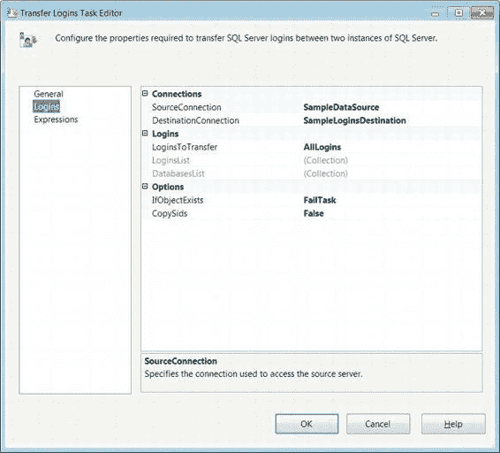
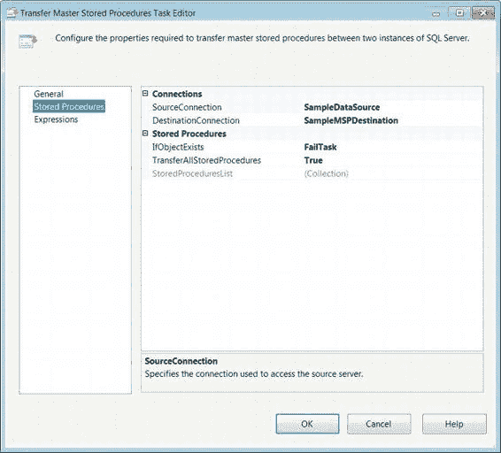
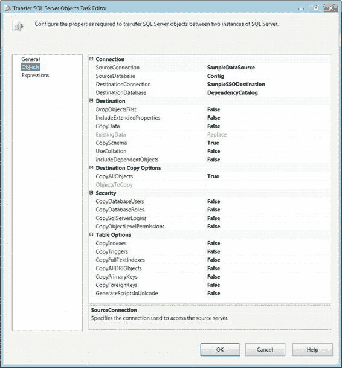
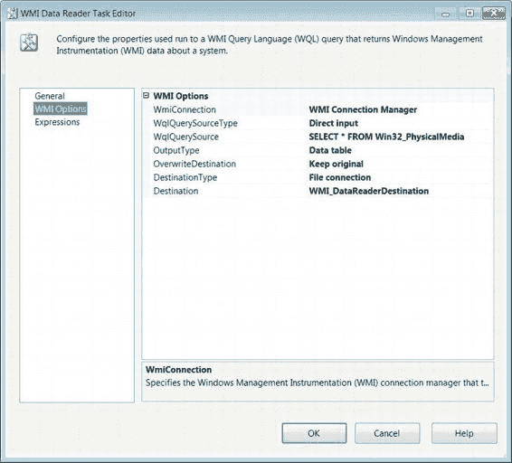
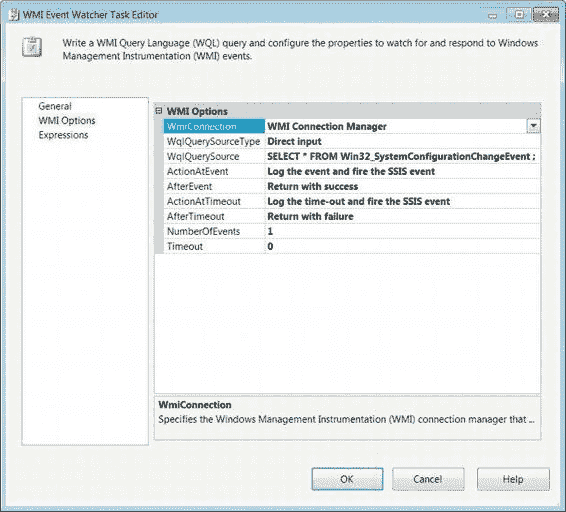
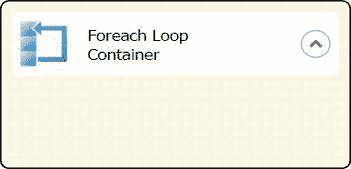

# 第 6 章 高级控制流任务

#### 传输登录名任务

登录名对于访问数据库中的数据至关重要。它们可以限制对数据库中不同对象的访问。`传输登录名`任务提供了一种在 SQL Server 实例之间快速复制登录名的方法。此任务可以复制所有登录名、指定的登录名，或特定数据库的登录名。该任务使用`SMO 连接管理器`来传输登录名。执行该包的用户必须在两台服务器上都具有`sysadmin`访问权限才能传输登录名。图 6-17 展示了该任务在控制流中的样子。图标显示了一个人物、一个锁和一个箭头。锁和人物图标代表了将要传输的安全信息。

*图 6-17. 传输登录名任务*

如图 6-18 所示的“登录名”页面，允许您配置所有必要的属性，以便在两个 SQL Server 实例之间传输 SQL Server 登录名。“常规”页面允许您修改任务的`名称`和`描述`。“表达式”页面允许您定义可以修改任务属性值的表达式。

[www.it-ebooks.info](http://www.it-ebooks.info/)

*图 6-18. 传输登录名任务编辑器—登录名页面*

“登录名”页面允许配置以下属性：

- `源连接`列出了可用作 SQL Server 登录名源的`SMO 连接管理器`。
- `目标连接`列出了可用作 SQL Server 登录名目标的`SMO 连接管理器`。
- `要传输的登录名`允许您定义要传输到目标的登录名。`所有登录名`选项会将源 SQL Server 实例上定义的所有登录名复制到目标服务器 SQL Server 实例。`选定的登录名`允许您枚举要传输到目标的特定登录名。`选定数据库的所有登录名`要求您指定要传输到目标的登录名；但是，登录名会受到`数据库列表`属性的进一步限制。
- `登录名列表`根据为`要传输的登录名`选择的选项，枚举要传输到目标的特定登录名。省略号按钮为您提供服务器上所有登录名的列表以供选择。如果指定了数据库列表，此列表将受到限制。
- `数据库列表`仅枚举您需要传输其登录名的数据库。
- `如果对象存在`定义了任务如何处理重复项。此属性的选项是`失败任务`、`覆盖`和`跳过`。`失败任务`导致任务在目标服务器上遇到现有登录名时出错。`覆盖`使用源定义重新创建登录名。`跳过`则保持目标服务器上的登录名不变。
- `复制 SID`指定复制操作是否应包含登录名的安全标识符。在传输数据库时，将此属性设置为`True`至关重要，否则登录名将不被目标数据库识别。

#### 传输 Master 存储过程任务

在生成新的 SQL Server 实例时，通常需要源 SQL Server 实例的 master 数据库上的用户定义存储过程。`传输 Master 存储过程任务`允许您使用`SMO 连接管理器`执行此操作。执行包的用户需要对源 SQL Server 实例上的 master 存储过程具有读取访问权限，并且在目标服务器上具有`sysadmin`权限才能创建它们。图 6-19 显示了该任务在控制流中的样子。图标是一个带有箭头的应用程序窗口，类似于存储过程，因为过程包含若干语句。

*图 6-19. 传输 Master 存储过程任务*

如图 6-20 所示的`传输 Master 存储过程任务编辑器`的“存储过程”页面，允许您配置所有必要的属性，以便在两个 SQL Server 实例的 master 数据库之间复制 master 存储过程。该任务将仅根据名称唯一标识 master 存储过程。“常规”页面允许您修改任务的`名称`和`描述`。“表达式”页面允许您定义可以修改任务属性值的表达式。

[www.it-ebooks.info](http://www.it-ebooks.info/)

*图 6-20. 传输 Master 存储过程任务编辑器—存储过程页面*

“存储过程”页面提供以下属性供配置：

- `源连接`标识要用作 master 存储过程源的`SMO 连接管理器`。
- `目标连接`标识要用作 master 存储过程目标的`SMO 连接管理器`。
- `如果对象存在`允许您管理目标 SQL Server 实例上是否存在该 master 存储过程。`失败任务`选项导致任务在目标服务器上遇到重复的 master 存储过程时出错。选择`覆盖`会使用源服务器上的定义重新创建该 master 存储过程。`跳过`则保持目标服务器上的 master 存储过程定义不变。
- `传输所有存储过程`允许您选择复制源 master 数据库上的所有用户定义存储过程还是指定集合。将此属性设置为`True`可启用`存储过程列表`属性以进行编辑。
- `存储过程列表`指定您需要复制到目标服务器的用户定义存储过程列表。省略号按钮打开一个对话框，列出所有可供传输的可用存储过程。

#### 传输 SQL Server 对象任务

从 SQL Server 数据库传输选定数据和对象的一种方法是使用`传输 SQL Server 对象任务`。通过组合多个此类任务，您可以从多个 SQL Server 数据库复制对象，并在一个 SQL Server 数据库中创建它们。此功能非常有用，特别是当您打算使用一个暂存数据库在类似系统中存储数据作为 ETL 过程的预处理步骤时。我们将在第 14 章中讨论更多关于预处理数据的选项。图 6-21 显示了该任务在控制流设计器窗口中的样子。图标是一个带有指示传输箭头的脚本上的圆柱体，代表了传输过程中将使用的各种数据库对象的脚本。

*图 6-21. 传输 SQL Server 对象任务*

如图 6-22 所示的`传输 SQL Server 对象任务`的“对象”页面，允许您配置所有必要的属性，以便在数据库之间传输所需的对象。实际的传输将利用`SMO 连接管理器`。“常规”页面允许您修改任务的`名称`和`描述`。“表达式”页面允许您定义可以修改任务属性值的表达式。

[www.it-ebooks.info](http://www.it-ebooks.info/)

*图 6-22. 传输 SQL Server 对象任务编辑器—对象页面*

“对象”页面允许您修改以下上下文相关的属性：

- `源连接`选择将作为数据库对象源的`SMO 连接管理器`。
- `源数据库`列出源 SQL Server 实例上存在的所有数据库以获取数据库对象。选择包含您需要复制的对象的数据库。
- `目标连接`选择指向目标服务器的`SMO 连接管理器`。

##### 属性参考

##### 控制复制行为的属性

`DestinationDatabase` 指定你希望包含新对象的数据库名称。在分配此字段之前，该数据库必须已在服务器上存在。

`DropObjectsFirst` 决定在传输前是否应删除正在传输的现有对象。

`IncludeExtendedProperties` 指定是否应将对象已定义的扩展属性也复制到目标。

`CopyData` 指定是否应随对象一起复制数据。

`ExistingData` 定义数据是应替换还是附加到目标数据库中的现有数据。仅当 `CopyData` 属性设置为 `True` 时，此选项才可用于编辑。

`CopySchema` 定义是否应随对象一起复制架构。

`UseCollation` 定义是使用目标服务器的默认排序规则，还是从源数据库复制。

`IncludeDependentObjects` 指定所选对象是否应级联到它们所依赖的对象。

##### 对象复制范围的属性

`CopyAllObjects` 定义是否应将源数据库中所有已定义的对象复制到目标。如果此选项设置为 `False`，则需要手动设置所有必需的对象。

`ObjectsToCopy` 展开以显示所有可复制的对象类型。对于每种类型，都有一个属性用于复制该类型的所有对象。对象类型包括：程序集、分区函数、分区架构、架构、用户定义聚合、用户定义类型和 XML 架构集合。每种对象类型都有一组属性。

##### 具体对象类型的列表属性

`CopyAllTables` 决定是否要复制源数据库中的所有表。
`TablesList` 指定应从源数据库复制的表。

`CopyAllViews` 决定是否要复制源数据库中的所有视图。
`ViewsList` 指定应从源数据库复制的视图。

`CopyAllStoredProcedures` 决定是否要复制源数据库中的所有存储过程。
`StoredProceduresList` 指定应从源数据库复制的存储过程。

`CopyAllUserDefinedFunctions` 决定是否要复制源数据库中的所有用户定义函数。
`UserDefinedFunctionsList` 指定应从源数据库复制的用户定义函数。

`CopyAllDefaults` 决定是否要复制源数据库中的所有默认定义。
`DefaultsList` 指定应从源数据库复制的默认值。

`CopyAllUserDefinedDataTypes` 决定是否要复制源数据库中的所有用户定义数据类型。
`UserDefinedDataTypesList` 指定应从源数据库复制的用户定义数据类型。

`CopyAllPartitionFunctions` 决定是否应复制源数据库上定义的所有分区函数。
`PartitionFunctionsList` 指定应从源数据库复制的分区函数。

`CopyAllPartitionSchemas` 决定是否应复制源数据库上定义的所有分区架构。
`PartitionSchemasList` 指定应从源数据库复制的分区架构。

`CopyAllSchemas` 决定是否应复制源数据库中的所有架构。
`SchemasList` 指定应从源数据库复制的架构。

`CopyAllSqlAssemblies` 决定是否应复制源数据库中的所有 SQL 程序集。
`SqlAssemblies` 指定应从源数据库复制的 SQL 程序集。

`CopyAllUserDefinedAggregates` 决定是否应复制源数据库中的所有用户定义聚合。
`UserDefinedAggregatesList` 指定应从源数据库复制的用户定义聚合。

`CopyAllUserDefinedTypes` 决定是否应复制源数据库中的所有用户定义类型。

`UserDefinedTypes` 指定应从源数据库复制的用户定义类型。

`CopyAllXmlSchemaCollections` 决定是否应复制源数据库中定义的所有 XML 架构集合。

[www.it-ebooks.info](http://www.it-ebooks.info/)

## 第 6 章  高级控制流任务

`XmlSchemaCollections` 指定应从源数据库复制的 XML 架构集合。

`CopyDatabaseUsers` 指定是否应传输源数据库上定义的数据库用户。

`CopyDatabaseRoles` 指定是否应传输源数据库上定义的数据库角色。

`CopySqlServerLogins` 指定是否应传输 SQL Server 实例的登录名。

`CopyObjectLevelPermissions` 指定是否应传输源数据库上的对象级权限。

`CopyIndexes` 决定是否应传输源数据库上的所有索引。

`CopyTriggers` 决定是否应传输源数据库上的所有触发器。

`CopyFullTextIndexes` 决定是否应传输源数据库上的所有全文索引。

`CopyPrimaryKeys` 决定是否应传输源数据库上的所有主键。

`CopyForeignKeys` 决定是否应传输源数据库上的所有外键。

`GenerateScriptsInUnicode` 决定传输中使用的所有脚本是否应以 Unicode 生成。

#### WMI 数据读取器任务

SQL Server Integration Services 一项极其有用的功能是能够查询主机或其他计算机的 Windows 日志。`WMI 数据读取器任务` 使用 Windows Management Instrumentation 查询语言 (`WQL`) 从 WMI 返回有关计算机的数据。

查询可以返回有关计算机的 Windows 事件日志、硬件以及已安装应用程序的信息。图 6-23 显示了该任务在控制流中的样子。图标是一个带有工具的剪贴板，表示诊断或检查清单。

`图 6-23. WMI 数据读取器任务`

WMI 数据读取器任务的 WMI 选项页（如图 6-24 所示）允许你配置所有必要的属性以查询和存储相关的计算机信息。如该页所示，`WQL` 查询与 `SQL` 查询非常相似。常规页允许你修改任务的名称和描述。表达式页允许你定义可以修改任务属性值的表达式。

[www.it-ebooks.info](http://www.it-ebooks.info/)

## 第 6 章  高级控制流任务

`图 6-24. WMI 数据读取器任务编辑器—WMI 选项页`

WMI 选项页提供以下属性的配置：
- `WMIConnectionName` 列出指向你需要查询的 Windows 计算机的 WMI 连接管理器。
- `WQLQuerySourceType` 定义向任务传递查询的方法。`直接输入` 选项允许你在 `WQLQuerySource` 字段中键入 `WQL` 查询。`文件连接` 表示查询存储在可通过文件连接管理器访问的文件中。`变量` 选项允许查询存储在 SSIS 变量中。
- `WQLQuerySource` 标识查询的访问方法。选择 `直接输入` 时，你可以在此字段中键入查询。

[www.it-ebooks.info](http://www.it-ebooks.info/)

## 第 6 章  高级控制流任务

- `OutputType` 定义查询的结果集。此属性有三个选项：`数据表`、`属性名称和值` 以及 `属性值`。这些选项以不同的方式输出相同的数据集。`数据表` 选项以关系格式输出数据，第一行作为列名，后续元组作为实际信息。`属性名称和值` 以更非规范化的格式显示信息。属性列为行，它们与值之间用逗号和空格分隔。

数值。数据的每一行将拥有其各自的数据集。属性值与属性名称和值的格式相同，但没有用于标识该值的属性名称。

`OverwriteDestination` 定义了目标中包含的数据应被**覆盖**、**追加**还是**保留**。

`DestinationType` 定义了查询结果的目标位置。结果可以通过使用 `File` 连接选项发送到平面文件，或使用 `Variable` 选项发送到 SSIS 变量。

#### WMI 事件监视器任务

应用程序能够运行的一个重要能力是确定主机上的条件是否适合其执行。SSIS `WMI 事件监视器任务` 提供了此功能。它利用针对 WMI 事件类的 WQL 查询来监听系统的事件。该任务可用于等待特定事件发生后才继续执行，或在可用空间低于阈值时删除文件以腾出空间，甚至可以等待应用程序的安装。图 6-25 展示了该任务在控制流中的样子。其图标是一个带有黄色闪电符号的剪贴板，表示该任务正在监视并等待非常具体事件的发生。

*图 6-25\. WMI 事件监视器任务*

WMI 事件监视器任务编辑器的“WMI 选项”页（如图 6-26 所示）允许你配置监视和响应 WMI 事件所需的所有属性。此页面定义了在所需事件发生后要采取的操作。

[www.it-ebooks.info](http://www.it-ebooks.info/)

第 6 章  高级控制流任务

*图 6-26\. WMI 事件监视器任务编辑器—WMI 选项页*

WMI 事件监视器任务的“WMI 选项”页允许修改以下属性：

`WMIConnectionName` 列出了包中定义的所有 WMI 连接管理器。选择指向目标计算机的那一个。

`WQLQuerySourceType` 定义了将查询传递给任务的方法。`直接输入` 选项允许你在 `WQLQuerySource` 字段中键入 WQL 查询。`文件连接` 表示查询存储在一个可通过文件连接管理器访问的文件中。`变量` 选项允许查询存储在 SSIS 变量中。

`WQLQuerySource` 标识了访问查询的方法。使用 `直接输入` 时，你可以将查询键入此字段。

[www.it-ebooks.info](http://www.it-ebooks.info/)

第 6 章  高级控制流任务

`ActionAtEvent` 定义了当 WQL 查询返回指示目标事件的结果集时要采取的操作。选项为 `记录事件` 和 `记录事件并引发 SSIS 事件`。`记录事件` 选项会导致事件被记录，而不会引起 SSIS 发出其自身事件。第二个选项在记录事件的同时，也会导致 SSIS 发出事件作为结果。

`AfterEvent` 定义了任务在检测到所需事件后采取的操作。`返回失败` 选项导致任务在收到 WQL 查询的结果时出错。`返回成功` 选项导致任务在所需事件发生后成功完成。`再次监视事件` 则按照 `NumberOfEvents` 字段中指定的次数继续监听该事件。

`ActionAtTimeout` 定义了当 WQL 查询超时时要采取的操作。`记录超时` 选项会导致事件被记录，而不会引起 SSIS 发出其自身事件。`记录超时并引发 SSIS 事件` 选项在记录超时的同时，也会导致 SSIS 发出事件作为结果。

`AfterTimeout` 定义了任务在达到超时期限后采取的操作。`返回失败` 选项导致任务在达到超时时出错。`返回成功` 即使所需事件未发生，也导致任务成功完成。`再次监视事件` 选项会重新启动超时计数器，任务将继续等待该事件。

`NumberOfEvents` 定义了任务在完成前监视事件发生的次数。

`超时`（Time-out）是一个非零值，用于设置在 WQL 查询未返回结果集的情况下，任务在该次迭代中停止监听前的秒数。

### 高级容器

前一章介绍了 `Sequence`（序列）容器，作为一种组织控制流以使其更易读的方法。本章介绍另外两个默认容器：`For Loop`（For 循环）容器和 `Foreach Loop`（Foreach 循环）容器。顾名思义，这两个容器用于重复运行一组可执行文件。`For Loop` 容器执行预设的次数，而 `Foreach Loop` 容器则依赖一个枚举器来控制其迭代。这些容器限制了优先约束跨越多个容器。当容器内的最后一个可执行文件或并发可执行文件完成执行时，迭代开始。要将可执行文件添加到容器中，你需要点击并从 SSIS 工具箱中将它们拖到容器内部的空间中。`Task Host`（任务宿主）容器不能直接访问，但它有助于组织控制流可执行文件。

#### For Loop 容器

`For Loop 容器` 应在执行次数预先确定时使用，它不依赖于对象来确定迭代次数。`For Loop` 容器利用表达式来设置、评估和递增迭代器。图 6-27 展示了该容器在没有任何可执行文件时在控制流中的样子。其图标是一个方形，周围有一个形成循环的箭头。方形代表被持续执行的过程。根据提供的表达式，此循环也可以表现为 `while` 或 `do while` 循环。名称标签右侧的箭头允许你折叠容器以最小化其在控制流中占用的空间。

*图 6-27\. For Loop 容器*

`For Loop` 编辑器的 `For Loop` 页（如图 6-28 所示）允许你配置 `For Loop` 控制。配置包括定义用于初始化、评估和递增迭代器的表达式。

*图 6-28\. For Loop 编辑器—For Loop 页*

[www.it-ebooks.info](http://www.it-ebooks.info/)

第 6 章  高级控制流任务

编辑器的 `For Loop` 页允许你修改以下属性：

`InitExpression` 提供了将用于设置循环迭代器初始值的表达式。该表达式不需要赋值；提供一个数值变量将自动求值为其值。对于某些类型的循环，此属性是可选的。

`EvalExpression` 提供了一个逻辑表达式，其求值结果决定循环是否继续。

`AssignExpression` 提供了将用于递增迭代器的表达式。此字段是可选的。

`Name` 为 `For Loop` 容器提供一个唯一的名称。

`Description` 对循环可执行文件进行简要说明。

**注意：** 由于 `For Loop` 容器可以实现为 `while` 或 `do while` 循环，因此对使用的表达式和 SSIS 变量值要格外小心。此循环有可能无限期地持续下去。

#### Foreach Loop 容器

`Foreach Loop 容器` 利用枚举器来控制其循环行为。枚举器本身可以由各种类型的对象组成。与 `For Loop` 容器不同，此循环不能无限期运行。

