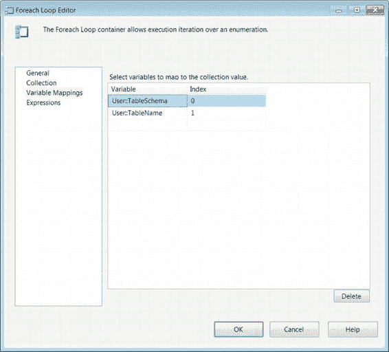

# 浏览按钮打开对话框，用于从服务器选择所需对象。系统将自动生成必要的表达式以填充“枚举”属性。

#### Foreach 循环编辑器—变量映射页面

当容器遍历列表时，它能够从枚举器中提取信息。通过配置“变量映射”页面（如图 6-31 所示），可以将元素存储在 SSIS 变量中，这些变量将在容器迭代时被新值覆盖。需要根据枚举器的结构定义列来接收每个值。

[www.it-ebooks.info](http://www.it-ebooks.info/)

