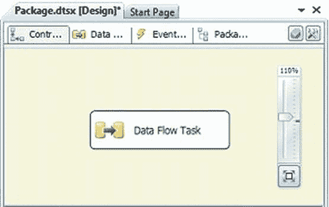

# 第 6 章  高级控制流任务

#### 任务主机控制器

当可执行文件添加到 SSIS 控制流时，任务主机容器会被隐式配置。该配置仅适用于可执行文件及其依赖项（对于容器而言）。此容器允许将变量和事件处理程序直接绑定到任务。此容器还限制了变量在不同可执行文件之间的作用域。

### 本章小结

本章介绍了高级控制流项目，它们使您能够执行许多非功能性需求。大多数高级任务在 SQL Server 实例之间传输对象。我们还介绍了 SSIS 工具箱中的高级容器。这些容器以不同的方式循环执行，但实现了相似的目标。隐式的任务主机控制器无法直接访问，但它在后台工作以保持包可执行文件的组织性。第 7 章将介绍数据流任务的基本组件。

[www.it-ebooks.info](http://www.it-ebooks.info/)

