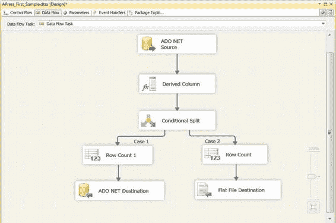

# 源和目标适配器

*“江河都往海里流，海却不满。”*

—所罗门王

在 SSIS 中，数据流是将数据从 A 点移动到 B 点并在途中进行操作的主要工具。数据流是一个强大的概念，允许您将数据移动和转换封装为控制流中的一个独立任务。数据流将数据从源移动到目标，就像所罗门王的河流将水从源头输送到大海一样。本章介绍数据流，并讨论数据流源适配器、目标适配器以及新的源和目标向导。

### 数据流

数据流包含在数据流任务的范围内，而数据流任务本身存在于控制流中。数据流任务如图 7-1 所示。

*图 7-1. BIDS 设计器界面上的数据流任务*

[www.it-ebooks.info](http://www.it-ebooks.info/)

