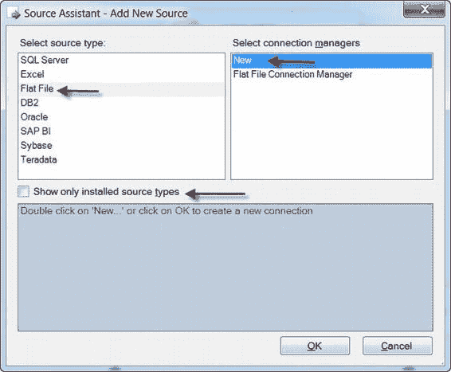

# 第 7 章  源和目标适配器

**注意**：我们将在第 22 章深入讨论 PipelineComponent 类的细节以及开发您自己的自定义组件。

### 源和目标

在 SSIS 数据流中，源适配器是从定义明确的数据存储中提取数据的组件。源适配器使用连接管理器连接到数据库（如 SQL Server 和 Oracle）、平面文件、XML 或您能定义的几乎任何其他源并从中提取数据。目标适配器与源适配器相反——它们将数据推送到数据存储。目标适配器使用连接管理器将数据发送到数据库、平面文件、Excel 电子表格或您可以连接到的任何其他目标。

虽然您可以在 SSIS 中创建极其复杂的数据流，但您可以创建的最简单的有用数据流可能由一个连接到单个目标适配器的源适配器组成。对于此示例，让我们考虑一个简单的数据流，它从平面文件中提取数据并将其加载到 SQL Server 数据库表中。这被认为是直接拉取，因为在数据从源移动到目标的过程中没有对数据应用任何转换。在本章中，假设您正在 BIDS 中编辑一个包含单个数据流的新 SSIS 包。

### 源向导

源向导是 SQL Server 12 SSIS 的新功能。当您将此组件从 SSIS 工具箱拖到设计器界面时，BIDS 会打开“添加新源”对话框。该对话框要求您选择源类型和要使用的连接管理器。如图 7-3 所示，源向导窗口允许您从几种类型的源中进行选择。对于我们的简单数据流示例，我们选择了平面文件源类型和<新建>连接管理器。

**注意**：“仅显示已安装”复选框将显示的类型限制为仅本地开发计算机上安装的那些类型。

[www.it-ebooks.info](http://www.it-ebooks.info/)

