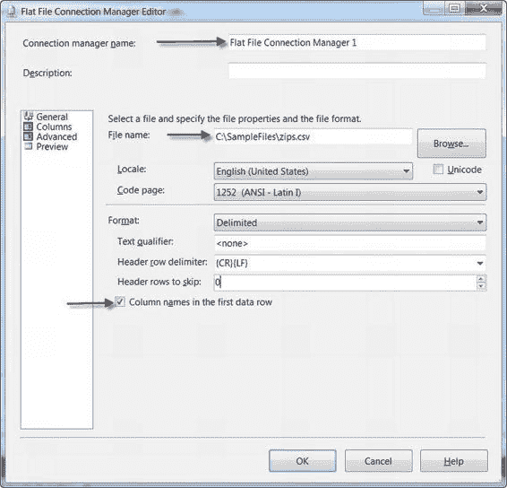

# 第 7 章  源和目标适配器

*图 7-3. 源向导的“添加新源”对话框*

当您选择<新建>连接管理器时，会弹出连接管理器编辑器。该编辑器特定于您要创建的连接管理器类型——平面文件连接管理器编辑器与 SQL Server 连接管理器编辑器具有不同的属性。平面文件连接管理器编辑器如图 7-4 所示。

[www.it-ebooks.info](http://www.it-ebooks.info/)

