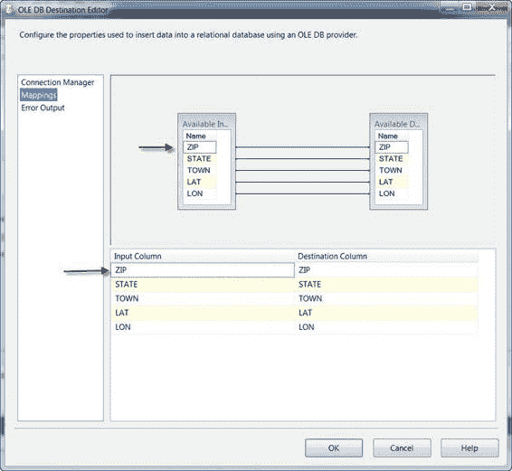
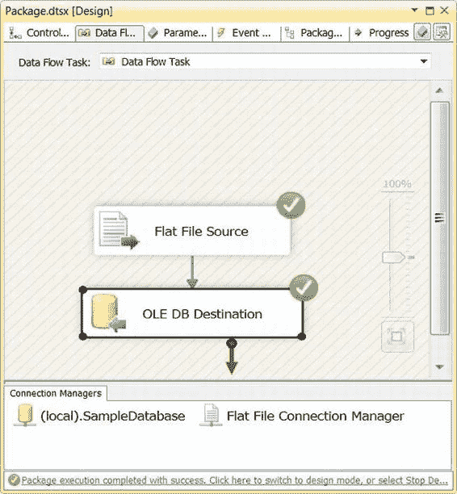
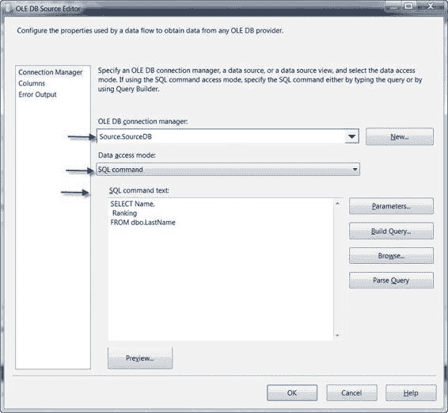
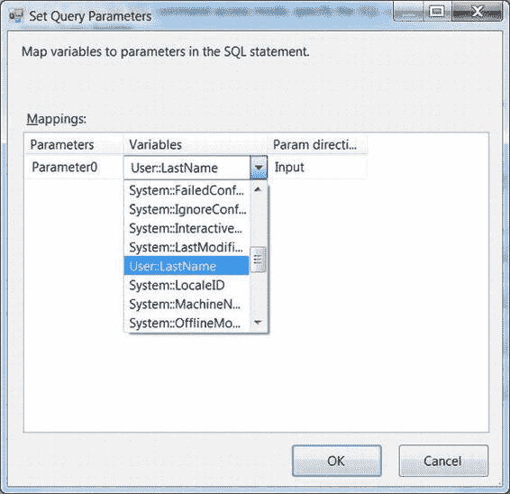

# 第七章：源适配器和目标适配器

在将`平面文件源适配器`连接到`OLE DB 目标适配器`之后，我们仍然需要配置`OLE DB 目标适配器`。双击`OLE DB 目标适配器`，可以打开`OLE DB 目标编辑器`。通过此编辑器，我们选择了`OLE DB 连接管理器`、`数据访问模式`以及目标表的名称。我们选择了`表或视图 - 快速加载`作为`数据访问模式`，这让我们也可以设置`每批行数`和`最大插入提交大小`选项。我们将这些选项从默认值更改了。这些选项如图 7-11 所示。

图 7-11. 在编辑器中为 OLE DB 目标设置属性

编辑器的"映射"页面为您提供了将目标组件的输入列映射到其输出列的机会。当您将目标适配器连接到数据流时，`BIDS`会尝试根据列名自动进行映射。在我们的示例中，源文件中的所有列都与目标表中的列同名，因此映射为我们自动执行。如果您需要将输入列映射到名称不同的输出列，可以通过在映射窗口的上半部分连接它们，或者在屏幕下半部分的网格视图中更改它们来修改映射，如图 7-12 所示。

[www.it-ebooks.info](http://www.it-ebooks.info/)



图 7-12. OLE DB 目标编辑器的"映射"页面

完成目标配置后，`BIDS`中数据流设计器里组件上的红色`x`将会消失。在`BIDS`中运行包，可以看到如图 7-13 所示，有 29,470 行数据从平面文件导入到了数据库表中。

[www.it-ebooks.info](http://www.it-ebooks.info/)



图 7-13. 使用源和目标助手创建的简单数据流成功执行

### 数据库源和目标

在前面的章节中，我们向您展示了如何使用源和目标助手来设置一个简单的包，将数据从平面文件提取并推送到数据库中。我们选择使用`平面文件源`和`OLE DB 目标适配器`进行演示，因为它们的使用是一个非常常见的场景，尤其是在使用`SSIS`从无法直接连接的遗留系统中提取数据并将其推送到 SQL Server 数据库时。本节将详细介绍数据库源和目标，并向您展示如何配置它们更高级的功能。

[www.it-ebooks.info](http://www.it-ebooks.info/)

#### OLE DB

`OLE DB 源和目标适配器`允许您连接到各种 OLE DB 数据存储，但通常用于数据库连接，因为它们提供良好的性能并支持多种关系数据库。在这个示例中，我们将配置一个`OLE DB 源适配器`和一个`OLE DB 目标适配器`，两者都连接到同一个 SQL Server 实例，并将数据从一个表移动到另一个表。这将是一个非常简单的演示，但将让您有机会探索各种 OLE DB 配置选项。

对于我们的示例，我们有两个表：一个名为`LastName`，包含美国最常见的姓氏列表（数据来自美国人口普查局）；另一个名为`LastName_Stage`，我们将把姓氏复制到这个表中。

我们的第一步是创建两个连接管理器，分别名为`Source_DB`和`Dest_DB`。

在这个示例中，这两个连接管理器指向同一台服务器和同一个数据库，但在现实世界中，它们很可能指向不同的服务器，或者同一服务器上的不同数据库。这就是为什么我们要为它们创建两个独立的连接管理器。表 7-2 显示了您可以在`OLE DB 源编辑器`中选择的各种选项，该编辑器如图 7-14 所示。

表 7-2. OLE DB 源编辑器对话框控件

**选项  描述**

##### OLE DB 连接管理器下拉列表
让你为数据源选择一个 OLE DB 连接管理器。在我们的示例中，我们选择了先前创建的 `Source_DB` 连接管理器。

##### 数据访问模式下拉列表
决定源适配器如何从 OLE DB 源检索数据。共有四个选项：

-   **表或视图模式**：让你选择数据库中的一个表或视图作为源。此模式返回表中的所有列，类似于 `SELECT *` 查询，但因源需要自行检索表元数据，开销稍大。

-   **表名或视图名变量模式**：让你将表或视图的名称存储在字符串变量中，以便在运行时检索。此模式也类似于 `SELECT *` 查询，返回表的所有列，包括你可能不需要的列。

[IT 电子书库](http://www.it-ebooks.info/)

**第七章 – 源适配器和目标适配器**

##### 选项描述

-   **SQL 命令模式**：让你有机会指定一个返回行集的 SQL 语句，例如 `SELECT` 或 `EXECUTE <procedure>`。使用 `SQL Command` 模式，你可以仅指定想要返回的列，并通过 `JOIN` 和 `WHERE` 子句限制返回的行。

-   **来自变量的 SQL 命令模式**：让你有机会执行存储在字符串变量中的 SQL 语句。存储在变量中的 SQL 命令在运行时被检索并执行。

> 因为它们可用于限制源适配器检索的列和行，`SQL Command` 和 `SQL Command from Variable` 模式是从 SQL 数据库或其他 OLE DB 源检索数据的最有效方法。我们在本例中选择了 `SQL Command` 模式。

##### SQL 命令文本框
`SQL Command` 模式提供了一个文本框，你可以在其中输入 `SELECT` 或其他生成行集的语句。在我们的示例中，我们从 `LastName` 表抓取行。其他访问模式则提供下拉框来选择表名或变量。

##### 参数按钮
如果你在查询中使用了参数，该按钮让你可以将变量映射到参数。

##### 构建查询按钮
允许你在“查询生成器”图形用户界面中编辑你的查询。

##### 浏览按钮
让你可以将 SQL 查询脚本文件加载到 `SQL Command` 文本框中。

##### 解析查询按钮
解析并验证你的 SQL 语句的语法。

##### 预览按钮
让你预览你的 SQL 命令文本生成的数据。

[IT 电子书库](http://www.it-ebooks.info/)



**第七章 – 源适配器和目标适配器**

> **注意：** 当从源表提取数据时，使用 SQL `SELECT` 语句是最佳实践，原因如下：首先，你的表可能包含比你实际需要拉取的更多的列。出于效率考虑，最小化拉入数据源的数据量是明智之举。其次，`Table or View` 访问模式会产生额外的开销，而使用 `SQL Command` 或 `SQL Command from Variable` 访问模式则可以避免。

**图 7-14. 配置 OLE DB 源以从 LastName 表提取数据**
在 OLE DB 源中，我们使用了一个 OLE DB *参数化查询*。在参数化查询中，你定义参数并将变量映射到这些参数。在查询执行时，参数化查询和参数值都会传递给服务器。服务器执行查询，并用相应的值替换参数。在我们的示例中，我们使用了以下简单查询：

[IT 电子书库](http://www.it-ebooks.info/)



**第七章 – 源适配器和目标适配器**

```sql
SELECT Name,
       Ranking
FROM   dbo.LastName
WHERE  Name LIKE ?;
```

在 OLE DB 中，`?` 用作参数占位符。OLE DB 中的参数通过其*序数位置*（在查询中出现的顺序）指示。第一个参数是 `Parameter0`，第二个是 `Parameter1`，依此类推。单击编辑器对话框上的 `Parameters` 按钮会打开“设置查询参数”对话框。在此窗口中，你可以将变量映射到参数，如图 7-15 所示。


