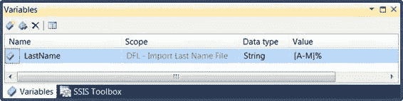
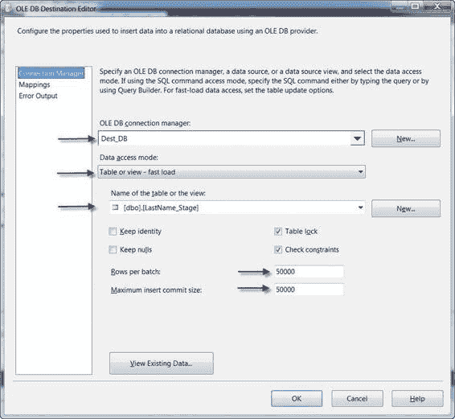
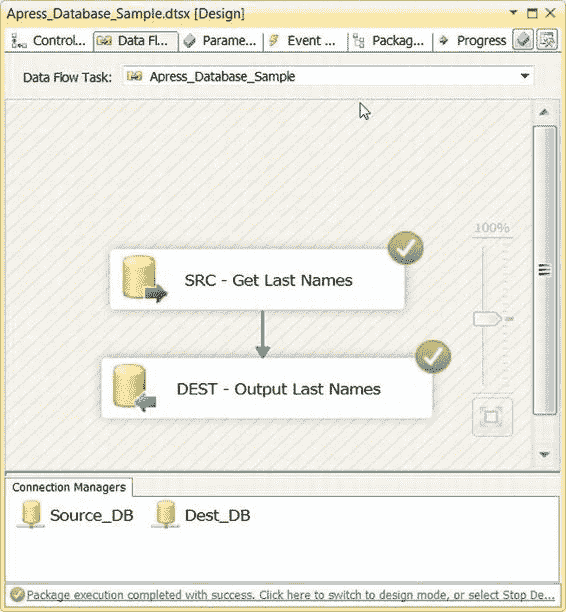
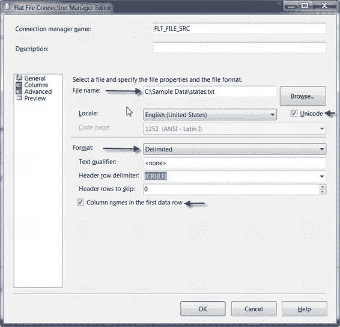

# 源和目标适配器

*图 7-15. 在我们的示例源查询中将变量映射到 OLE DB 参数* 我们创建了一个名为 `User::LastName` 的字符串变量，并用 `SQL wildcard LIKE` 运算符模式填充它（在这个例子中，我们选择了 `[A-M]%`，这将返回所有以字母 *A* 到 *M* 开头的名称）。图 7-16 展示了“参数和变量”窗口的“变量”部分，我们在那里定义了 `User::LastName` 变量。

> **注意：** 关于创建和使用 SSIS 变量的详细讨论，请参见第 9 章。

[www.it-ebooks.info](http://www.it-ebooks.info/)

*图 7-16. 在“参数和变量”窗口的“变量”部分定义变量*

我们示例中的下一步是配置 OLE DB 目标，如图 7-17 所示。

*图 7-17. 配置 OLE DB 目标编辑器以输出到表*

[www.it-ebooks.info](http://www.it-ebooks.info/)

使用 OLE DB 目标编辑器，您可以精确配置数据的去向，以及决定数据如何到达的一些属性。表 7-3 是 OLE DB 目标编辑器的控件说明。

*表 7-3. OLE DB 目标编辑器对话框控件*

| 控件 | 描述 |
| :--- | :--- |
| **OLE DB 连接管理器** 下拉列表 | 让您选择一个 OLE DB 连接管理器作为数据的目标。这里我们选择了 `Dest_DB` 连接管理器。 |
| **数据访问模式** 下拉列表 | 决定源适配器如何将数据发送到 OLE DB 目标。此下拉列表有五个选项： -- **表或视图**模式让您选择数据库中的一个表或视图的名称来发送数据。这种模式会产生大量开销，因为它为发送到目标的每一行生成一个 `INSERT` 语句。 -- **表或视图 - 快速加载**模式使用 OLE DB 快速加载选项。快速加载选项使用 OLE DB `IRowsetFastLoad` 接口执行数据的内存中*批量复制*。在快速加载模式下，SSIS 在内存中将行排队，并分批发送到服务器。这可以显著提升性能，优于普通访问模式。 -- **表名或视图名变量**模式让您将表或视图的名称存储在字符串变量中，以便在运行时使用。与**表或视图**模式类似，此模式为每一行生成一个 `INSERT` 语句。 -- **表名或视图名变量 - 快速加载**模式使用 OLE DB 快速加载选项将数据发送到名称存储在变量中的表或视图。与其他快速加载选项类似，此访问模式在将行发送到服务器之前对其进行批处理。 -- **SQL 命令**模式常常让初次看到它的人感到困惑。您可能想象它提供了一种给出参数化 `INSERT` 或 `UPDATE` 语句的方式；实际上，它提供了一种定义用于插入数据的“虚拟视图”的方式。如果您使用此选项，很可能是在对一个表进行简单的 `SELECT`。 -- 在这个例子中，我们选择了常用的**表或视图 - 快速加载**模式。**表或视图**模式也经常被使用。**来自变量**和 **SQL 命令**模式通常用于特殊目的的情况。 |
| **保留标识** 复选框 | 在快速加载模式下，此选项用源中的值填充标识列。 |
| **保留 Null 值** 复选框 | 同样是一个快速加载选项，当目标列应用了默认约束时，此选项决定源列的 Null 值是否作为 Null 值插入到目标列中。 |
| **表锁** 复选框 | 另一个快速加载选项，用于在加载期间锁定目标表。这可以提高性能，但会阻止其他进程在加载期间访问该表。 |
| **检查约束** 复选框 | 打开时，会在数据加载时检查目标表上的约束。 |
| **每批行数** | **每批行数**用于优化快速加载操作期间的内存使用。我们发现将此值设置为 `50000`–`100000` 通常效果良好，尽管您可能需要尝试该值以找到适合您配置的最佳设置。 |
| **最大插入提交大小** | 此值设置 OLE DB 目标在尝试将数据提交到服务器之前排队的最大批次大小。我们通常将此值设置为与**每批行数**设置相同的值。 |

[www.it-ebooks.info](http://www.it-ebooks.info/)

> **注意：** 通常我们将 **每批行数** 和 **最大插入提交大小** 设置为 `50000` 到 `100000` 之间的值。我们建议将这些值设置为非默认值。将它们设置为非默认值将有助于提供程序优化其内存使用，并避免一些旧版本 OLE DB 提供程序报告的问题。

成功运行此包会产生如图 7-18 所示的屏幕。

*图 7-18. 成功的 OLE DB 源到 OLE DB 目标包执行*

[www.it-ebooks.info](http://www.it-ebooks.info/)

### ADO.NET

ADO.NET 源和目标适配器允许您创建托管的 .NET `SqlClient` 连接。因为它们是托管代码，这些类型的连接总体上往往比其本机模式的 OLE DB 对应部分提供较弱的性能。另一方面，从 .NET 代码（如脚本任务和脚本组件）中，它们更容易以编程方式访问和管理，正是因为它们是托管的。在许多情况下，特别是当涉及少量行时，ADO.NET 与 OLE DB 源和目标适配器之间的性能差异可以忽略不计。

ADO.NET 源适配器具有简化的接口，允许您选择一个 ADO.NET 连接管理器和两种访问模式之一：**表或视图**模式或 **SQL 命令**模式。与 OLE DB 源适配器不同，ADO.NET 源适配器不支持参数。

> **提示：** 虽然无法对 ADO.NET 源适配器进行参数化，但您可以将该组件的 `SqlCommand` 属性设置为一个表达式。您可以通过数据流任务属性访问此属性。我们将在第 9 章详细讨论 SSIS 表达式。

ADO.NET 目标适配器也具有简单的接口。它允许您选择一个 ADO.NET 连接管理器和一个用于发送输出的表或视图。还有一个额外的复选框“**尽可能使用批量插入**”，它将利用基于内存的批量复制，类似于 OLE DB 的 `IRowsetFastLoad` 接口。

#### SQL Server 目标

SQL Server 目标适配器提供高速批量插入，类似于大容量插入任务。主要区别在于，与位于控制流中的大容量插入任务不同，SQL Server 目标位于数据流的末端——因此您可以在批量加载数据之前转换数据。另一个区别是，SQL Server 目标不是从文件读取其源数据。相反，它从共享内存进行批量加载，这意味着您不能使用它将数据加载到远程服务器。

#### SQL Server Compact

SSIS 有一个 SQL Server Compact 目标适配器，可让您将数据发送到 SQL Server Compact Edition (CE) 实例。连接到 SQL Server CE 时需要记住的一件事是，只有 32 位驱动程序可用。

#### 文件

平面文件和数据库可以说是 SSIS 包中最常用的源和目标，这就是为什么我们从详细讨论这两类适配器开始本章的原因。

然而，还有更多基于文件的源和目标可用。我们将在本节讨论这些源和目标适配器及其属性。

[www.it-ebooks.info](http://www.it-ebooks.info/)

##### 平面文件

