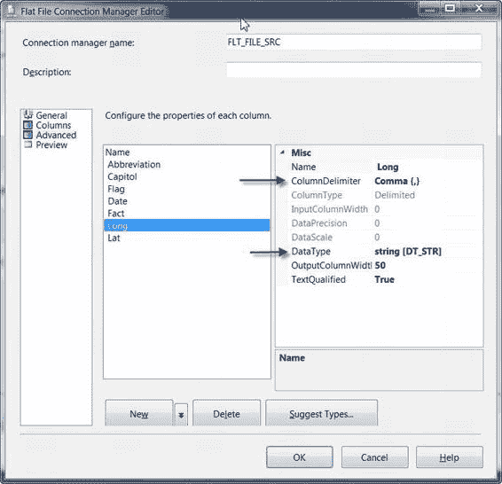
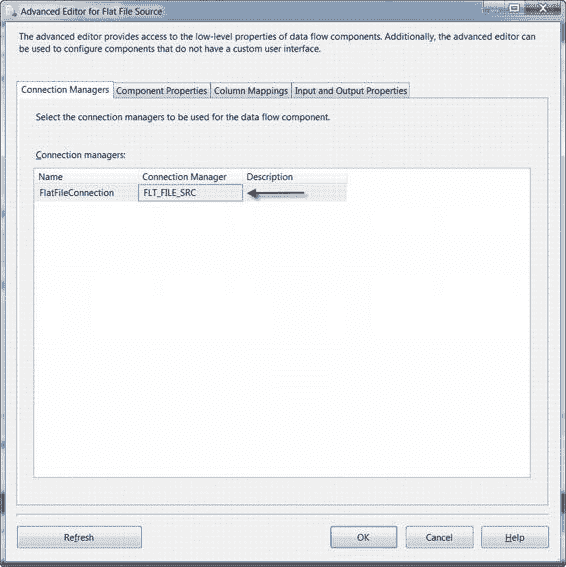
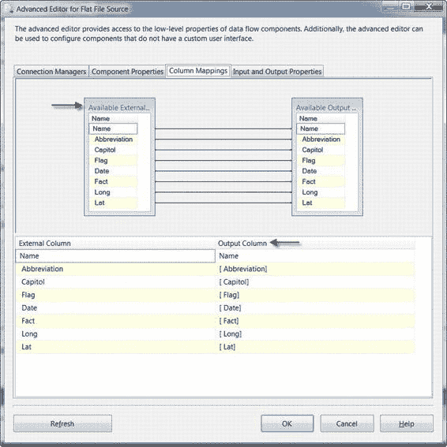
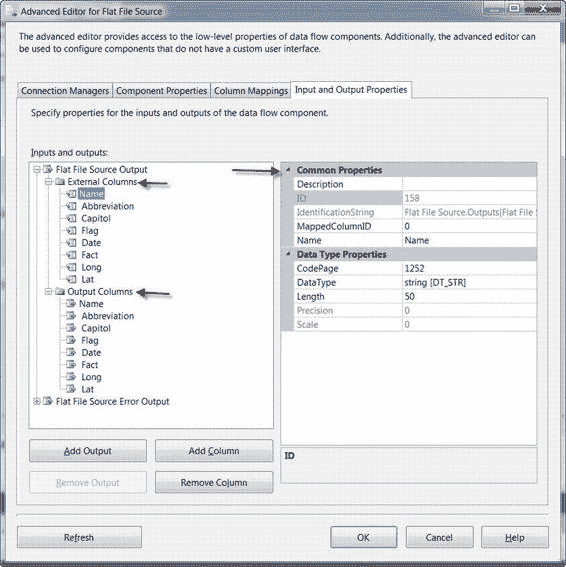
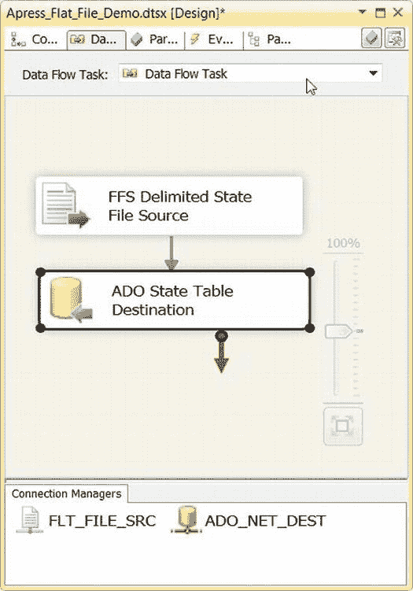
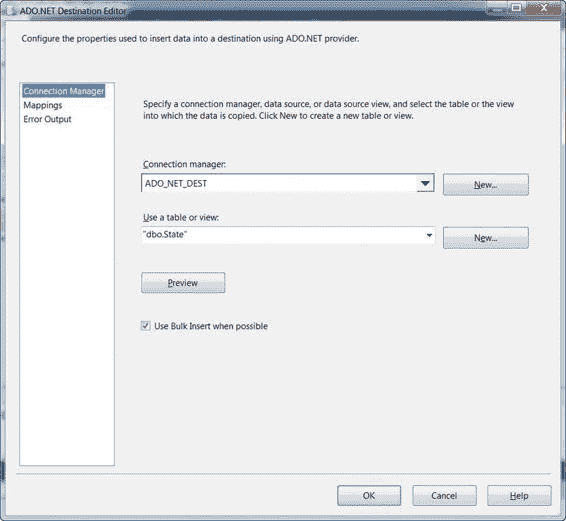
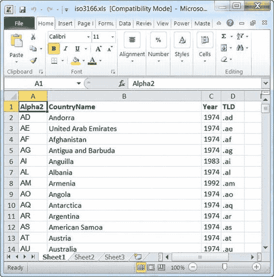
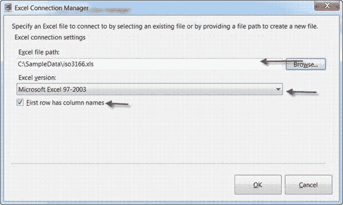

# 第七章：源和目标适配器

##### 平展文件

当谈论导入和导出文件时，极大概率谈论的是**平展文件**。由于其非常普遍，`SSIS` 为从平展文件导入数据和平展文件导出数据提供了广泛的支持和选项也就不足为奇了。当我们谈论平展文件时，我们指的是分隔符文件、固定宽度文件和*参差右对齐文件*（即除最后一列长度可变外，其他列均为固定宽度的文件）。

我们在本章的第一个示例中演示了一个简单的平展文件导入，现在我们将通过另一个示例，回头讨论其高级选项。我们首先在一个新包中创建并配置了一个`平展文件连接管理器`和一个`ADO.NET 连接管理器`。我们按照图 7-19 所示配置了`平展文件连接管理器`。

我们配置`平展文件连接管理器`，从名为`states.txt`的分隔符文件中提取数据。该文件包含`Unicode`数据，因此我们勾选了`Unicode`复选框。因为我们使用了`Unicode`，所以`代码页`下拉框被禁用，因为它与此无关。格式是分隔符格式，大多数列使用管道符分隔——稍后会详细说明；最后，文件的第一行包含列名。

我们还在`平展文件连接管理器编辑器`的`高级`页面上调整了一些设置。

我们将`列分隔符`（它告诉`SSIS`如何将文件分割成列）设置为管道字符(`|`)，适用于大多数列。在文件的最后一个字段中，我们有每个州首府的`经度`和`纬度`，以逗号(`,`)分隔，如图 7-20 所示。所以实际上，我们拥有的是一个所谓的`混合分隔符文件`。

当你创建平展文件连接时，所有列默认都是 50 个字符的字符串。在我们的案例中，我们调整了一些列的`数据类型`设置：例如，我们将`经度`和`纬度`列更改为双精度浮点`[DT_R8]`数据类型。

**注意：** 本节我们只是对`平展文件连接管理器`做了简要概述。我们在第 4 章详细讨论了连接管理器及其配置。

配置好`平展文件连接管理器`后，我们配置了`平展文件`源适配器以使用它。虽然`平展文件`源适配器有一个标准的简化编辑器，但我们选择使用所有组件默认都有的`高级编辑器`来配置此组件。要访问如图 7-21 所示的`高级编辑器`，只需右键单击`平展文件`源适配器，然后从上下文菜单中选择`显示高级编辑器`。

我们在`高级编辑器`的`连接管理器`选项卡上设置的第一个选项，是告诉`平展文件`源适配器使用`平展文件连接管理器`。

`列映射`选项卡用于映射`外部列`（由连接管理器定义的列）和`输出列`（由`平展文件`源适配器输出的列）。您可以通过在上部窗口中将外部列拖放到`输出列`框中来更改列映射，也可以通过在下部窗口的网格框中从下拉列表选择不同的列来进行更改。`列映射`选项卡如图 7-22 所示。

`输入和输出属性`选项卡提供了对高级列级元数据的访问。在此视图中，您可以看到各个外部列、输出列及其属性，如图 7-23 所示。

配置好`平展文件`源适配器后，我们将其输出连接到`ADO.NET`目标，并配置`ADO.NET`目标适配器以使用`ADO.NET 连接管理器`。源到目标的连接以及`ADO.NET`目标适配器如图 7-24 和图 7-25 所示。

`平展文件`目标适配器与`平展文件`源适配器的功能相反。`平展文件`目标适配器不是将平展文件的内容拉入并输出到您的数据流中，而是接受来自数据流的输入并将其输出到平展文件。

#### Excel 文件

业务用户经常将电子表格用作临时数据库。从业务用户的角度来看，这很有道理，因为他们和他们的同事都熟悉电子表格范式。他们都理解用户界面，知道如何实现简单甚至复杂的计算，以及如何完全按照他们想要的方式格式化界面。从开发人员和`DBA`带来的`IT`视角来看，没有什么比想到数百 GB 的业务信息以临时的电子表格格式在虚拟空间中漂浮（可能未受保护）更可怕的事情了。

`Excel`源和目标可以帮助您将数据从电子表格中提取出来，并将其存储在安全、结构化的数据库中，或者从定义良好的系统中提取数据，并将其放入业务用户易于操作的格式中。

在这个例子中，我们假设一个简单的包中有两个数据流。一个数据流将读取`Excel`电子表格的内容并将其存储在表中，第二个数据流将读取同一张表的内容并将其输出到`Excel`电子表格。我们的示例`Excel`电子表格如图 7-26 所示。

第一步是创建一个`Excel 连接管理器`。在`连接管理器`选项卡中右键单击并选择`新建连接`。然后选择`EXCEL`连接管理器类型。您将看到`Excel 连接管理器`对话框，如图 7-27 所示。在此示例中，我们选择了一个名为`iso3166.xls`的`Excel`文件，其中包含来自`ISO 3166`标准的国家名称和缩写列表，我们选择了`Microsoft Excel 97–2003`格式，并勾选了表示电子表格的第一行数据包含列名的复选框。

**注意：** `ISO 3166`是国家代码和名称的国际标准。如果可能，使用公认的标准而不是重新发明轮子是个好主意。

我们还创建了一个`OLE DB 连接管理器`，如本章“目标助手”部分所述。

下一步是将`Excel`源适配器和`OLE DB`目标适配器拖到`BIDS`设计器界面。

