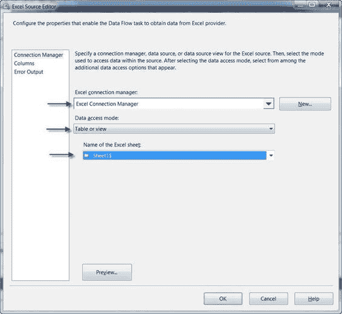
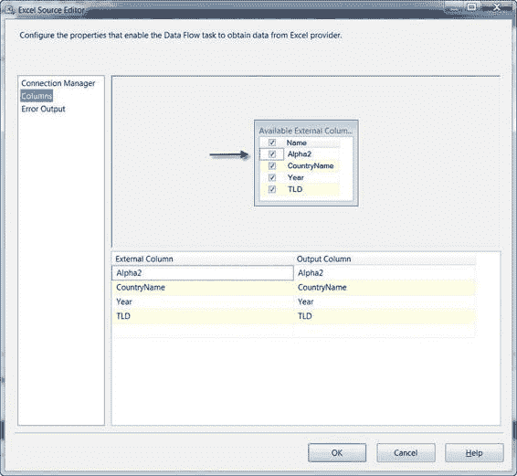
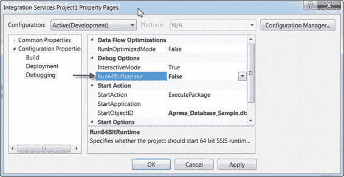
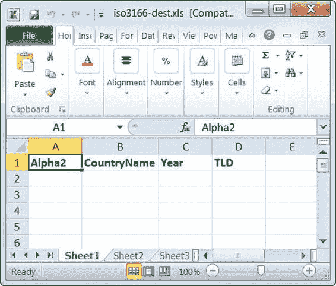
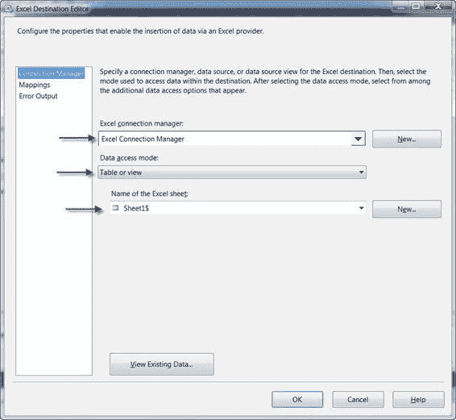

# 第 7 章 - 源和目标适配器

设计界面并将它们连接起来。然后，我们双击 Excel 源以打开 `Excel 源编辑器` 进行编辑。在编辑器中，我们选择了刚刚创建的 `Excel 连接管理器`，选择了 `表或视图` 的数据访问模式，并选择了 Excel 工作簿中的第一个工作表 `Sheet1$`，如图 7-28 所示。

**注意：** `Excel 源编辑器` 允许您选择 Excel 工作簿中的整个工作表或命名的单元格区域。

[www.it-ebooks.info](http://www.it-ebooks.info/)



##### 图 7-28. 在编辑器中配置 Excel 源

您可以通过选择 `Excel 源编辑器` 的 `列` 选项卡来查看源列。`列` 页面会列出可用的 `外部列`（物理 Excel 文件中的列），每列旁边都有一个复选框。如果您不希望某个列包含在数据流中，可以取消勾选它。图 7-29 显示了 `Excel 源编辑器` 的 `列` 页面。

[www.it-ebooks.info](http://www.it-ebooks.info/)



##### 图 7-29. 查看 Excel 源编辑器的列页面

作为选择 `表或视图` 访问模式并选择工作表名称的替代方法，您可以选择 `SQL 命令` 模式并输入 SQL 风格的查询，以从 Excel 电子表格中获取相同的数据。以下查询从您的工作表中检索与当前示例中相同的数据：

```sql
SELECT Alpha2,
       CountryName,
       Year,
       TLD
FROM [Sheet1$];
```

**注意：** Excel 源和 Excel 目标配配器使用 Microsoft OLE DB Provider for Jet 4.0 和 Excel 索引顺序访问方法 (ISAM) 驱动程序来读写 Excel 电子表格。请记住，此驱动程序仅提供非常有限的 SQL 风格查询语法子集，并且不支持许多您可能习惯的 T-SQL 功能。

当您设置 Excel 源适配器时，它会尝试通过对电子表格中的数据进行采样来自动确定 `外部列` 的数据类型。目前，除了修改电子表格中的数据外，没有办法强制或转换 Excel 列的数据类型为更合适的类型。表 7-4 显示了 Excel ISAM 驱动程序支持的所有数据类型。

##### 表 7-4. Excel 到 SSIS 再到 SQL Server 的数据类型转换

| **Excel 数据类型** | **SSIS 数据类型** | **SQL Server 数据类型** |
| :--- | :--- | :--- |
| 布尔值 | `Boolean [DT_BOOL]` | `bit` |
| 货币 | `Currency [DT_CY]` | `money` |
| 日期/时间 | `Datetime [DT_DATE]` | `datetime` |
| 备注 | `Unicode 文本流 [DT_NTEXT]` | `nvarchar(max)` |
| 数值 | `双精度浮点数 [DT_R8]` | `float` |
| 字符串 | `Unicode 字符串，长度 255 [DT_WSTR]` | `nvarchar(255)` |

如果 SSIS 高估了您的 Excel 列的大小或数据类型——例如，对于一个 `nvarchar(2)` 列使用了 `nvarchar(255)`——您可能需要向数据流中添加一个 `派生列` 转换（我们将在下一章介绍）以将列转换为适当的类型。为了完成数据流，我们只需将 `OLE DB 目标` 配置为指向一个数据库表，并像本章“目标助手”部分描述的那样进行列映射。这个示例包的成功运行如图 7-30 所示。

##### JET 驱动程序与 64 位

在运行连接到 Microsoft Office 文件（如 Excel 电子表格和 Access 数据库）的包之前，您需要知道 Microsoft Jet 4.0 驱动程序只有 32 位 (x86) 版本。如果您在 64 位机器上进行开发，您需要将项目设置为使用 32 位运行时运行，以便它使用 32 位 Jet 4.0 驱动程序连接到 Excel 工作簿。您可以在 BIDS 解决方案资源管理器中右键单击您的项目并选择 `属性` 来访问此选项。在 `调试` 属性下，将 `Run64BitRuntime` 选项更改为 `False`，如图 7-30 所示。

此设置使 BIDS 使用 32 位运行时而非 64 位运行时来执行此项目的包。然而，此设置仅在 BIDS 的设计时有效。如果您从命令行或使用其他工具执行包，则必须确保使用的是 32 位运行时。

##### 图 7-30. 将 SSIS 项目设置为以 32 位模式运行

[www.it-ebooks.info](http://www.it-ebooks.info/)



##### 图 7-31. Excel 电子表格成功导入到 SQL Server 表

Excel 源适配器允许您将数据从 Excel 电子表格提取到数据流中，而 Excel 目标则允许您将数据流中的数据输出到 Excel 电子表格。为了演示，我们将从刚刚填充的数据库中提取 `Country` 表的内容，并将其输出到一个新的电子表格。

我们将在 SSIS 包中添加一个新的 `Excel 连接管理器`，并将其指向一个新的、基本为空的工作簿。新工作簿将仅在第一行包含列名，如图 7-32 所示。

[www.it-ebooks.info](http://www.it-ebooks.info/)



##### 图 7-32. 新的 SSIS 目标工作簿，除列标题外为空

接下来，我们将向一个空的数据流添加一个 `OLE DB 源` 适配器和一个 `Excel 目标` 适配器。

在将 `OLE DB 源` 配置为从数据库中的 `Country` 表提取数据后，我们将 `OLE DB 源` 输出链接到 `Excel 目标` 输入。最后一步是配置 `Excel 目标`。

在 `Excel 目标编辑器` 中，我们选择了新创建的 `Excel 连接管理器`，将数据访问模式设置为 `表或视图`，并选择了第一个工作表的名称 `Sheet1$`，如图 7-33 所示。

[www.it-ebooks.info](http://www.it-ebooks.info/)



##### 图 7-33. 在 Excel 目标编辑器中配置 Excel 目标配适器

#### 原始文件

无论何时从平面文件读取或写入平面文件，后台都在进行成千上万的数据转换。考虑一个整数，例如 `2,147,483,647`。这个数字在您的计算机中仅占用 4 字节内存。但当您将其写入平面文件时，它会被转换为一个长度为 10 个字符的数字字符串。这不仅存储空间增加了一倍多，而且由于转换还会带来性能损失。当您从平面文件读回该数字时，您必须读取 10 个字符，并再次承受转换带来的性能损耗。诚然，对于单个数字而言，大小差异和性能影响并不大，但如果将其乘以 10 列和 1,000,000 行（这并非不合理的例子），突然之间，您就会在性能和存储空间上看到显著的变化。

对于日常的文件传输以及与其他系统的导入/导出，平面文件是合适的选择。在许多情况下，平面文件并不是很大，因此大小和性能差异并不显著。但更重要的是，在系统之间传输数据时，纯文本是不会出错的选择。考虑到字符集的一些差异，每个系统都能读取文本，每个系统也都能写入文本。

然而，有时您可能会发现需要在处理过程中临时存储大量部分处理过的数据。一个常见的例子是：当大量行已经通过 SSIS 包处理，进行了大量加工后，您需要在另一个 SSIS 包（或同一包中的不同数据流）中获取这些数据以进行进一步处理。为了最大化 SSIS 包间处理的效率，原始文件是无与伦比的选择。


