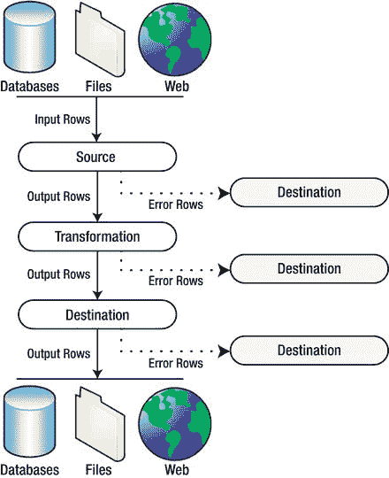

# 第 8 章：数据流转换

*目标是将数据转化为信息，将信息转化为洞见。*
——卡莉·菲奥莉娜

在上一章中，您了解了`SSIS`如何从 A 点提取数据并将其推送到 B 点。在本章中，您将开始探索不同类型的**数据操作**，即**转换**，您可以在数据从源移动到目标的过程中对数据执行这些操作。正如卡莉·菲奥莉娜所指出的，我们的最终目标是从原始数据开始，并利用它达到洞见的状态。

数据流转换是将原始数据沿着这一旅程的前半部分推进、将其转化为可用信息的关键。

### 高层次数据流

`SSIS`数据流由源、转换和目标组成。图 8-1 显示了`SSIS`数据流的高层次视图。

如图所示，`SSIS`源组件从各种来源（如数据库、文件和网络）提取数据。源组件将数据引入数据流，数据在数据流中从一种转换移动到另一种转换。数据处理完毕后，它会移动到目标组件，目标组件将其推送到存储，包括数据库、文件、网络或您可以访问的任何其他类型的目标。图中的实心黑箭头类似于`SSIS`设计器中的输出路径（绿色箭头）。某些组件（如我们将在本章后面讨论的`多播`转换）具有多个输出路径。

每种数据流组件（源组件、转换和目标组件）也可以有一个错误输出路径。在`BIDS`设计器中，这些由红色箭头表示。当组件在处理一行数据时遇到数据错误，该错误行将被重定向到错误输出。通常，您需要将错误输出连接到目标组件，以便保存错误行供后续审阅、修改和可能的重新处理。

### 转换类型

`SSIS`自带了 30 种开箱即用的标准转换。这些标准转换使您能够以多种方式操作数据，包括修改、连接、路由以及对单个行或整个行集执行计算。

转换可以按功能线分组，我们在本章中就是这样做的。例如，行转换以及拆分和连接转换是我们涵盖的两个组。

