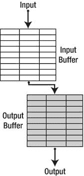
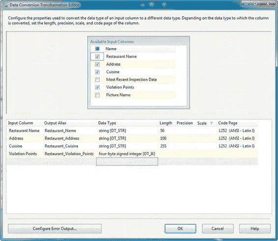

# 数据流转换

## 按数据处理分类

在不同的层级上，转换也可以根据其处理数据的方式进行分类。具体来说，数据流转换可以分为同步或异步。此外，还可以根据其 `阻塞` 行为进一步细分。

### 同步转换

`同步转换` 一次处理输入的每一行。当通过同步转换发送数据时，SSIS 使用 `输入缓冲区`（在处理期间为临时数据存储预留的内存区域）作为 `输出缓冲区`。如图 8-2 所示。

*图 8-2. 同步转换使用输入缓冲区作为输出缓冲区。*

由于同步转换将输入缓冲区重新用作输出缓冲区，它们往往比异步转换使用更少的内存。一般来说，同步转换也具有以下其他属性（尽管这些属性并非对每个组件都始终成立）：

-   同步组件通常是非阻塞的或仅部分阻塞的。这意味着它们往往在处理行后立即输出它们，或者在最小延迟下处理和输出行。
-   同步组件也倾向于输出与接收输入相同数量的行。然而，一些同步组件可能会有效地丢弃行，导致输出行少于输入行。

### 异步转换

`异步转换` 倾向于以集合方式转换数据。当处理单行数据的方法依赖于输入中的其他行数据时，就会使用异步转换。

例如，你可能需要对输入数据进行排序或聚合。在这些情况下，转换需要一次查看所有数据行，无法独立转换每一行。

从技术角度来看，异步转换维护独立的 `输入` 和 `输出` 缓冲区。数据移入输入缓冲区，经过转换，然后移动到输出缓冲区。输入和输出缓冲区之间额外的数据移动可能会损失一些性能，并且维护两套独立的缓冲区往往比同步转换使用更多的内存。图 8-3 显示了数据在异步转换的输入和输出缓冲区之间移动。

*图 8-3. 异步转换将数据从输入缓冲区移动到单独的输出缓冲区。*

一般来说，异步转换旨在处理以下情况：

-   输入行的数量不等于输出行的数量。`聚合` 和 `行采样` 转换就是这种情况。
-   必须获取多个输入和输出缓冲区来排队数据以进行处理，如 `排序` 转换。
-   必须组合多个输入行，例如 `Union All` 和 `Merge` 转换。

### 阻塞转换

除了将转换分组为同步和异步类别外，如前所述，还可以根据其 `阻塞` 行为进一步细分。`完全阻塞` 的转换必须排队并处理整个行集，然后才能允许数据流通过。考虑 `排序` 转换，它对整个行集进行排序。考虑将 1000 行推入 `排序` 转换。它不能只排序前 100 行并开始向输出发送行——`排序` 转换必须将所有 1000 行排队以便对它们进行排序。因为它在对输入进行排队时阻止数据流过管道，所以 `排序` 转换是完全阻塞的。

一些转换在排队和处理数据时会短暂地阻塞管道流。这些转换被归类为 `部分阻塞`。`合并连接` 转换是一个部分阻塞转换的例子。`合并连接` 接受两个已排序的行集作为输入；执行两个输入的完全、左或内连接；然后输出连接后的行集。当数据通过 `合并连接` 时，先前缓冲的行可以从输入缓冲区中丢弃。因为它必须从每个行集中排队有限数量的行来执行连接，所以 `合并连接` 是一个部分阻塞组件。

`非阻塞` 转换不会阻塞数据流。它们在接收数据时尽可能快地转换和输出行。`派生列` 转换是一个非阻塞转换的例子。表 8-1 比较了每类阻塞转换的属性。

*表 8-1. 转换阻塞类型*

| 属性 | 完全阻塞 | 部分阻塞 | 非阻塞 |
| :--- | :--- | :--- | :--- |
| 通信模式 | 异步 | 异步 | 同步 |
| 逻辑处理（通用） | 完整行集 | 行集子集 | 行级别 |
| 输入行数必须等于输出行数 | 否 | 否 | 是 |
| 处理前排队所有输入行 | 是 | 否 | 否 |
| 可以生成新线程 | 是 | 是 | 否 |
| 输入缓冲区是输出缓冲区 | 否 | 否 | 是 |
| 输入排序顺序保留 | 否 | 否 | 是 |
| 可以重命名/更改输入列的数据类型 | 是 | 是 | 否 |

### 行转换

行转换通常是类型中最简单、最快的。它们是同步的（某些 `脚本组件` 转换可能除外），并操作于单个数据行。本节介绍 SSIS 中可用的内置行转换。

**注意：** 我们将在第 10 章详细讨论脚本组件。

#### 数据转换

ETL 中的一个常见任务是将数据从一种类型转换为另一种类型。例如，你可能读入 Unicode 字符串，需要将其转换为非 Unicode 编码，或者可能需要将数字数据转换为字符串，反之亦然。这就是 `数据转换` 转换的设计目的。

`数据转换` 转换提供了一种简单的方法来转换输入列的数据类型。对于我们的示例，我们借用了一些来自纽约市卫生部的数据。我们选取了选定的有数十项违规的餐厅数据，并将其保存在 Excel 电子表格中。如图 8-4 所示，我们在 Excel 源适配器之后立即添加了一个 `数据转换` 转换。

*图 8-4. 在 Excel 电子表格上使用数据转换转换*

我们在数据流中使用 `数据转换` 转换，因为 `Excel 连接管理器` 只理解少数几种数据类型。例如，它只能将字符数据读取为长度为 255 个字符的 Unicode 数据或 2.1 GB 的字符大型对象 (`LOB`)。此外，数字只能识别为双精度浮点数，因此你必须将它们显式转换为其他数据类型。

`数据转换` 转换会为你指定要转换为新数据类型的列创建副本。每个新创建列的默认名称采用 `Copy of <列名>` 的形式，但如图 8-5 所示，你可以在编辑器的 `输出别名` 字段中重命名列。编辑器的 `数据类型` 字段允许你选择转换的目标数据类型。在本例中，我们选择将 `违规点数` 列转换为有符号整数 (`DT_I4`)，并将 Unicode 字符串列转换为可变长度的非 Unicode 字符串。

*图 8-5. 编辑数据转换转换*

