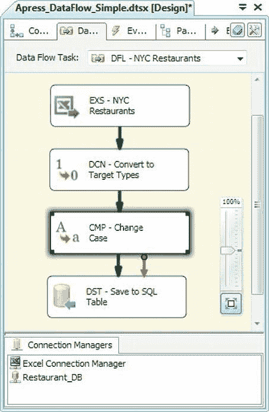
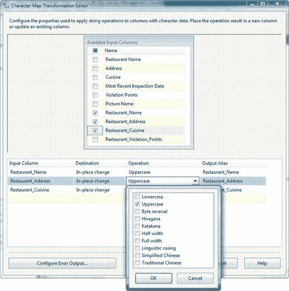

# 第 8 章：数据流转换

##### 数据类型映射

特别是在进行数据转换时，理解 SSIS 数据类型如何映射到目标数据类型非常重要。Microsoft 联机丛刊 (BOL) 文档记录了 SSIS 数据类型与少数几种 RDBMS 之间的映射关系。我们在表 8-2 中提供了 SSIS 到 SQL Server 数据类型映射的简要列表以及额外的转换选项。

[www.it-ebooks.info](http://www.it-ebooks.info/)

##### 表 8-2. SSIS 数据类型到 SQL 数据类型的映射

**SSIS 数据类型** | **SQL 类型** | **长度** | **精度** | **小数位数** | **代码页**
--- | --- | --- | --- | --- | ---
布尔型 [`DT_BOOL`] | `bit` | 否 | 否 | 否 | 否
字节流 [`DT_BYTES`] | `varbinary` | 是 | 否 | 否 | 否
货币 [`DT_CY`] | `money` | 否 | 否 | 否 | 否
数据库日期 [`DT_DBDATE`] | `date` | 否 | 否 | 否 | 否
数据库时间 [`DT_DBTIME`] | `time` | 否 | 否 | 否 | 否
带精度的数据库时间 [`DT_DBTIME2`] | `time` | 否 | 否 | 是 | 否
数据库时间戳 [`DT_DBTIMESTAMP`] | `datetime` | 否 | 否 | 否 | 否
带精度的数据库时间戳 [`DT_DBTIMESTAMP2`] | `datetime2` | 否 | 否 | 是 | 否
带时区的数据库时间戳 [`DT_DBTIMESTAMPOFFSET`] | `datetimeoffset` | 否 | 否 | 是 | 否
日期 [`DT_DATE`] | `date` | 否 | 否 | 否 | 否
十进制 [`DT_DECIMAL`] | `decimal` | 否 | 否 | 是 | 否
双精度浮点数 [`DT_R8`] | `float` | 否 | 否 | 否 | 否
八字节有符号整数 [`DT_I8`] | `bigint` | 否 | 否 | 否 | 否
八字节无符号整数 [`DT_UI8`] | `numeric` | 否 | 否 | 否 | 否
文件时间戳 [`DT_FILETIME`] | `datetime` | 否 | 否 | 否 | 否
浮点数 [`DT_R4`] | `real` | 否 | 否 | 否 | 否
四字节有符号整数 [`DT_I4`] | `int` | 否 | 否 | 否 | 否
四字节无符号整数 [`DT_UI4`] | `numeric` | 否 | 否 | 否 | 否
图像 [`DT_IMAGE`] | `varbinary(max)` | 否 | 否 | 否 | 否
数值 [`DT_NUMERIC`] | `numeric` | 否 | 是 | 是 | 否
单字节有符号整数 [`DT_I1`] | `numeric` | 否 | 否 | 否 | 否
单字节无符号整数 [`DT_UI1`] | `tinyint` | 否 | 否 | 否 | 否
字符串 [`DT_STR`] | `varchar` | 是 | 否 | 否 | 是
文本流 [`DT_TEXT`] | `varchar(max)` | 是 | 否 | 否 | 是
两字节有符号整数 [`DT_I2`] | `smallint` | 否 | 否 | 否 | 否
两字节无符号整数 [`DT_UI2`] | `numeric` | 否 | 否 | 否 | 否
Unicode 字符串 [`DT_WSTR`] | `nvarchar` | 是 | 否 | 否 | 否
Unicode 文本流 [`DT_NTEXT`] | `nvarchar(max)` | 否 | 否 | 否 | 否
唯一标识符 [`DT_GUID`] | `uniqueidentifier` | 否 | 否 | 否 | 否

请注意，SSIS 数据类型可以映射到此处未指示的其他数据类型，例如字节流 [`DT_BYTES`] 数据类型可以映射到 `varbinary`、`binary`、`uniqueidentifier`、`geography` 和 `geometry` 数据类型。一些 SSIS 数据类型（例如 SSIS 提供的无符号整数）并非 SQL Server 原生支持，但在此表中我们为 SQL Server 中可用于存储其他数据类型的数据类型提供了近似值。

[www.it-ebooks.info](http://www.it-ebooks.info/)

> **提示：** 派生列转换可以执行与数据转换转换相同的任务，甚至更多。实际上，你可以将数据转换视为一种便捷转换，它提供了派生列功能的一个子集。派生列比数据转换灵活得多，但稍微复杂一些，因为你必须使用 SSIS 表达式语言的转换运算符来编写数据类型转换。我们将在本章后面讨论派生列转换，并在第 9 章深入探讨 SSIS 表达式语言的细节。

#### 字符映射

字符映射转换允许你对字符串列执行字符操作。此示例在前一个示例的基础上进行了扩展，添加了一个字符映射来更改字符串列的大小写，如图 8-6 所示。

##### 图 8-6. 数据流中的字符映射转换

[www.it-ebooks.info](http://www.it-ebooks.info/)

> **注意：** 与数据转换转换类似，字符映射转换中的某些功能（大写和小写选项）也可以通过使用派生列来实现。我们将在本章后面介绍派生列。

