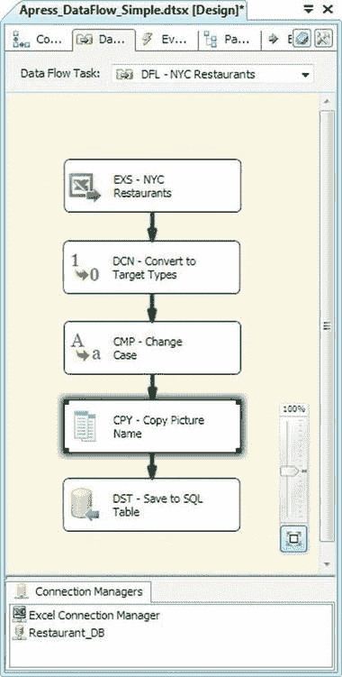
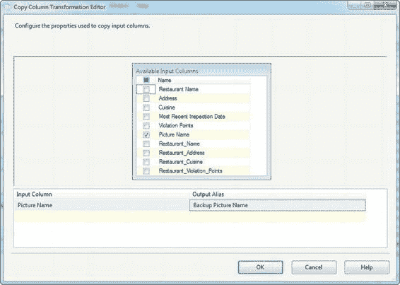
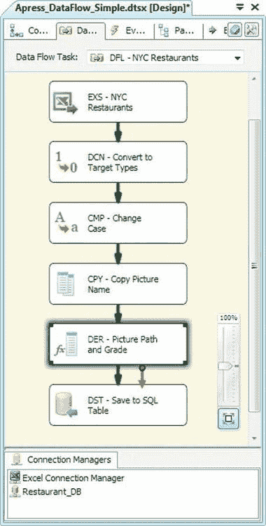
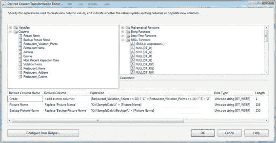
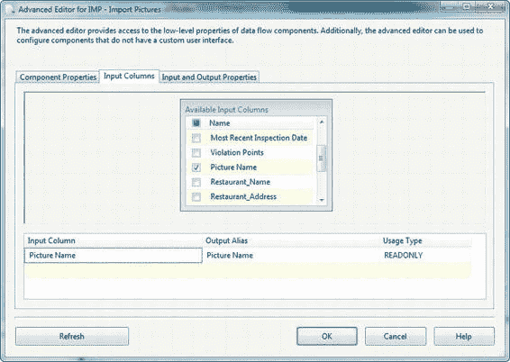
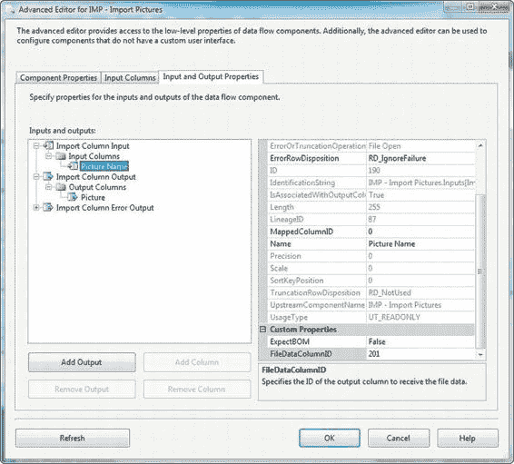
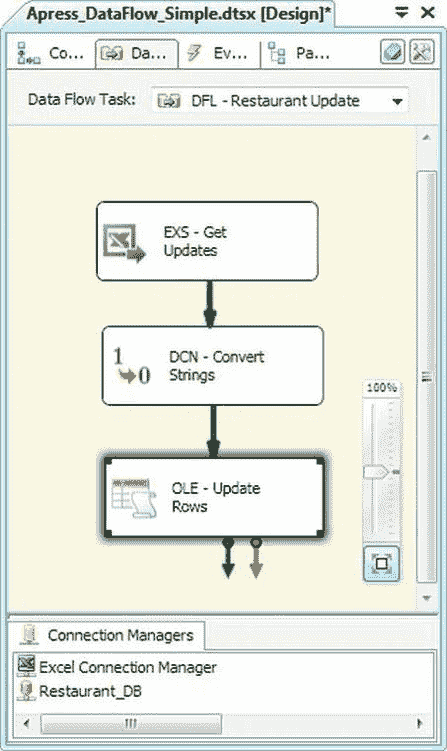
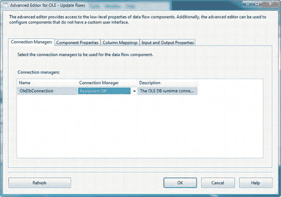
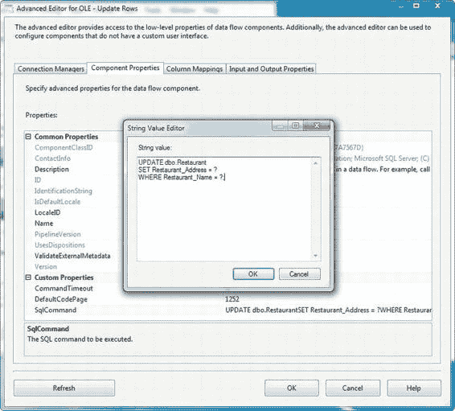

# 第 8 章：数据流转换

## 字符映射转换

字符映射转换允许您对传入的字符数据列应用字符串操作。对于每个选定列，您可以选择执行一个或多个字符串操作，例如将字符串转换为大写或小写。字符映射转换编辑器相对简单。

在此编辑器中，您选择希望更新的列。然后，您决定操作结果是应放置在新列中，还是直接替换同一列中的值（`就地更改`）。您可以通过更改`输出别名`字段中的值来更改输出列的名称。

最后，在`操作`字段中，您可以选择应用于所选列的转换类型。图 8-7 显示了转换编辑器。

**图 8-7. 编辑字符映射转换**

[www.it-ebooks.info](http://www.it-ebooks.info/)

字符映射转换支持 10 种可以对传入数据执行的字符串转换。您可以从下拉列表中选择多个选项，以便同时对一个输入列执行多次转换。在此示例中，我们选择对选定的字符串列使用`大写`。此转换中可供选择的字符串操作列于表 8-3 中。

**表 8-3. 字符映射转换操作**

| 操作 | 描述 |
| :--- | :--- |
| 字节反转 | 反转 Unicode 字符的字节顺序 |
| 全角 | 将单字节字符更改为双字节字符 |
| 半角 | 将双字节字符更改为单字节字符 |
| 平假名 | 将片假名字符映射为平假名字符 |
| 片假名 | 将平假名字符映射为片假名字符 |
| 语言学大小写 | 应用语言学大小写规则；必须与小写或大写结合使用 |
| 小写 | 将所有字符更改为小写 |
| 简体中文 | 将繁体中文字符映射为简体中文字符 |
| 繁体中文 | 将简体中文字符映射为繁体中文字符 |
| 大写 | 将所有字符更改为大写 |

尽管您可以为单个列选择多个操作，但其中一些转换是互斥的，如表 8-4 所示。

**表 8-4. 互斥的字符映射操作**

| 如果您选择了... | 则不能同时选择... |
| :--- | :--- |
| 全角 | 半角、小写、大写 |
| 半角 | 全角、小写、大写 |
| 平假名 | 片假名、小写、大写 |
| 片假名 | 平假名、小写、大写 |
| 语言学大小写 | 全角、半角、平假名、片假名、简体中文、繁体中文、字节反转 |
| 小写 | 大写、平假名、片假名、半角、全角 |
| 简体中文 | 繁体中文 |
| 繁体中文 | 简体中文 |
| 大写 | 小写、平假名、片假名、半角、全角 |

#### 复制列转换

复制列转换会创建您指定列的副本。图 8-8 扩展了我们一直在处理的示例，其中包含了复制列转换。



**图 8-8. 将复制列添加到数据流**

此转换的编辑器很简单：只需勾选您想要复制的列。默认情况下，复制的列被命名为`<列名> 的副本`。如果您愿意，可以编辑`输出别名`字段，将其更改为更有意义的名称。我们添加的复制列转换将创建`图片名称`列的副本，如图 8-9 所示。



**图 8-9. 在编辑器中编辑复制列转换**

### 派生列转换

派生列转换是 SSIS 中最广泛使用且最灵活的行转换之一。此转换允许您使用 SSIS 表达式语言创建的表达式来生成新列，或替换现有列。`SSIS 表达式语言`具有强大而灵活的语法，支持数学运算符和函数、数据类型转换、条件表达式、字符串操作和空值处理。

**注意：** 我们将在第 9 章深入探讨`SSIS 表达式语言`的细节。

要创建派生列转换，我们将其从工具栏拖动并放置在源和目标之间的数据流中。我们将通过添加派生列转换来扩展前面的示例，如图 8-10 所示。



**图 8-10. 简单数据流中的派生列转换**

派生列转换允许我们定义表达式，其结果将以新列的形式添加到输出中（或替换现有列）。图 8-11 显示了此示例中出现的派生列转换编辑器。



**图 8-11. 编辑派生列转换**

如转换编辑器所示，两列的值被替换为表达式的结果。新列则由表达式的结果填充，这些表达式是使用`SSIS 表达式语言`编写的。这种强大的语言允许您对变量、列和常量执行数学计算和字符串操作。我们用于`图片名称`和`图片名称的副本`列的表达式如下所示：

`"C:\\SampleData\\" + [Picture Name]`

`"C:\\SampleData\\Backup\\" + [Picture Name]`

这些表达式利用`SSIS 表达式语言`的字符串连接功能，将文件路径前置到传入转换的图片名称。`SSIS 表达式语言`使用类似 C#的语法，包括转义字符，这就是为什么我们必须在表达式中将反斜杠（`\`）加倍的原因。结果是文件系统中文件的两个完整路径。尽管这些表达式相当简单直接，但我们实现了一个更复杂的派生列，它根据纽约市卫生局的评级标准计算字母等级。结果存储在一个添加到数据流的新列中，名为`Grade`：

```
(Restaurant_Violation_Points >= 28)?"C":(Restaurant_Violation_Points >= 14)?"B":"A"
```

此表达式使用`条件运算符`（`?:`）根据纽约市卫生局的评级标准为每个餐厅分配一个等级。该标准为违规点数在 0 到 13 之间的餐厅分配 A 级，14 到 27 点之间分配 B 级，28 点及以上分配 C 级。此示例中的条件运算符精确地模拟了这些规则。

当您从左到右阅读表达式时，会注意到第一个布尔表达式（`Restaurant_Violation_Points >= 28`），它返回`True`或`False`。如果结果为真，条件运算符返回问号后的值（此处为 C）。如果结果为假，则评估第二个布尔表达式（`Restaurant_Violation_Points >= 14`）。如果它返回`True`，则返回 B；如果返回`False`，则返回 A。

**注意：** `SSIS 表达式语言`是 SSIS 的一个强大功能。如果您不熟悉此示例中使用的函数和运算符，请不要担心。我们将在第 9 章对`SSIS 表达式语言`的详细讨论中涵盖这些内容以及更多内容。

#### 导入列转换


#### 导入列转换

**导入列**转换提供了一种方法，可以从文件系统获取大型对象数据，以丰富数据流中的行数据。**导入列**允许你向数据中添加图像、二进制和文本文件。我们在图 8-12 的数据流中添加了一个**导入列**转换，用于导入此列表中餐厅的图片。

*图 8-12. 数据流中的导入列转换*

[www.it-ebooks.info](http://www.it-ebooks.info/)



## 第 8 章 - 数据流转换

当你需要将大型对象数据与其他数据行绑定并一起存储在数据库中时，**导入列**转换非常有用。但有一个注意事项——这个转换的编辑器是所有转换中较为晦涩的之一。

##### 配置导入列

配置**导入列**的第一步是在**输入列**选项卡上选择一个字符串列。我们选择了**图片名称**列，该列之前我们已填充了从数据流传入的每个图片的完整路径（在**派生列**转换中）。你可以在图 8-13 中看到这一点。

*图 8-13. 选择指向要导入文件的输入列*

你在第一步中选择的输入列会告诉**导入列**转换要将哪个文件导入数据流。正如我们的示例所示，该任务应包含文件的完整路径。

配置此转换的下一步是在**输入和输出属性**中添加一个输出列。该列将在**导入列**读取文件后保存其内容。以下为此新输出列的合适数据类型：

*   `image [DT_IMAGE]` 用于图像、文字处理文件或电子表格等二进制数据
*   `text stream [DT_TEXT]` 用于 ASCII 文本文件等文本数据
*   `Unicode text stream [DT_NTEXT]` 用于 Unicode 文本文件和 UTF-16 编码的 XML 文件等 Unicode 文本数据

[www.it-ebooks.info](http://www.it-ebooks.info/)



## 第 8 章 - 数据流转换

**导入列**较为晦涩的方面之一是在**输入和输出属性**选项卡上配置输入列。要配置输入列，请拿一支笔和一张纸（是的，笔和纸！）并记下你的输出列 **ID** 属性旁边的数字。在我们的示例中，该数字是 `201`。

然后在同一选项卡上编辑输入列。滚动到页面底部，将你刚刚记下的数字输入到 **FileDataColumnID** 属性中。如果你正在加载 Unicode 数据，并且你的数据具有字节顺序标记（BOM），则可以将 **ExpectBOM** 属性设置为 `True`，否则设置为 `False`。如图 8-14 所示。

*图 8-14. 完成导入列转换的配置*

最后，如果你的输入列可能包含空值，你可能需要将 **ErrorRowDisposition** 属性从默认值 `RD_FailComponent` 更改为 `RD_IgnoreFailure` 或 `RD_RedirectRow`。如果设置了 `RD_IgnoreFailure` 或 `RD_RedirectRow`，则组件在遇到空值时不会引发异常。不幸的是，此组件无法将空值与不存在的实际文件路径分开处理（如果你愿意，可以使用额外的数据流组件单独处理此问题）。正确配置**导入列**的最终结果是，输入列引用的图像文件中包含的数据被添加到数据流的新输出列中。

## 处理错误行

SSIS 中的数据流转换在处理错误行方面提供了相当大的灵活性。许多组件提供了细粒度的错误处理，允许你为可能发生的不同类型异常选择不同的错误处理方式。例如，在某些组件中，你可以将截断错误与其他错误区别处理。

**导入列**转换错误的错误处理粒度较低——行要么（因任何原因）出错，要么不出错。无论你使用的转换具有何种错误处理粒度，你都有几个选项来处理错误行：

*   `RD_FailComponent` 在遇到错误时导致组件失败；这是大多数转换的默认错误处理方式。
*   `RD_IgnoreFailure` 简单地忽略发生的错误。
*   `RD_RedirectRow` 将导致错误的行重定向到组件的错误输出。

在其他界面不那么晦涩的组件中，你会在它们的编辑器中看到相同的选项，但名称更友好。在这些组件中，你会看到选项列为 *忽略失败*、*重定向行* 和 *失败组件*。这些选择与前面列表中的 `RD_` 选项等效。

#### OLE DB 命令

**OLE DB 命令**转换是一种有趣的行转换，它为通过转换的每一行执行一条 SQL 语句。最常见的情况是，你会看到**OLE DB 命令**转换用于对单个行发出更新语句，主要是因为 SSIS 目前还没有一个**合并目标**可以为你完成批量更新的工作。

**注意：** **OLE DB 命令**转换使用一种称为“逐行痛苦处理”（Row by Agonizing Row， RBAR）的处理模型（该术语由 SQL 专家和 Microsoft MVP Jeff Moden 推广）。在 SQL 方面，这对于大型数据集不被视为最佳实践。

为了演示，我们设置了一个数据流，该数据流读取一个 Excel 电子表格，其中包含对我们之前加载的餐厅信息的更新，然后将更新应用到数据库。图 8-15 显示了数据流中的 **OLE DB 命令**。

[www.it-ebooks.info](http://www.it-ebooks.info/)



## 第 8 章 - 数据流转换

*图 8-15. 包含 OLE DB 命令转换的数据流*

对 **OLE DB 命令**转换的所有更改都在一个包含四个选项卡的**高级编辑器**窗口中进行。**连接管理器**选项卡让你选择**OLE DB 连接管理器**，转换将针对该管理器发出 SQL 语句。在图 8-16 中，选择了 **Restaurant_DB** 连接管理器。

[www.it-ebooks.info](http://www.it-ebooks.info/)



## 第 8 章 - 数据流转换

*图 8-16. OLE DB 命令高级编辑器的连接管理器选项卡*

**组件属性**选项卡允许你设置 **OLE DB 命令**转换的 **SqlCommand** 属性。**SqlCommand** 属性保存你希望对通过转换的每一行执行的 SQL 语句。你可以使用**字符串值编辑器**对话框编辑 **SqlCommand** 属性，该对话框可从**组件属性**选项卡访问，如图 8-17 所示。在此实例中，我们将其设置为一个简单的参数化 `UPDATE` 语句。

##### 参数化 SQL 语句

参数化允许你动态替换 SQL 语句中的值。当你对 SQL 进行参数化时，语句和参数值会分别发送到服务器。服务器在执行时动态替换 SQL 语句中的参数化值。参数化 SQL 比通过拼接字符串构建 SQL 语句更安全，后者可能使你的代码易受 SQL 注入攻击。参数化 SQL 还可以因查询计划缓存重用而提供性能优势。

特别是 OLE DB 提供程序使用问号（`?`）作为参数占位符（一些其他提供程序使用不同的参数占位符）。在我们的示例中，我们使用了以下参数化 SQL 语句：

```sql
UPDATE dbo.Restaurant
SET Restaurant_Address = ?
WHERE Restaurant_Name = ?;
```

SQL Server 在执行时用实际值替换参数标记。

[www.it-ebooks.info](http://www.it-ebooks.info/)



## 第 8 章 - 数据流转换

*图 8-17. OLE DB 命令高级编辑器的组件属性选项卡*


