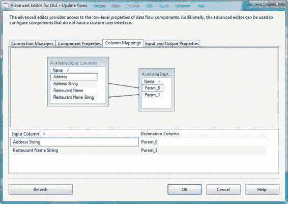
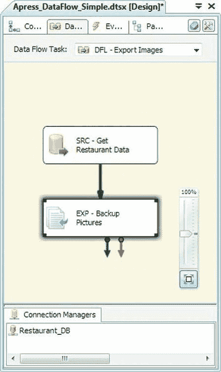
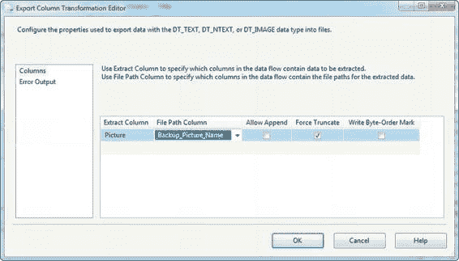
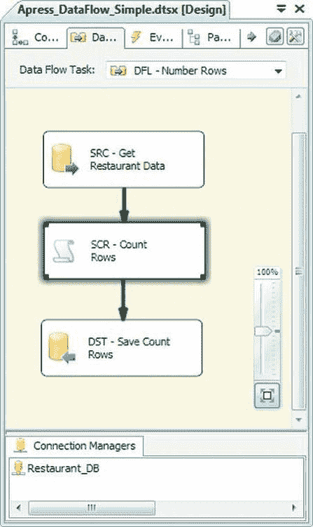
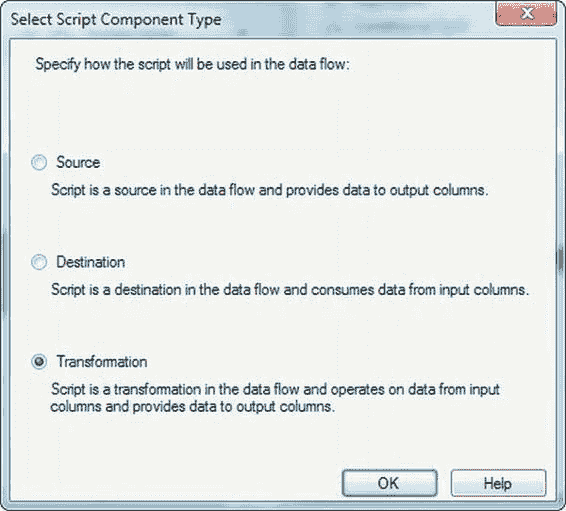
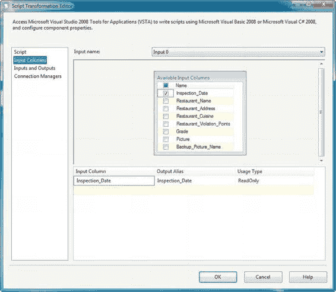
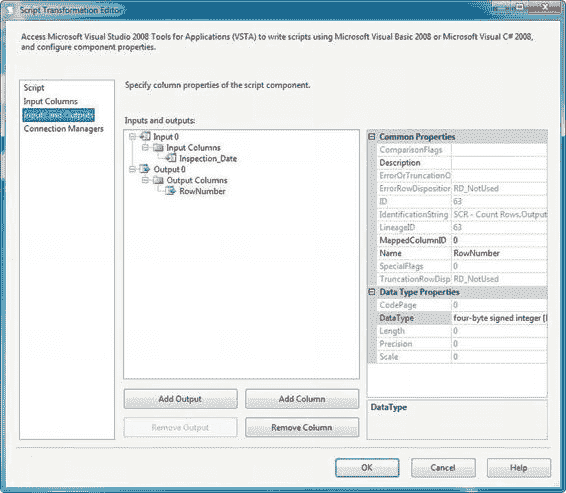
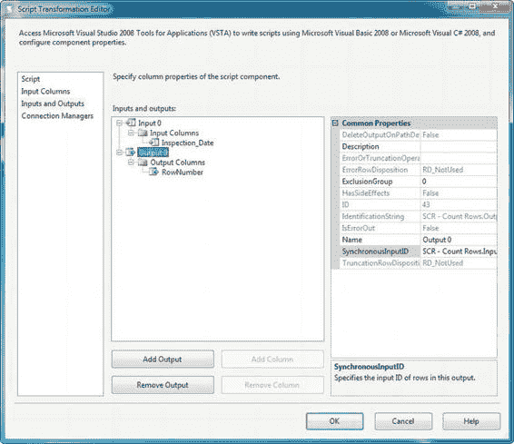
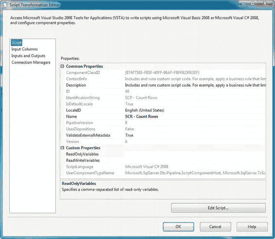
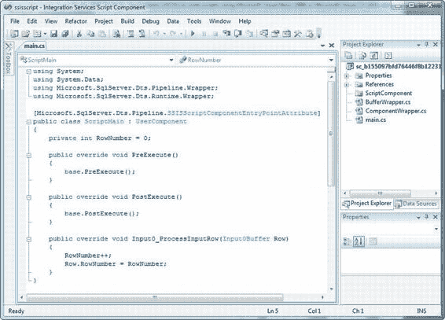

# 编辑器的“列映射”选项卡允许你将 OLE DB 命令的输入列映射到 SQL 语句中的参数。

由于 OLE DB 命令使用问号作为参数的占位符，因此参数被视为**位置型**——也就是说，可以通过从零开始的数字位置来引用它们。图 8-18 显示，我们将“地址字符串”列映射到了 `Param_0`，而“餐厅名称字符串”列映射到了 `Param_1`。

[www.it-ebooks.info](http://www.it-ebooks.info/)



**图 8-18. 在高级编辑器中将输入列映射到 OLE DB 命令参数**

OLE DB 命令对于你可能遇到的一些非常特定的情况很有用。然而，其性能可能有所欠缺，特别是对于大型数据集（数千行或更多）。我们建议尽可能使用基于集合的解决方案，而不是 OLE DB 命令转换，并且当你确实必须使用 OLE DB 命令时，尽量减少通过它发送的行数。

#### 导出列

“导出列”转换执行与“导入列”转换相反的功能。“导出列”允许你从数据流中提取 LOB 数据并将其保存到文件系统的文件中。图 8-19 展示了数据流中的“导出列”转换。

[www.it-ebooks.info](http://www.it-ebooks.info/)



**图 8-19. 数据流中的“导出列”转换**

尽管“导入列”和“导出列”转换是一对匹配的功能，但“导出列”配置起来要简单得多。“导出列”编辑器允许你通过 `提取列` 属性选择包含 LOB 数据的列，并通过 `文件路径列` 属性选择目标文件路径。你还可以从三个复选框属性中选择：如果目标文件已存在，`允许追加` 会将你的 LOB 数据追加到输出文件；`强制截断` 会在开始写入数据前清空目标文件（如果该文件已存在）；而`写入字节顺序标记` 会向输出文件输出一个 BOM，这在你的 LOB 数据由 Unicode 字符数据组成时可能很重要。图 8-20 展示了“导出列转换编辑器”。

[www.it-ebooks.info](http://www.it-ebooks.info/)



**图 8-20. 配置“导出列”转换**

#### 脚本组件

“脚本”组件让你能够运用你的 .NET 编程技能，轻松创建 SSIS 组件，以满足超出标准组件范围的需求。“脚本”组件擅长执行其他 SSIS 标准组件无法执行的转换类型。

通过“脚本”组件，你可以执行简单的转换，例如计算数据流中的行数，或者执行极其复杂的转换，例如计算密码学单向哈希值以及执行复杂的聚合。“脚本”组件同时支持同步和异步模式，并且可以用作源、目标或流中转换。

在这个介绍中，我们将演示一个简单的行计数示例，如图 8-21 所示。

[www.it-ebooks.info](http://www.it-ebooks.info/)



**图 8-21. 数据流中的“脚本组件”转换**

在这个例子中，我们使用“脚本”组件创建了一个简单的同步转换，为通过它的每一行添加一个递增的行号。要创建此转换，我们将“脚本”组件从 SSIS 工具箱拖放到设计器界面。它立即提示我们选择要创建的组件类型，如图 8-22 所示。

[www.it-ebooks.info](http://www.it-ebooks.info/)



**图 8-22. 选择要创建的脚本组件类型**

对于此示例，我们创建一个简单的同步转换，因此我们选择了“转换”脚本组件类型。将“脚本”组件添加到数据流后，我们通过“脚本转换编辑器”对其进行了配置。我们首先转到“输入列”页面。在此页面上，你可以选择输入列，这些列可以在脚本组件内部访问。你还可以指示某列是只读还是可读/写，如图 8-23 所示。

**提示：** 第 10 章将介绍如何使用脚本组件创建源和目标，以及更复杂的转换。

[www.it-ebooks.info](http://www.it-ebooks.info/)



**图 8-23. 为脚本组件选择输入列**

接下来，我们在编辑器的“输入和输出”页面上，向组件的“输出列”集合中添加了一个列。我们将该列命名为 `RowNumber`，并将其设为四字节有符号整数 [`DT_I4`]，如图 8-24 所示。

[www.it-ebooks.info](http://www.it-ebooks.info/)



**图 8-24. 将 RowNumber 列添加到脚本组件的输出**

正如我们提到的，此组件将是一个简单的同步脚本组件。脚本组件默认是同步的。脚本组件是否同步由“输入和输出”页面上输出列集合的 `SynchronousInputID` 属性决定。当此属性设置为某个输入列集合的名称时（如图 8-25 所示），该组件就是同步的。如果将此属性设置为 `None`，则该组件是异步的。在本例中，我们将此属性设置为输入列集合的名称 `SCR - Count Rows.Inputs[Input 0]`。

[www.it-ebooks.info](http://www.it-ebooks.info/)



**图 8-25. 在“输入和输出”页面上检查 SynchronousInputID 属性**

接下来，我们转到“脚本”页面来编辑脚本。在此页面上，你可以将 `ScriptLanguage` 属性设置为 Microsoft Visual Basic 2008 或 Microsoft Visual C# 2008。如图 8-26 所示，我们选择 C# 作为我们的脚本语言。在“脚本”页面上，你还可以通过 `ReadOnlyVariables` 和 `ReadWriteVariables` 集合选择希望脚本访问的任何变量。我们在此示例中未使用变量，但将在第 9 章详细讨论它们。

[www.it-ebooks.info](http://www.it-ebooks.info/)



**图 8-26. 在脚本转换编辑器的“脚本”页面上编辑属性**

选择脚本语言后，我们通过单击“编辑脚本”按钮来编辑 .NET 脚本。

这会调出 Visual Studio Tools for Applications (VSTA) 编辑器，并显示一个基本同步脚本组件的模板，如图 8-27 所示。

[www.it-ebooks.info](http://www.it-ebooks.info/)



**图 8-27. 在脚本组件中编辑脚本**

所有脚本组件都有一个名为 `ScriptMain` 的默认类，该类继承自 `UserComponent` 类，而后者又继承自 `Microsoft.SqlServer.Dts.Pipeline.ScriptComponent` 类。`UserComponent` 类要求你重写其三个方法以实现同步脚本组件：

*   `PostExecute()` 方法在组件完成处理行后执行任何清理代码，例如处置对象并向 SSIS 变量赋最终值。当组件关闭时，`PostExecute()` 恰好被调用一次。在此实例中，我们没有需要运行的自定义后执行代码，因此我们只是调用了 `base.PostExecute()` 方法来执行基类中的任何标准后执行代码。

*   `PreExecute()` 方法在组件开始处理数据行之前执行任何设置代码，例如变量初始化。当组件首次初始化时，`PreExecute()` 恰好被调用一次。在此实例中，我们没有需要运行的自定义前执行代码，因此我们只是调用了 `base.PreExecute()` 方法来执行基类中的任何标准前执行代码。

*   `Input0_ProcessInputRow(Input0Buffer Row)` 方法对通过组件的每一行调用一次。这是你放置每行转换逻辑的地方。在我们的示例中，我们递增一个私有变量 `_rowCount`，然后将其值赋给 `Row.RowNumber` 输出列。此示例组件的代码如清单 8-1 所示。

```
public override void PreExecute()
{
    base.PreExecute();
}

public override void PostExecute()
{
    base.PostExecute();
}

private int _rowCount = 0;

public override void Input0_ProcessInputRow(Input0Buffer Row)
{
    Row.RowNumber = _rowCount++;
}
```

**清单 8-1. 一个简单的同步行计数转换的脚本**

在此示例中，“脚本”组件提供了一种简单的方法来向数据流添加行号。这只是你可以使用脚本组件创建的众多转换中的一个例子。


