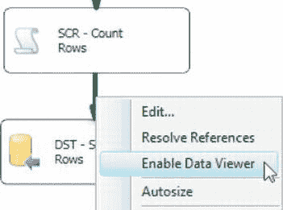
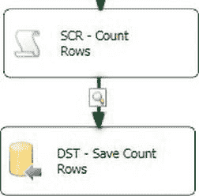
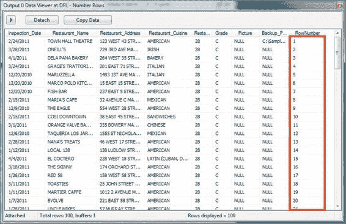
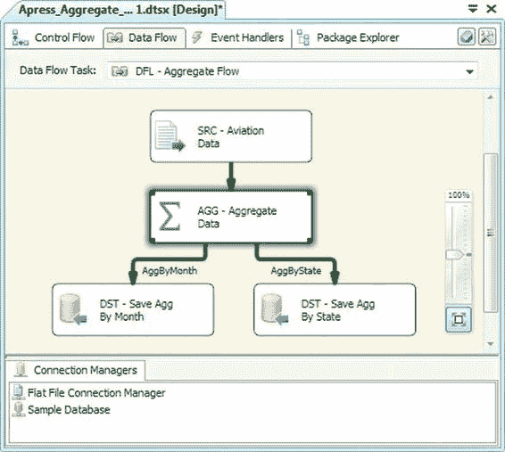

# 第 8 章 数据流转换

### 行集转换

行集转换从其输入生成新的行集。行集转换是异步的，输入行数通常与输出行数不同。此外，输出行集的“形状”也可能与输入行集的“形状”不同。

例如，我们将在本节后面讨论的 `Pivot`（透视）转换，它会将输入行集“侧转”过来。

#### 聚合

`Aggregate`（聚合）转换主要执行两项任务：(1) 它可以对输入数据应用聚合函数，(2) 它允许你根据输入列中的值对数据进行分组。基本上，它执行的功能类似于 T-SQL 聚合函数（例如 `MIN`、`MAX`、`COUNT`）和 `GROUP BY` 子句。

在图 8-31 所示的示例包中，我们从美国国家运输安全委员会导入了样本航空事故数据，并对传入数据执行了两次聚合，在数据流中分别由 `Aggregate` 转换的不同输出来表示。

图 8-31. 包含 `Aggregate` 转换的示例包

---

处理完所有数据行后，会调用 `PostExecute()`。当组件完成所有数据行的处理时，`PostExecute()` 方法会被精确地调用一次。我们的示例不需要运行任何自定义的后执行代码，因此我们调用了 `base.PostExecute()` 方法来执行基类中的任何标准后执行代码。

[www.it-ebooks.info](http://www.it-ebooks.info/)

`Input0_ProcessInputRow()` 方法是脚本组件的主力。该方法对每个输入行调用一次。它接受一个 `Input0Buffer` 参数，其中包含当前行的内容。通过这个 `Input0Buffer` 参数，你可以读取和写入输入字段的值。在我们的示例中，我们每次调用该方法时都递增 `RowNumber` 变量，并将其值赋给 `Input0Buffer` 的 `RowNumber` 字段。

结果是在数据流中添加了一个名为 `RowNumber` 的新列，其中包含数据流中每一行的递增编号。你可以通过在脚本组件输出上添加数据查看器来查看数据流中的数据。为此，右键单击从脚本组件出来的绿色箭头，然后从上下文菜单中选择“启用数据查看器”选项，如图 8-28 所示。

图 8-28. 在脚本组件输出上启用数据查看器

在输出路径上添加数据查看器后，你会看到输出箭头上出现一个放大镜图标，如图 8-29 所示。

图 8-29. 输出路径上的数据查看器放大镜图标

运行包时，数据查看器将显示在一个弹出窗口中，窗口内有一个网格，其中包含来自数据流的数据。数据查看器会暂停数据流，因此在你单击箭头按钮或“分离”之前，行不会移动到下一步。单击箭头按钮允许另一组行通过，之后它将再次暂停数据流。“分离”按钮将数据查看器与数据流分离，导致数据查看器停止收集和显示新行，并允许所有行通过。在我们的示例包中放置数据查看器的结果如图 8-30 所示。

图 8-30. 在数据查看器中查看数据

数据查看器是一个非常方便的数据调试工具，你可能会想要熟悉它——你无疑会经常使用它来排除数据流问题和数据错误。

**注意：** 以前版本的 SSIS 包含四种类型的数据查看器——网格、直方图、散点图和柱形图数据查看器。由于网格数据查看器是最常用的，SSIS 团队在 SSIS 12 中移除了其他类型的数据查看器。

[www.it-ebooks.info](http://www.it-ebooks.info/)

