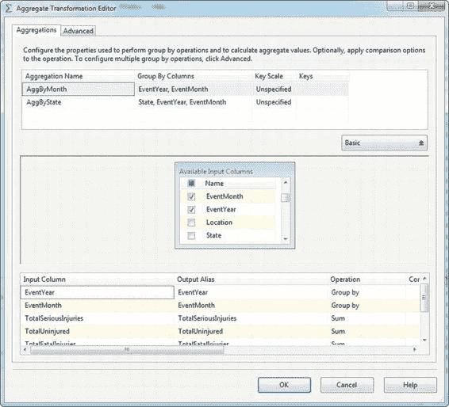
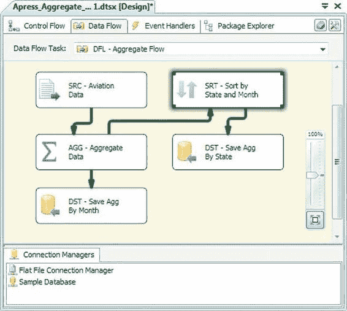

# 第八章 - 数据流转换

`Aggregate`（聚合）转换可在`Basic`（基本）模式或`Advanced`（高级）模式下进行配置。在`Basic`模式下，该转换只有一个输出；在`Advanced`模式下，它可以有多个输出，每个输出包含不同聚合的结果。在本例中，我们配置了两个聚合：

*   第一个聚合名为`AggByMonth`。此聚合对输入中的伤害计数字段进行求和，并按`EventYear`和`EventMonth`分组。
*   第二个聚合名为`AggByState`。此聚合对伤害计数字段进行求和，按`State`、`EventYear`和`EventMonth`分组。

[www.it-ebooks.info](http://www.it-ebooks.info/)

##### 图 8-32. 在高级模式下编辑聚合转换

`Advanced/Basic`（高级/基本）按钮会显示或隐藏编辑器顶部的多重聚合配置框。您可以从输入列列表中选择列，并在编辑器下部选择要对这些列执行的操作。可选择的操作包括：

*   `Group By`（分组依据）根据此列对结果进行分组，类似于 SQL `SELECT`查询中的`GROUP BY`子句。
*   `Count`（计数）返回此列中值的数量。如果您选择`(*)`作为输入列，则计数中会包含 NULL 值。否则，NULL 值将被忽略。此操作等效于 SQL 的`COUNT`聚合函数。
*   `Count Distinct`（计数不同值）返回此列中不同值的数量。等效于 SQL 的`COUNT(DISTINCT ...)`聚合函数。
*   `Sum`（求和）返回此列中值的总和。等效于 SQL 的`SUM`聚合函数。
*   `Average`（平均值）返回选定列中值的平均值。等效于 SQL 的`AVG`聚合函数。
*   `Minimum`（最小值）返回列中的最小值。等效于 SQL 的`MIN`聚合函数。
*   `Maximum`（最大值）返回列中的最大值。等效于 SQL 的`MAX`聚合函数。

`Group By`、`Count`和`Count Distinct`操作可对数字或字符串数据执行。`Sum`、`Average`、`Minimum`和`Maximum`操作只能对数字数据执行。

**提示：** `Aggregate`转换不要求传入数据已排序。

[www.it-ebooks.info](http://www.it-ebooks.info/)

#### 排序

`Sort`（排序）转换根据您在设计器中选择的列的值对传入的行进行排序。您可能需要在数据流中对输入数据进行排序的原因有几种，包括：

*   某些转换（例如本章稍后介绍的`Merge Join`）要求输入数据已排序。
*   在某些情况下，如果数据已预先排序，将数据保存到关系数据库时可以获得更好的性能。
*   在某些情况下，数据需要按特定顺序处理，或者在移交给另一个数据流或 ETL 过程之前需要排序。

在任何这些情况下，您都需要在传递数据之前对其进行排序，如图 8-33 所示。

**提示：** 由于`Sort`是一个完全阻塞的异步转换，它会暂停数据流直到完成排序操作。尽可能在源处对数据排序是一个好习惯。例如，如果您从关系数据库中提取数据，可以考虑在查询中使用`ORDER BY`子句来保证顺序。如果输入的顺序无法保证——例如，当您从平面文件中提取数据，或者对数据执行的转换可能改变数据在数据流中的顺序时，`Sort`转换可能是最佳选择。如果您的数据在 SQL Server 中未在排序列上建立索引，`ORDER BY`子句可能会使用大量服务器端资源。然而，如果数据已建立索引，`SSIS`的`Sort`转换将无法利用该索引。

[www.it-ebooks.info](http://www.it-ebooks.info/)

##### 图 8-33. 数据流中的排序转换

