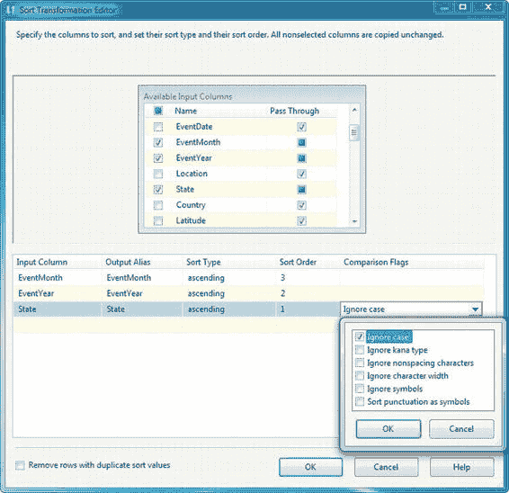
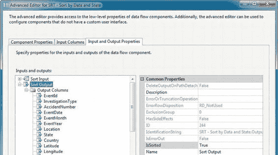
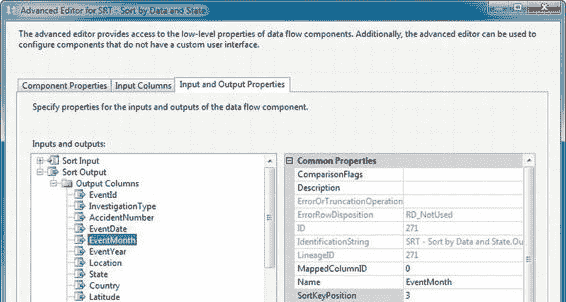
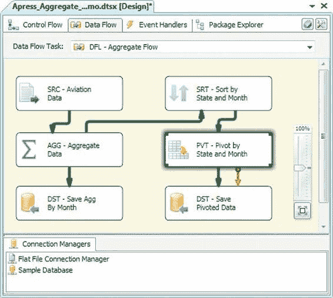
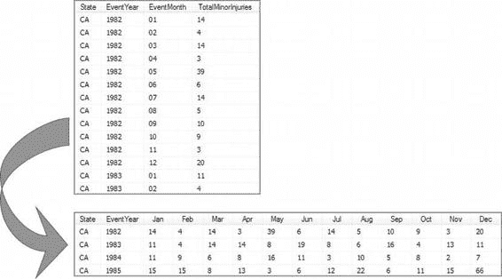
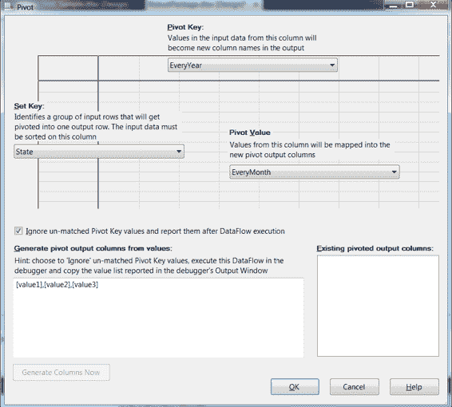
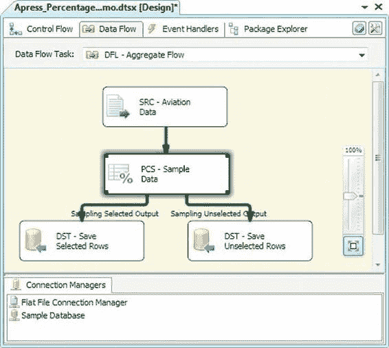

# 第 8 章 数据流转换

## 排序转换

`排序`转换提供了多种适用于排序的选项。在排序编辑器中，您可以选择要依据其排序的列，并为每列选择排序类型（升序或降序选项）和排序顺序。排序顺序指示排序操作中列的顺序。在我们的示例中，我们按州列排序，然后按事件年份和事件月份排序。

`比较标志`选项为字符数据提供了几个与排序相关的选项，例如在排序过程中忽略大小写和符号。在我们的示例中，我们选择在对传入数据排序时忽略州列的大小写。您还可以选择删除具有重复排序值的行。

图 8-34 显示了排序转换编辑器。

[www.it-ebooks.info](http://www.it-ebooks.info/)

**图 8-34. 编辑排序转换**

##### ISSORTED 属性

`排序`转换中一个值得注意的特性通过`高级编辑器`中的`输入和输出属性`展现出来。`IsSorted`属性由`排序`转换自动设置，如图 8-35 所示。

[www.it-ebooks.info](http://www.it-ebooks.info/)

**图 8-35. 排序转换高级编辑器中的 IsSorted 属性**

需要排序输入的转换（例如本章后面介绍的`合并联接`）会检查此属性。如果在数据流中更上游的输出上未将其设置为`True`，则需要排序输入的转换会因此报错。

与`IsSorted`输出属性密切相关的是列级`SortKeyPosition`属性，如图 8-36 所示。

**图 8-36. 高级编辑器中的 SortKeyPosition 属性**

[www.it-ebooks.info](http://www.it-ebooks.info/)

对于`排序`转换，`SortKeyPosition`可以通过`基本编辑器`设置。如果您对传入数据进行了预排序（例如在源查询中使用`ORDER BY`子句），则必须在源适配器上手动设置这些属性。

#### 透视转换

`透视`转换允许您对输入数据执行透视操作。透视操作意味着您获取数据并将其“横向转动”，实质上是将一列中的值转换为结果集中的列。如图 8-37 所示，我们向数据流中添加了一个`透视`转换，以对汇总的航空数据进行反规范化，创建包含月份名称的列。

**图 8-37. 添加透视转换以透视汇总的航空数据**

这个`透视`转换获取输入的各个行，并根据事件月份进行透视。透视操作将月份转换为列，如图 8-38 所示。

[www.it-ebooks.info](http://www.it-ebooks.info/)

**图 8-38. 透视转换的结果**

在 SSIS 的先前版本中，`透视转换编辑器`很难使用——这种情况在这个新版本中得到了纠正。新重新设计的`透视转换编辑器`如图 8-39 所示。

[www.it-ebooks.info](http://www.it-ebooks.info/)

**图 8-39. 透视转换编辑器**

> **注意：** `透视`转换要求输入数据已排序，否则可能产生不正确的结果。与其他需要排序输入数据的转换不同，`透视`转换并不强制执行此要求。请确保您输入到`透视`转换的数据是已排序的。

#### 百分比采样转换

`百分比采样`转换从输入中选取给定百分比的采样行来生成样本数据集。此转换实际上将您的输入数据分成两个独立的

[www.it-ebooks.info](http://www.it-ebooks.info/)

