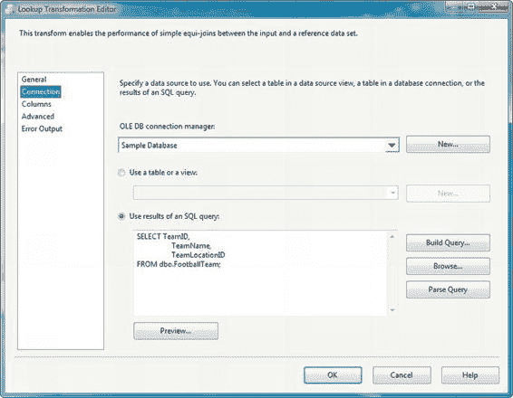
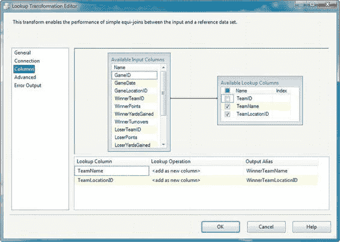
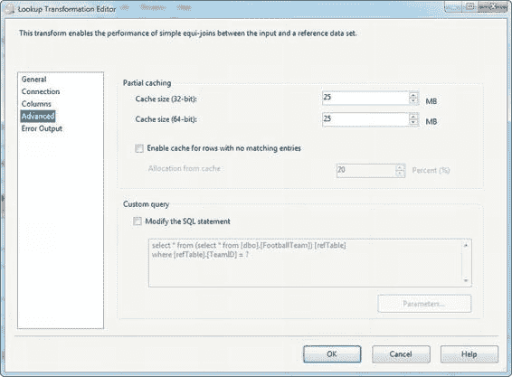
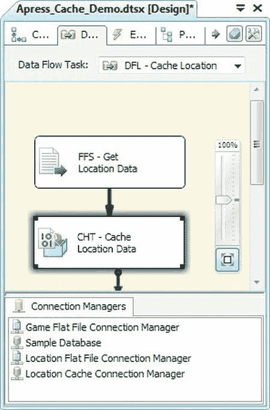
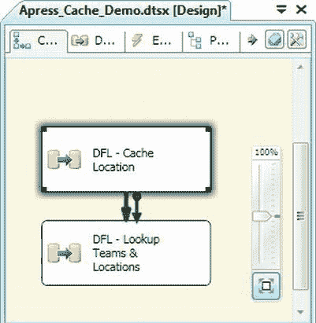
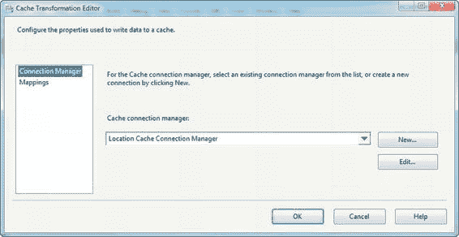

# 第 8 章：数据流转换

## 查找转换

使用 `Lookup` 转换时需要记住的一点是，它是区分大小写、区分重音、区分假名等等的。无论你的输入源或参考数据的排序规则和敏感性设置如何，这一点都成立。也就是说，如果你从具有不区分大小写排序规则的数据库提取参考数据，并从具有不区分大小写排序规则的数据库提取输入数据，这对 `Lookup` 转换来说无关紧要——`Lookup` 转换执行的字符串比较仍然是区分大小写的。如果你想模拟大小写敏感性，请在比较前将你的输入字符串数据和相关的参考数据全部转换为大写或小写。

**图 8-48. 查找转换编辑器的“常规”页面**

##### 常规页面

编辑器的“常规”页面让你选择将作为参考数据源的连接管理器。你的选项是 `OLE DB 连接管理器`或`缓存连接管理器`。在本示例中，我们选择了默认的 `OLE DB 连接管理器`。

你还可以在此页面上选择缓存模式。缓存模式有三种选项：

-   **完整缓存**模式将整个参考数据集预加载并缓存到内存中。这是最常用的模式，适用于小型参考数据集，或者预计会有大量参考行匹配的情况。
-   **部分缓存**模式不会将任何参考数据预加载到内存中。使用此缓存模式时，参考数据行在需要时才从数据库中检索，然后被缓存以供将来查找使用。每检索一个数据行都会发出单独的 `SELECT` 语句。当你拥有小型参考数据集，或者预计只有极少数参考行会与输入数据集中的许多记录匹配时，此模式很有用。
-   **无缓存**模式不预加载任何参考数据。在`无缓存`模式下，参考数据行在需要时才检索，每次使用单独的 `SELECT` 语句获取一行。从技术上讲，`无缓存`模式实际上确实会缓存它检索到的最后一个参考行，但一旦需要新的参考行就会立即丢弃它。除非你的参考数据集非常小并且预计匹配的行非常少，否则通常不推荐使用此模式。此模式产生的开销可能会损害你的性能。

`Lookup` 转换通常与 `OLE DB 连接管理器`紧密关联。默认情况下，查找操作希望从 OLE DB 源（例如 SQL Server 或其他关系数据库）提取其参考数据。当你希望从其他源（例如平面文件或 Excel 电子表格）提取参考数据时，你需要先将其存储在 `Cache` 转换中。我们将在下一节介绍 `Cache` 转换。

第一页上的最后一个选项让你指定如何处理没有匹配项的行。你有四个选项：

1.  **使组件失败**（默认）：如果一个输入行通过但没有在参考数据集中找到匹配行，则该组件失败。
2.  **忽略失败**：如果一个输入行通过但没有找到匹配的参考行，则组件继续处理，将参考数据输出列的值设置为 null。
3.  **将行重定向到无匹配输出**：设置此选项后，转换将创建一个“无匹配”输出，并将任何没有匹配参考行的行定向到该新输出。
4.  **将行重定向到错误输出**：设置此选项后，组件将任何没有匹配参考行的行定向到转换的标准错误输出。

##### 连接页面

编辑器的“连接页面”让你选择一个指向存储参考数据的数据库的 `OLE DB 连接管理器`。在此选项卡上，你还可以选择源表或 SQL 查询，如**图 8-49** 所示。

> **提示：** 指定 SQL 查询而不是表作为源是最佳实践。指定 SQL 查询涉及的开销较少，因为 SSIS 不必检索表元数据。通过 SQL 查询，你还可以最小化检索的数据量（包括列和行），而指定表则无法做到这一点。

**图 8-49. 查找转换编辑器的“连接”页面**

##### 列页面

编辑器的第三页——“列”页面——是你定义输入数据集和参考数据集之间连接的地方。只需在`可用输入列`框中单击一列，然后将其拖动到`可用查找列`框中的相应列。选中你希望添加到数据流中的参考数据列旁边的复选框。**图 8-50** 显示了“列”页面。

**图 8-50. 查找转换编辑器的“列”页面**

在此示例中，我们将输入数据集的 `WinnerTeamID` 列连接到参考数据的 `TeamID` 列，并选择将 `TeamName` 和 `TeamLocationID` 添加到目标。你从`可用查找列`框中选择的列将添加到编辑器下部网格中。

每个`查找列`都有一个分配的`查找操作`，可以设置为`<添加为新列>`或`替换“列`*，指示列值应作为新列添加到数据流中，还是应替换现有列。最后，`输出别名`列允许你更改数据流中输出列的名称。

##### 高级页面

“高级”页面允许你设置 `Lookup` 缓存属性。`缓存大小`属性指示应使用多少内存来缓存参考数据。32 位最大缓存大小为 3,072 MB，64 位最大缓存大小为 17,592,186,044,416 MB。

在`部分缓存`模式下，你还可以在此选项卡上设置`为无匹配项的行启用缓存`选项，并设置缓存分配的百分比（默认为 20%）。此选项会缓存没有匹配参考行的数据值，从而最小化到数据库服务器的往返查询。

`自定义查询`选项允许你更改在`部分缓存`或`无缓存`模式下用于执行数据库查找的 SQL 查询，如下图所示。

**图 8-51. 查找转换编辑器的“高级”页面**

#### 缓存转换

正如我们在上一节提到的，`Lookup` 转换默认寻找 `OLE DB 连接管理器`作为其参考数据源。也可以使用其他源，但必须通过 `Cache` 转换间接使用。`Cache` 转换可以从多种源读取数据，包括平面文件和 ADO.NET 数据源，这些源不受 `Lookup` 转换直接支持，如**图 8-52** 所示。

**图 8-52. 填充缓存转换**

如图所示，`Cache` 转换接受数据流中源组件的输出作为其输入。它使用一个 `缓存连接管理器` 将参考数据缓存在内存中以供查找组件使用。因为 `Cache` 转换必须在查找执行之前填充，所以你通常希望在一个独立的数据流中填充它，该数据流位于包含查找的数据流之前。在我们的示例中，我们在一个数据流中填充 `Cache` 转换，在第二个数据流中执行查找，并使用优先约束将它们链接起来，如**图 8-53** 所示。

**图 8-53. 用于缓存和查找的独立数据流**

