# 第八章 数据流转换

*图 8-53. 在独立数据流中填充缓存的转换*

缓存转换通过“缓存转换编辑器”进行配置。“连接管理器”页面让你选择将用于填充缓存引用数据的缓存连接管理器，如图 8-54 所示。

*图 8-54. 缓存转换编辑器的连接管理器页面*

[www.it-ebooks.info](http://www.it-ebooks.info/)

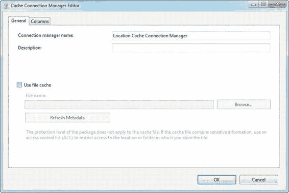

你可以点击“编辑”按钮来编辑缓存连接管理器，以打开“连接管理器编辑器”。在编辑器的“常规”选项卡（如图 8-55 所示）中，你可以更改连接管理器的名称，并选择使用文件缓存。如果选择使用文件缓存，连接管理器会将缓存数据写入文件。你还可以使用现有的缓存文件作为源，而不是从数据流中的上游源提取数据。

*图 8-55. 缓存连接管理器编辑器的常规选项卡*

“列”选项卡显示了缓存中列的列表及其数据类型和相关信息。“索引位置”列必须配置，以反映你希望在查找组件中连接的列。不属于索引的列，其索引位置为 0；索引列应从 1 开始顺序编号。在我们的示例中，`LocationID`列是唯一的索引列，其索引位置设置为 1。图 8-56 显示了“列”选项卡。

[www.it-ebooks.info](http://www.it-ebooks.info/)

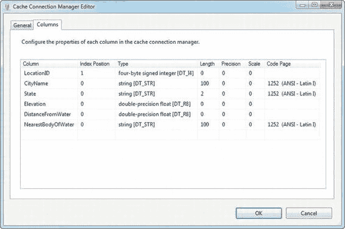

*图 8-56. 缓存连接管理器编辑器的列选项卡*

我们演示缓存转换的示例包扩展了前面的示例，它针对缓存转换执行查找，如图 8-57 所示。

[www.it-ebooks.info](http://www.it-ebooks.info/)

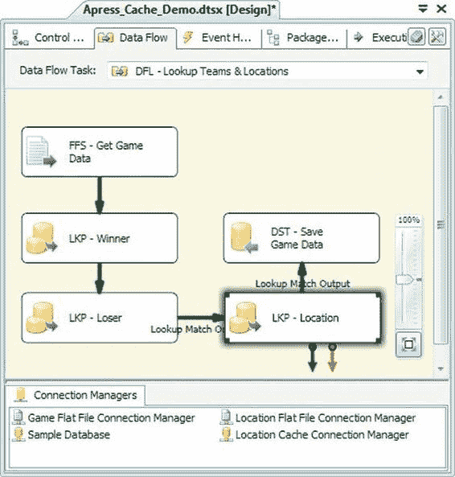

*图 8-57. 针对缓存转换进行查找的数据流*

针对缓存的查找转换的配置与针对 OLE DB 源的查找类似。主要区别如下：
- 你必须选择“完全缓存”模式。“部分缓存”和“无缓存”对于针对缓存的查找是无效选项。
- “连接类型”必须设置为“缓存连接管理器”。
- 在查找转换的“连接”选项卡上，你必须选择“缓存连接管理器”，而不是“OLE DB 连接管理器”。

在“列”选项卡上，你还会在“可用查找列”框的“索引”列中注意到一个放大镜图标，如图 8-58 所示。这些列是你将要映射到输入数据的列。除了这些细微差别之外，针对缓存连接管理器的查找操作与针对 OLE DB 源的操作完全相同。

[www.it-ebooks.info](http://www.it-ebooks.info/)

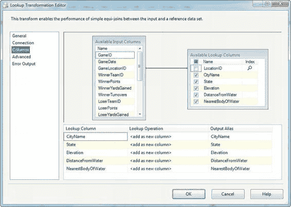

*图 8-58. 针对缓存连接管理器的查找转换的列选项卡*

#### 条件拆分

“条件拆分”转换可让你将满足特定条件的数据行重定向到不同的输出。你可以将此功能用作引导数据沿不同处理路径流动的工具，非常类似于过程编程语言（如 C#或 VB）中的 if...then...else 结构；或者将其用作过滤器，从数据集中排除数据，类似于 SQL WHERE 子句。我们扩展了前面的示例，以过滤掉任何在常规赛季期间没有发生的比赛，如图 8-59 所示。

[www.it-ebooks.info](http://www.it-ebooks.info/)

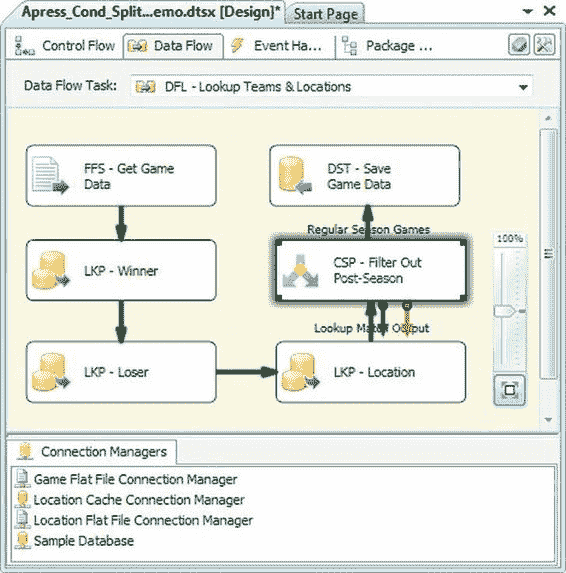

*图 8-59. 在数据流中添加条件拆分转换*

“条件拆分转换编辑器”让你能够控制为此转换添加任意数量的输出。每个输出都根据你为其提供的条件重定向行。条件以 SSIS 表达式语言表达式的形式编写。通常，你会在条件中使用变量或列，以使你的数据具有自导向性。在此示例中，我们向转换添加了一个名为“常规赛季比赛”的输出。我们应用到此输出的条件是`[GameWeek] == “Regular Season”`，请参考下面的图 8-60。我们将在第 9 章讨论 SSIS 表达式语言。

[www.it-ebooks.info](http://www.it-ebooks.info/)

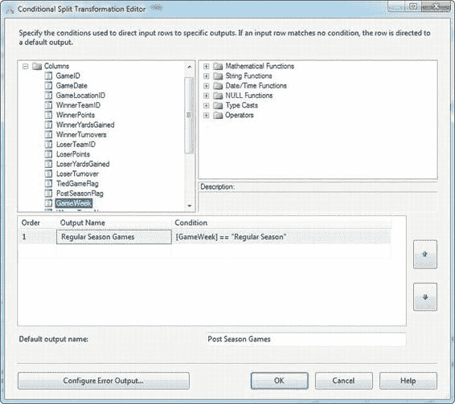

*图 8-60. 编辑条件拆分转换*

当`GameWeek`列包含值`Regular Season`时，数据被重定向到“常规赛季比赛”输出。请注意，SSIS 表达式语言中的字符串比较区分大小写。任何不符合此条件的行都被定向到默认输出，在此示例中，我们将其命名为“季后比赛”。

**提示：** 当你定义多个带条件的输出时，它们会按照“顺序”字段指示的顺序进行评估。一旦某行匹配了给定条件，它会立即被重定向到相应的输出，不会与后续条件进行比较。

当你将条件拆分转换的输出连接到另一个数据流组件的输入时，将显示一个“输入输出选择”框。选择你想要发送到下一个组件的输出，如图 8-61 所示。

[www.it-ebooks.info](http://www.it-ebooks.info/)

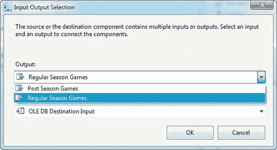
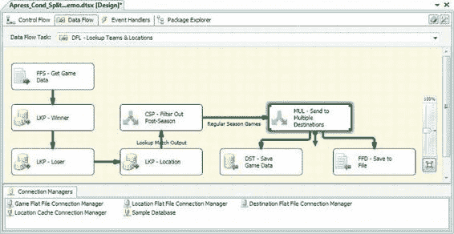

*图 8-61. 连接条件拆分转换时的输入输出选择*

在此案例中，我们没有将“季后比赛”输出连接到任何下游组件，这意味着定向到它的行不会被发送到数据流中。这实际上是对输入数据进行过滤。

#### 多播

“多播”转换在数据流中复制你的数据，这在很多情况下非常有用，例如当你想要对相同源数据并行应用不同的转换时，或者当你想要同时将数据发送到多个目标时。基于前面的示例，我们只是在数据流中的 OLE DB 目标之前添加了一个多播转换。

我们将使用多播转换将转换后的数据发送到两个目标：OLE DB 目标和一个平面文件目标，如图 8-62 所示。

[www.it-ebooks.info](http://www.it-ebooks.info/)

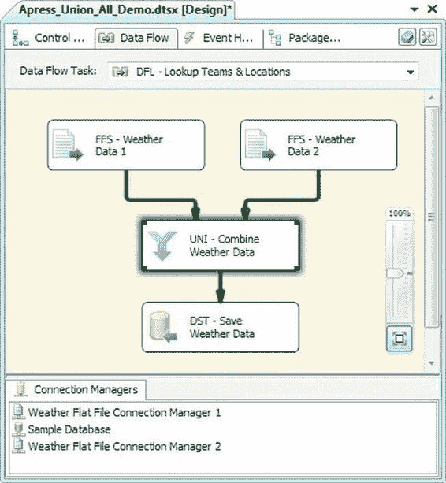

*图 8-62. 多播转换将数据发送到多个目标*

你可以使用多播转换根据需要多次复制数据，尽管它最常用于创建其输入数据的一个副本。

#### Union All

“Union All”转换将两个或更多数据集的行合并到单个数据集中，类似于 SQL 中的`UNION ALL`运算符。对于此示例，我们获取了两个包含每日天气数据的平面文件，并在数据流中将它们合并为一个数据集，如图 8-63 所示。

[www.it-ebooks.info](http://www.it-ebooks.info/)

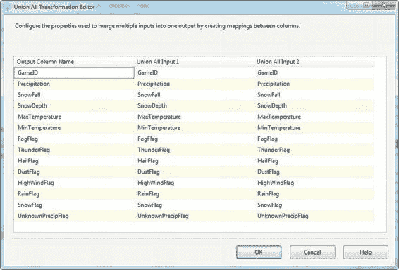

*图 8-63. 使用 Union All 转换合并来自两个源文件的数据*

当你将第一个输入添加到 Union All 转换时，它定义了输出数据集的结构。当你将第二个及后续输入连接到 Union All 转换时，它们会根据匹配的列名逐列对齐。你可以通过双击 Union All 转换来显示编辑器，从而查看所有输入的列，如图 8-64 所示。

[www.it-ebooks.info](http://www.it-ebooks.info/)

*图 8-64. Union All 转换编辑器*

`输出列名称`条目列出了添加到输出中的每个列的名称。这些名称是可编辑的，因此您可以根据需要进行更改。如果不同输入中应匹配的列名称不同，您可以从`联合所有输入`列表的下拉列表中选择它们。

选择`<ignore>`将在该输入的列中放入一个`null`值。

**提示：** 当涉及多个输入时，`联合所有`转换的输出顺序无法保证。要确保顺序，您需要在`联合所有`之后执行一次`排序`操作。

#### 合并

`合并`转换与`联合所有`类似，但它保证输出有序。为实现这一保证，`合并`转换要求所有输入都已排序。当您需要合并来自两个独立源的输入，然后对结果数据集执行`合并连接`时，这尤其有用。

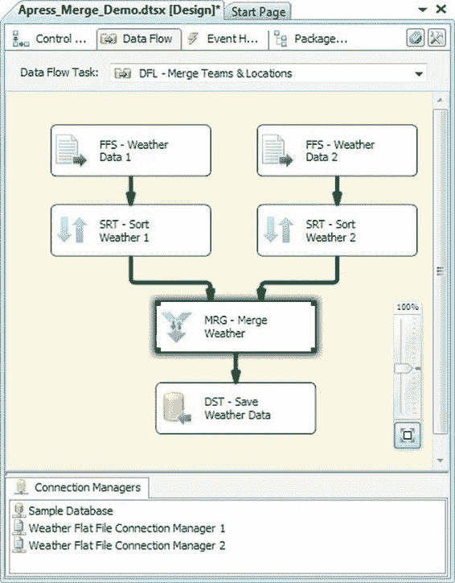
*图 8-65. 具有两个已排序输入的合并转换*

在我们的示例中，我们按`GameID`字段对来自两个源的天气数据进行了排序，然后对它们执行了合并。双击该转换可以查看`合并转换编辑器`。该编辑器与`联合所有转换编辑器`非常相似，只有一个细微差别：排序键字段在`合并输入`和`输出列`列表中都有明确标记。

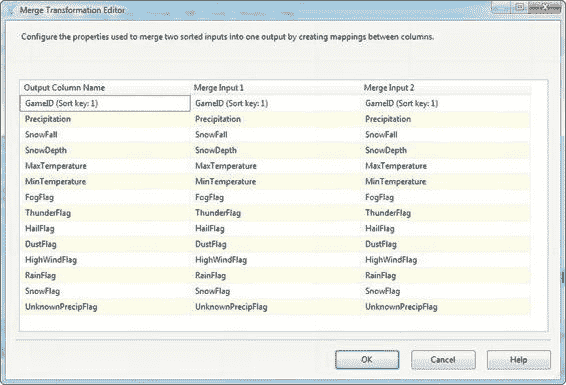
*图 8-66. 查看合并转换编辑器*

正确配置后，`合并`转换保证输出将根据排序键进行排序。

#### 合并连接

`合并连接`转换允许您对两个输入数据集执行连接操作，非常类似于 SQL 连接。主要区别在于，与 SQL Server 在执行连接时为您处理数据排序/排序不同，`合并连接`转换要求您预先在连接键列上对输入进行排序。

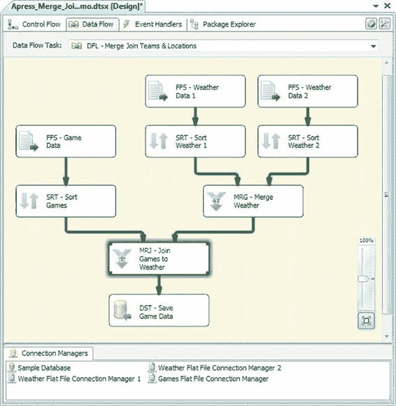
*图 8-67. 添加到数据流中的合并连接*

如图 8-68 所示，`合并连接转换编辑器`允许您选择连接类型。您可以选择`内连接`、`左外连接`或`全外连接`。所有这些连接的工作方式都与您使用 SQL 时的预期一致：

*   `内连接`仅返回左输入键和右输入键匹配的行。如果任一输入中有连接键值与另一输入不匹配的行，则这些行不会被返回。
*   `左外连接`返回左输入的所有行以及右输入中连接键匹配的行。如果左输入中存在右输入中没有匹配行的行，则在右侧列中返回空值。
*   `全外连接`返回左右输入的所有行。当连接键在右侧或左侧不匹配时，在另一侧的列中返回空值。

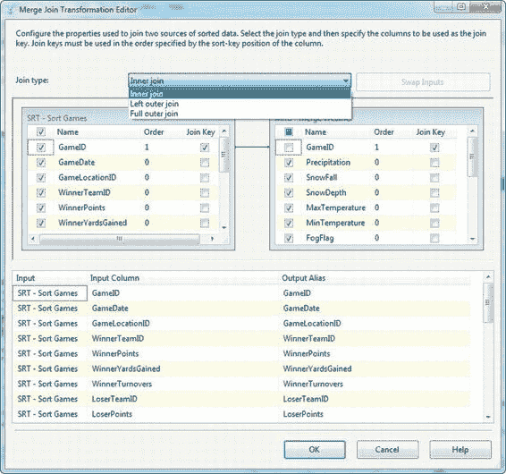

您可能会注意到的一点是，`合并连接`不支持 SQL 中等效的交叉连接或右外连接。您可以通过选择`左外连接`作为连接类型，然后单击`交换输入`按钮来模拟右连接。这会将您的左输入移动到右侧，反之亦然。交叉连接可以通过在两侧添加一个派生列，其中包含一个常量值，然后在这两列上进行连接来模拟。不过，交叉连接功能除了用于生成大型数据集（例如用于测试目的）外，并不那么有用。

在编辑器中，您可以链接连接键列，并选择要返回的来自两侧的列。您还可以在编辑器底部的`输出别名`列表中重命名输出列。

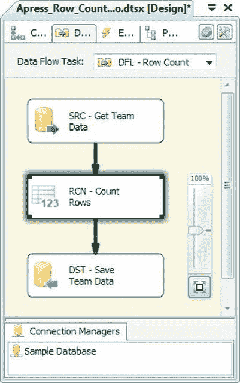
*图 8-68. 在合并连接编辑器中设置属性*

##### 审核

SSIS 包含一些执行"审核"功能的转换。本质上，这些任务允许您捕获有关您的包或数据流本身的元数据。您可以使用此元数据在细粒度级别分析 ETL 过程的各个方面。

##### 行数

`行数`转换正如其名——它统计流经它的行数。`行数`将您指定的变量设置为其计数的结果。

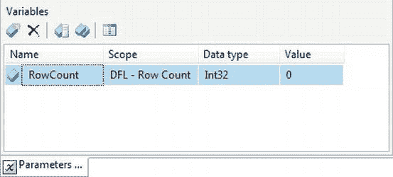
*图 8-69. 数据流中的行数转换*

将`行数`转换添加到数据流后，您需要在`参数和变量`选项卡上创建一个变量，并向包中添加一个整数变量。在本例中，我们选择添加一个名为`RowCount`的变量。

**注意：** 如果您不熟悉 SSIS 变量，请不要担心。我们将在第 9 章详细讨论它们。目前，只需知道 SSIS 变量是内存中的命名临时存储位置，就像其他编程语言一样。您可以在表达式中访问变量，我们也在第 9 章讨论了这一点。

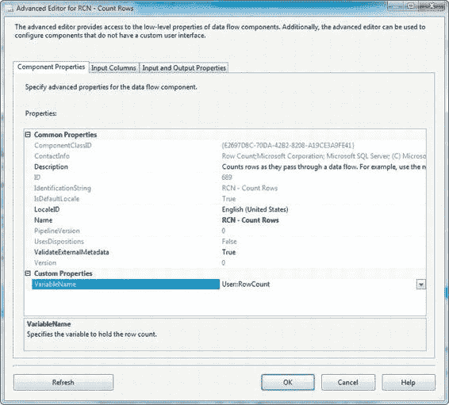
*图 8-70. 在参数和变量选项卡中添加变量*

配置`行数`转换的最后一步是选择它将转换的变量。通过使用`行数`编辑器的`VariableName`属性，将变量与`行数`转换关联起来。

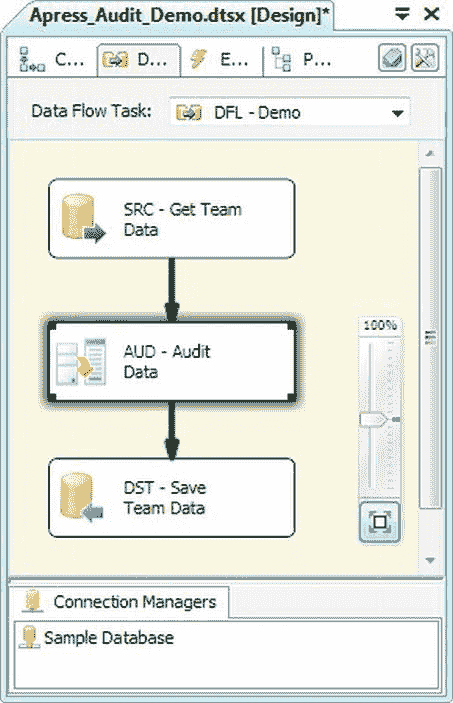
*图 8-71. 将变量与行数转换关联*

**提示：** 在数据流完成之前，不要尝试访问由`行数`转换设置的变量值。该值在最后一行流经数据流之后才会更新。

##### 审核

`审核`转换为您提供了一种快捷方式，可以将各种系统变量作为列添加到数据流中。

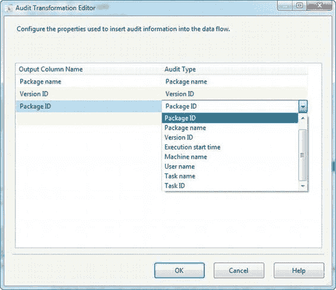
*图 8-72. 数据流中的审核转换*

将`审核`转换添加到数据流后，双击它以在编辑器中编辑属性。在编辑器中，您可以选择要添加到数据流中的审核列。您还可以重命名默认的输出列名称。

*图 8-73. 在审核转换编辑器中选择审核列*

**提示：** `审核`转换是一种便捷转换。作为替代方案，您可以使用`派生列`转换访问所有相同的系统变量并将它们添加到数据流中的列中。

### 商业智能转换

除了到目前为止涵盖的转换之外，SSIS 还提供了一些商业智能转换。其中一种转换，即`缓慢变化维度`转换，专门用于维度数据 ETL。我们将在第 17 章介绍这个组件及其高效替代方案。其余组件设计用于数据清理和验证。我们将在第 12 章详细介绍这些转换。

### 总结

本章介绍了 SSIS 数据流转换组件。我们讨论了同步与异步转换之间的区别，以及阻塞、非阻塞和部分阻塞转换。你了解了可以在数据流中应用的各个转换，包括每个转换可用的各种设置，并附有示例。下一章将介绍 SSIS 变量和 SSIS 表达式语言。

[www.it-ebooks.info](http://www.it-ebooks.info/)

