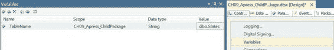
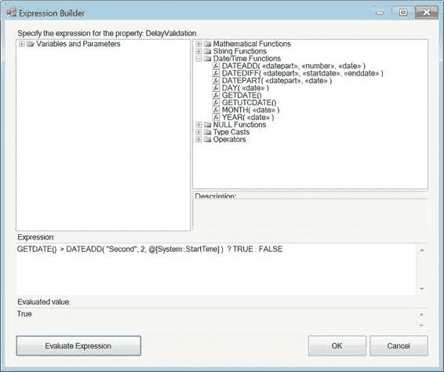
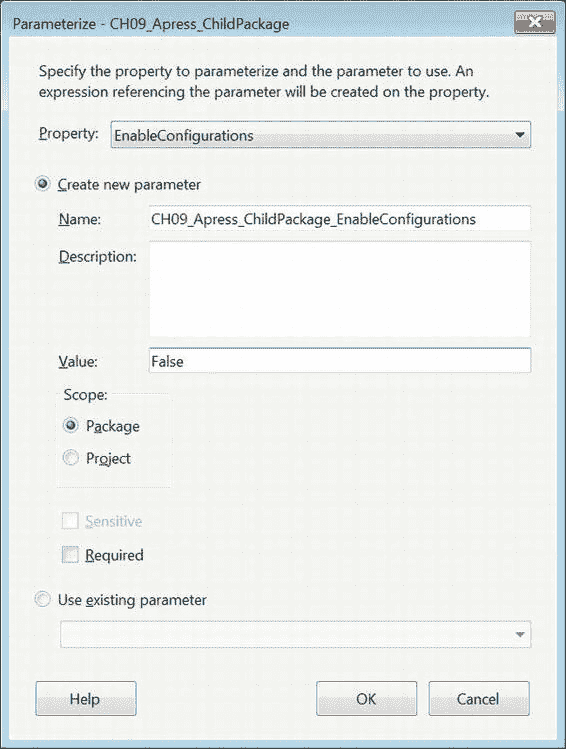
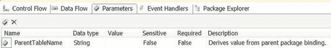
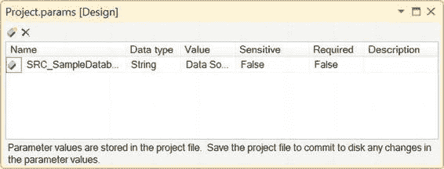
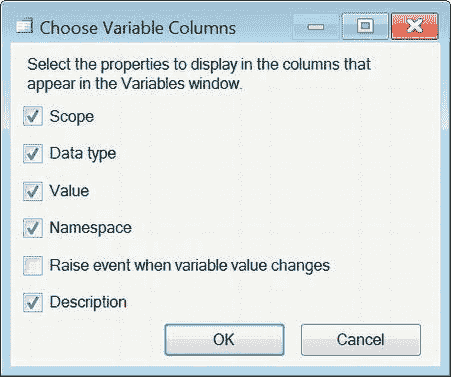
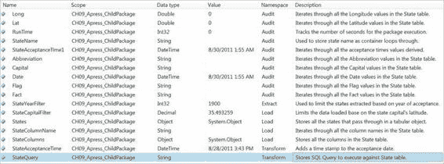
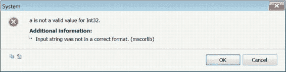

# 第 9 章
## 变量、参数与表达式

> 老话是最好的，简短的老话更佳。
> ——温斯顿·丘吉尔 首相

为了创建模块化和健壮的解决方案，开发人员通常会创建变量和访问这些变量的例程。集成服务在这方面也不例外。SSIS 中可用的变量拥有自己的数据类型，这些类型通常与 SQL Server 数据类型相关联。参数用于在父包和子包之间传递值，以扩展 ETL 项目的模块化。此外，还提供了一种表达式语言，允许 ETL 过程在运行时读取或修改这两者的值。表达式语言当然可能变得很复杂，因此建议你铭记丘吉尔的话，保持逻辑尽可能简洁、可读且易于修改。

变量通过允许你评估条件、修改数据流中的数据、参数化 SQL 以及许多其他选项，为运行包提供了灵活性。根据其数据类型，这些变量可用于存储标量值或表值。标量值对于参数化 SQL 很有用，而表值则可以控制循环容器。本章涵盖了 SSIS 变量可以具有的数据类型，并展示了它们在运行时如何与包进行交互。

### 什么是变量与表达式？

*变量* 用于存储 SSIS 可执行文件在运行时可以访问的值。某些数据类型的变量可以在设计时提供默认值，但它们真正在运行时发挥作用。变量有两种：系统变量和用户定义变量。

*系统变量* 捕获包在运行时的状态。它们由 SSIS 定义，在某些情况下会自动更新。你既不能修改系统变量的值，也不能定义任何系统变量。但是，你可以访问系统变量的值，例如 `System::StartTime`，以便为跟踪过程存储执行信息。`System::` 表示变量所属的命名空间；我们将在本章后面介绍命名空间。在 SSIS 中，变量名区分大小写。

*用户定义变量* 非常有用，因为它们可以通过使流程模块化来扩展 SSIS 的功能。定义为 `String` 和 `Date` 等数据类型的标量变量可用于参数化 `Execute SQL 任务` 和源查询。定义为 `Object` 数据类型的表变量可用于控制循环容器，并允许脚本组件访问数据。你可以创建用户定义变量，并可以定义各个组件对这些变量的访问级别（只读或读/写）。要将变量添加到包中，可以使用 `变量` 窗口。右键单击包的控制流并选择 `变量` 选项即可打开该窗口，如图 9-1 所示。另一种方法是使用 `视图` 菜单选择 `其他窗口` ➤ `变量`。



*表达式* 在 SSIS 中用于根据条件的评估返回一个值。表达式语言本身由标识符、字面量、函数和运算符组成。一些表达式可以编写为给变量赋值、返回计算结果，或者用作条件语句。与大多数编程语言一样，表达式遵循严格的语法。该语法决定了标识符、字面量、函数和运算符的正确用法。为了帮助你编写表达式，SSIS 提供了表达式求值器和生成器。图 9-2 显示了带有表达式求值器的表达式生成器。求值器将解析并验证表达式是否符合语法。表达式生成器可快速访问所有可用的变量、函数、类型转换和运算符。你可以单击并拖动所需项目从其各自的位置到表达式文本框中，以将其添加到表达式中。



表达式
```
GETDATE() > DATEADD( "Second", 2, @[System::StartTime] ) ? TRUE : FALSE
```
评估为一个布尔值。它执行一个简单的检查，以确定自包开始执行以来是否已经过去了 2 秒。这个特定表达式使用 `? :` 语法来处理 `IF THEN` 语句。`DATEADD` 函数允许我们调整检查的时间间隔。我们使用此表达式来修改控制流任务属性（如 `DelayValidation`）的值。此表达式只能设置为具有布尔定义的属性。

> **注意：** 一旦包被打开用于设计时评估，系统变量就会存储值。例如，`System::StartTime` 变量将保留包最初打开时的时间戳。即使使用调试模式运行包，此值也不会更新。只有关闭并重新打开包时，它才会更新。

### 什么是参数？

为了支持 SSIS 的新部署模型，此版本引入了参数。*参数* 基本上取代了使用配置来指定值的需要。参数可以在包级别或项目级别使用。

*包级别参数* 对于父包-子包设计非常有用。它们允许你在父包之间传递特定值以配置子包。在将参数传递给子包之前，你需要创建包参数。包内的某些对象可以绑定到属性，这样当从父包继承值时，它会直接影响子包的属性。也可以创建绑定来映射到子包内存在的对象属性。

图 9-3 展示了如何将参数绑定到包属性。你可以使用向导创建新参数，也可以使用项目参数，其值对项目中的所有包都可用。参数名区分大小写。我们将在本章后面讨论参数化包。所有的可执行文件、容器和事件处理器也可以被参数化。已创建的包参数可以绑定到包中每个这些对象的特定属性。连接管理器不能直接参数化，但诸如 `ConnectionString` 之类的属性可以通过使用 `脚本任务` 和从父包继承值的变量来修改。




右键单击控制流背景，或右键单击某个对象并选择`参数化`时，会出现`参数化`对话框。使用此对话框可以创建您所需的任何新参数。所有包参数都可以在已添加到`BIDS`的新`参数`设计器窗口中查看。该设计器窗口如图 9-4 所示。

[www.it-ebooks.info](http://www.it-ebooks.info/)





## 第九章  变量、参数与表达式

*图 9-4. `参数`设计器窗口*

`项目参数`可用于项目中包含的所有包。添加项目参数会在解决方案中创建一个文件，允许您查看项目级别的所有参数。Visual Studio 有一个专门用于项目参数的设计器窗口，如图 9-5 所示。

*图 9-5. 项目级参数*

以下是各种参数的说明：

-   `名称` 指定项目参数的名称。
-   `数据类型` 指定参数的数据类型。
-   `值` 为参数提供默认值。
-   `敏感` 指定参数中包含的数据是否敏感。这样，敏感数据可以根据项目的安全级别进行加密、不保存或保持原样。如果参数中包含用户名和密码信息，此字段可能会派上用场。
-   `必需` 指定在包部署到服务器后，其执行期间必须提供此参数。
-   `描述` 提供参数的简短概要。

参数不仅仅局限于修改包属性。它们可以像其他变量一样在`表达式生成器`中访问。这使得您可以访问在项目级别设置的字符串或整数值，而无需像旧版本那样担心保持多个包变量同步。借助此功能，将不再需要配置文件来跨多个包维护变量值。

[www.it-ebooks.info](http://www.it-ebooks.info/)

## 第九章  变量、参数与表达式

### SSIS 数据类型

与大多数编程语言一样，SSIS 变量也需要数据类型。这些数据类型大部分与 SQL Server 数据类型相对应。从 SQL Server 提取数据时，每列都被识别为这些数据类型之一。`数据转换`任务将使用这些数据类型来转换来自其他源的数据，以便数据可以无缝映射到 SQL Server 数据库。

表 9-1 显示了 SSIS 使用的数据类型。我们包含了一列，展示了可在表达式中用于转换值的`类型转换`函数。您可以按以下方式在表达式中使用这些函数：`(<</*类型转换函数*/>> [, <</*参数 1*/>>, <</*参数 2*/>>, … ]) (<</*表达式*/>>)`。

表达式周围的括号不是必需的，但将更容易确定正在被类型转换的内容。

*表 9-1. SSIS 数据类型*

| **数据类型** | **描述** | **范围/大小** | **类型转换函数** |
| :--- | :--- | :--- | :--- |
| `DT_BOOL` | 布尔值。 | True/False。 | `(DT_BOOL)` |
| `DT_BYTES` | 二进制数据值。 | 最大大小为 8,000 字节的二进制数据。 | `(DT_BYTES, «长度»)` |
| `DT_CY` | 货币值。 | 精度和小数位数为 (19,4) 的 8 字节有符号整数。 | `(DT_CY)` |
| `DT_DATE` | 支持 YYYY/MM/DD HH:MM:SS 的日期数据类型。由浮点数提供，其整数部分代表日期，小数部分代表时间戳。 | 0001/01/01 00:00:00–9999/12/31 23:59:59。 | `(DT_DBDATE)` |
| `DT_DBDATE` | 支持 YYYY/MM/DD 的日期数据类型。 | 0001/01/01–9999/12/31。 | `(DT_DBDATE)` |
| `DT_DBTIME` | 支持 hh:mm:ss 的时间数据类型。 | 00:00:00–23:59:59。 | `(DT_DBTIME)` |
| `DT_DBTIME2` | 支持 hh:mm:ss[.fffffff] 的时间数据类型。 | 00:00:00.0000000–23:59:59.9999999。 | `(DT_DBTIME2, «小数位数»)` |

[www.it-ebooks.info](http://www.it-ebooks.info/)

## 第九章  变量、参数与表达式

| **数据类型** | **描述** | **范围/大小** | **类型转换函数** |
| :--- | :--- | :--- | :--- |
| `DT_DBTIMESTAMP` | 日期数据类型... | 1753/01/01 | `(DT_DBTIMESTAMP)` |


### 数据类型参考

#### DT_DBTIMESTAMP
支持 YYYY/MM/DD 00:00:00.000 到 hh:mm:ss[.fff]。
取值范围：9999/12/31 23:59:59.997。
日期数据类型，0001/01/01。

#### DT_DBTIMESTAMP2 (DT_DBTIMESTAMP2, «scale»)
支持 YYYY/MM/DD 00:00:00.0000000 到 hh:mm:ss[.fffffff]。
取值范围：9999/12/31 23:59:59.9999999。
日期数据类型，0001/01/01。

#### DT_DBTIMESTAMPOFFSET (DT_DBTIMESTAMPOFFSET, «scale»)
支持 YYYY/MM/DD 00:00:00.0000000 +/- OFFSET 到 hh:mm:ss[.fffffff] +/- 14hh, +/- .59mm。
取值范围：9999/12/31 23:59:59.9999999 +/- 14hh, +/- .59mm。
此时间戳包含一个偏移量，以支持协调世界时 (UTC)。小时和分钟偏移量的符号必须匹配。如果不匹配，则分钟偏移量或小时偏移量必须为 0。

#### DT_DECIMAL (DT_DECIMAL, «scale»)
具有定义的精度和小数位数的精确数值。12 字节无符号值。
小数位数范围从 0 到 28，最大精度为 29。

#### DT_FILETIME (DT_FILETIME)
64 位值，返回自 1601/01/01 以来发生的 100 纳秒间隔数。
取值范围：1601/01/01 00:00:00.000 到 9999/12/31 23:59:59.997。

#### DT_GUID (DT_GUID)
全局唯一标识符，以二进制数据形式存储。16 字节二进制字符串。

#### DT_I1 (DT_I1)
有符号整数。1 字节。0 到 255。

#### DT_I2 (DT_I2)
有符号整数。2 字节。-32,768 到 32,767 (-2¹⁵ 到 (2¹⁵) - 1)。

#### DT_I4 (DT_I4)
有符号整数。4 字节。-2,147,483,648 到 2,147,483,647 (-2³¹ 到 (2³¹) -1)。

#### DT_I8 (DT_I8)
有符号整数。8 字节。-9,223,372,036,854,775,808 到 9,223,372,036,854,775,807 (-2⁶³ 到 (2⁶³)-1)。

#### DT_NUMERIC (DT_NUMERIC, «precision», «scale»)
具有定义的精度和小数位数的精确数值。小数位数范围从 0 到 38，最大精度为 38。

#### DT_R4 (DT_R4)
浮点值。4 字节。

#### DT_R8 (DT_R8)
浮点值。8 字节。

#### DT_STR (DT_STR, «length», «code_page»)
美国国家标准协会、ANSI/英国计算机协会成员 MBCS 字符串，以空字符终止。如果输入的字符串包含多个空值，则在第一个空值处终止。最大长度 8,000 字节。接受 ANSI/MBCS 字符。

#### DT_UI1 (DT_UI1)
无符号整数。1 字节。

#### DT_UI2 (DT_UI2)
无符号整数。2 字节。

#### DT_UI4 (DT_UI4)
无符号整数。4 字节。

#### DT_UI8 (DT_UI8)
无符号整数。8 字节。

#### DT_WSTR (DT_WSTR, «length»)
以空字符终止的 Unicode 字符串。最大长度 4,000 字节。接受 Unicode 字符。

#### DT_IMAGE (DT_IMAGE)
二进制数据。最大尺寸 2,147,483,647 ((2³¹)-1) 字节。

#### DT_NTEXT (DT_NTEXT)
Unicode 字符串。最大长度 1,073,741,823 字符。

#### DT_TEXT (DT_TEXT, «code_page»)
ANSI/MBCS 字符串。最大长度 2,147,483,647 字符。

### 变量作用域、默认值和命名空间

SSIS 提供了几种对变量进行分组的方法，这样就不会最终陷入混乱的状态。您的命名约定将极大地帮助您保持变量的有序性。如果您没有这些标准，SSIS 中默认附带的方法应该有助于提供某种表象。

变量的作用域在物理上限制了变量被所有方法访问。命名空间可帮助您对服务于特定目的的变量进行分组。分配默认值可确保用户定义的变量将具有 NULL 以外的值。默认值将在调试模式和运行时使用，除非使用表达式或脚本任务对其进行修改。

#### 作用域
大多数编程语言都为其变量提供作用域。*作用域*定义为变量与值和表达式相关的上下文。对于 SSIS，这转化为哪些可执行文件、容器和事件处理程序可以访问变量。在包中定义变量意味着包内的所有对象都可以访问该变量。为了将变量的作用域限制为特定的可执行文件，您应该在添加变量时在控制流设计器窗口中选择该对象。如果您未选择任何对象，默认为包作用域。

变量窗口顶部有几个图标，允许您修改变量，如图 9-6 所示。

*图 9-6. 变量选项*

以下列表描述了变量工具栏上每个按钮的功能：
*   **添加变量**：使用选定对象作为变量的定义作用域，向集合添加一个变量。
*   **移动变量**：将变量移动到不同的作用域。
*   **删除变量**：删除突出显示的变量。
*   **显示系统变量**：显示所有系统变量。
*   **显示所有作用域的变量**：显示包中定义的所有用户定义的变量。默认情况下，仅显示选定对象的变量。这有助于快速识别可用变量。
*   **选择变量列**：打开一个对话框，允许您快速查看所有可用的列。



“选择变量列”图标很重要，因为它允许您控制变量的所有方面。默认情况下，提供的唯一列是名称、作用域、数据类型和值，如前面的图 9-1 所示。图 9-7 显示了可以为用户定义变量修改的所有可用列。“命名空间”和“描述”列被省略了，但通过对话框，您可以将它们添加回来。“变量值更改时引发事件”复选框显示特定变量是否绑定到值更改时将引发的事件。

*图 9-7. 选择变量列对话框*

> **注意：** 每次重新启动 Visual Studio 时，您都必须重新添加“命名空间”和“描述”列。关闭 Visual Studio 窗口后，这些列会重置为默认值。

图 9-8 显示了我们添加此包所需的所有变量后的变量窗口。

CH09_Apress_ChildPackage 的目标是提取 1900 年之后接受的州，将日期列转换为日期时间列，并仅加载首府位于北纬 35.493259 以北的州。使用两个变量进行行过滤的目的是演示源组件中的 SQL 查询可以参数化，并显示在数据进入数据流后，可以使用条件拆分根据变量值进行过滤。



*图 9-8. 在 CH09_Apress_ChildPackage.dtsx 中定义的变量*

> **注意：** SSIS 数据类型变量映射到 ETL 中使用的 SSIS 数据类型。例如，Int32 数据类型指的是 32 位有符号整数，String 数据类型映射到 Unicode 字符串，Decimal 指的是 DT_NUMERIC 数据类型。图 9-8 中显示的数据类型名称比数据流内部元数据查看器中出现的名称更便于阅读。


变量添加完成后，可以通过使用图 9-9 所示的`选择新作用域`对话框来更改其作用域。此过程的工作原理是将所选变量的所有属性复制到新作用域中。创建这些新变量后，其名称将附加一个`1`，而原始变量将被删除。该对话框将显示所有可用对象及其可能嵌套的容器，以便您可以将变量作用域移动到该对象。对话框还会显示您可能已创建的所有事件处理程序。

*图 9-9. 选择新作用域对话框*

[www.it-ebooks.info](http://www.it-ebooks.info/)



