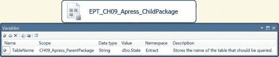
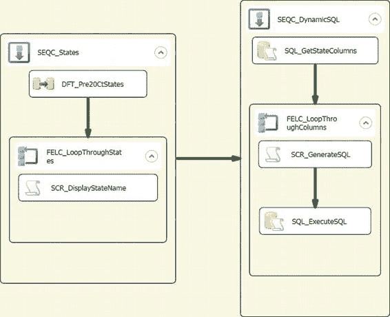
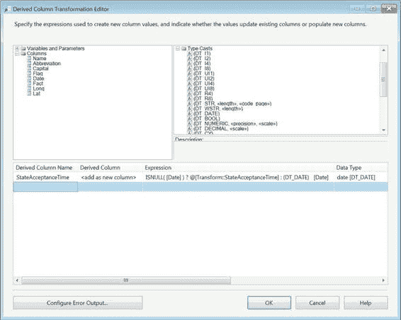
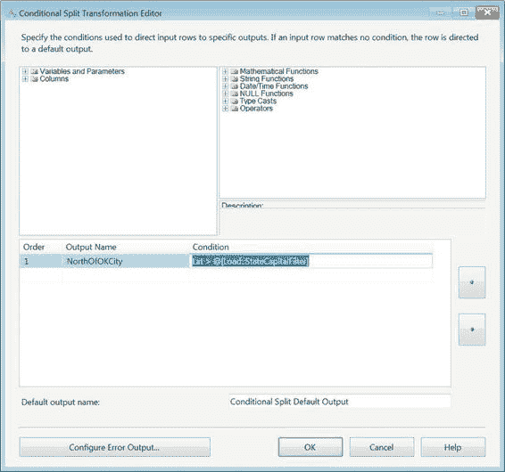

# 第九章 变量、参数与表达式

[www.it-ebooks.info](http://www.it-ebooks.info/)

| 名称 | 数据类型 | 描述 |
| :--- | :--- | :--- |
| `ProgressCountHigh` | `Int32` | 与`ProgressCountLow`协同工作，显示`OnProgress`事件完成的操作总数。表示 64 位复合值的高部分。仅可用于`OnProgress`。 |
| `ProgressCountLow` | `Int32` | 与`ProgressCountHigh`协同工作，显示`OnProgress`事件完成的操作总数。表示 64 位复合值的低部分。仅可用于`OnProgress`。 |
| `ProgressDescription` | `String` | 描述事件处理程序的进度。仅可用于`OnProgress`。 |
| `Propagate` | `Boolean` | 标识事件处理程序是否传播到更高级别的事件处理程序。可用于所有事件处理程序。 |
| `SourceDescription` | `String` | 触发事件处理程序的源的描述。可用于所有事件处理程序。 |
| `SourceID` | `String` | 触发事件处理程序的源的唯一标识符。可用于所有事件处理程序。 |
| `SourceName` | `String` | 触发事件处理程序的源的名称。可用于所有事件处理程序。 |
| `VariableDescription` | `String` | 触发事件处理程序的变量的描述。仅可用于`OnVariableValueChanged`。 |
| `VariableID` | `String` | 触发事件处理程序的变量的唯一标识符。仅可用于`OnVariableValueChanged`。 |

[www.it-ebooks.info](http://www.it-ebooks.info/)



### 访问变量

在为你的 ETL 过程创建了所有需要的变量后，你很可能想要访问它们。SSIS 提供了多种访问变量的方式。只有用户定义的变量是可修改的。存储在变量中的值可以用来基于变量值构造新值，或者在数据流中分流数据行。

为了说明访问变量和参数的不同方法，我们创建了两个包：`CH09_Apress_ParentPackage.dtsx` 和 `CH09_Apress_ChildPackage.dtsx`。父包的唯一任务是使用“执行包任务”来执行子包。图 9-11 展示了父包的“包资源管理器”内容。该变量用于演示通过使用参数向子包传递变量。

*图 9-11. `CH09_Apress_ParentPackage.dtsx` 包资源管理器*

如图 9-12 所示，子包稍微复杂一些。它用于展示两个示例。第一个要执行的示例是`SEQC_States`序列容器。其目标是演示如何通过在“数据流任务”、“Foreach 循环容器”和“脚本任务”中使用转换来访问变量。此示例的最终结果是显示一个消息框，重复显示一个字符串，直到`Foreach 循环容器`遍历完所有记录。第二个示例的主要目的是展示生成和执行动态 SQL 的实现。这是通过使用“执行 SQL 任务”检索一组字符串来帮助创建不同的 SQL 语句，使用“脚本任务”将字符串连接成可执行 SQL，以及使用最后的“执行 SQL 任务”执行存储在该字符串中的查询来完成的。

[www.it-ebooks.info](http://www.it-ebooks.info/)



*图 9-12. `CH09_Apress_ChildPackage.dtsx` 控制流设计器窗口*

### 参数化查询

SSIS 允许我们使用变量的另一个绝佳方式是对“数据流任务”中的源查询进行参数化。为了参数化查询，你需要将“数据访问模式”设置为“SQL 命令”。清单 9-1 展示了我们在源组件`SRC_GetPre20CtStates`内部使用的查询。

*清单 9-1. 参数化源查询*
```sql
SELECT DISTINCT
    Name,
    Abbreviation,
    Capital,
    Flag,
    Date,
    Fact,
    Long,
    Lat
FROM dbo.State s
WHERE YEAR(s.Date) < ? ;
```

问号是用来标记参数位置的限定符。我们建议将所有必需的参数放在同一区域，这样阅读和维护 SQL 就不会变成噩梦。为了将正确的变量值映射到这个限定符，我们必须使用源编辑器上的“参数”按钮。图 9-13 展示了我们的参数映射配置。我们使用了`Extract::StateYearFilter`变量来限制传入的数据。`Parameter0`这个名称是预先确定的，因为我们使用的是 OLE DB 源组件。

有关不同提供程序所需的参数命名约定的更多信息，请参阅第 7 章。

*图 9-13. `SRC_GetPre20CtStates`的“设置查询参数”对话框*

> **注意：** 我们为`Extract::StateYearFilter`变量提供了一个默认值。该值可以通过使用“脚本任务”并将其列在`ReadWriteVariables`字段后，使用赋值语句进行修改。

### 派生列转换

在数据开始在管道中流动后，SSIS 允许你使用“派生列”转换来访问存储在变量中的值。相同的功能可以通过使用与前面所示类似代码的“脚本任务”转换来使用。对于数据流的这个特定部分，我们希望能够用默认值替换 null 值，并将此转换作为新列添加到管道中。为了实现这个需求，我们使用了表达式 `ISNULL( [Date] ) ? @[Transform::StateAcceptanceTime] : (DT_DATE) [Date]`。图 9-14 演示了“派生列”转换如何自动从类型转换中读取数据类型信息。我们将在本章后面更深入地讨论类型转换。

[www.it-ebooks.info](http://www.it-ebooks.info/)



`ISNULL()`函数返回一个类似于 SQL Server 函数的布尔值。如果条件计算结果为`True`，我们提供`Transform::StateAcceptanceTime`的值。否则，我们保留原始日期。唯一的区别是此列包含时间戳信息。

*图 9-14. 用于替换缺失数据的派生列*

> **注意：** 因为我们在源 SQL 查询的`WHERE`子句中使用了等于运算符，所以`ISNULL([Date])`条件将始终返回`False`。如果初始查询中没有该条件，`ISNULL([Date])`可能返回`True`。

### 条件性拆分

SSIS 提供了“条件性拆分”转换，可以将数据重定向到多个流。在最简单的情况下，它可以充当`WHERE`子句，在更复杂的情况下，它可以充当`CASE`语句。对于我们的示例，我们有一个非常简单的标准：我们只想加载首府位于俄克拉荷马城以北的州。我们将俄克拉荷马城的纬度值设置为`Transform::StateCapitalFilter`的默认值。有了这个值，我们在图 9-15 所示的条件性拆分中使用表达式 `Lat > @[Load::StateCapitalFilter]` 来仅传递所需的记录。因为纬度值随着我们接近北极而增加，所以使用“大于”比较运算符来确定记录是否应通过。

[www.it-ebooks.info](http://www.it-ebooks.info/)



*图 9-15. 基于变量值排除值的条件性拆分*

### 记录集目标


