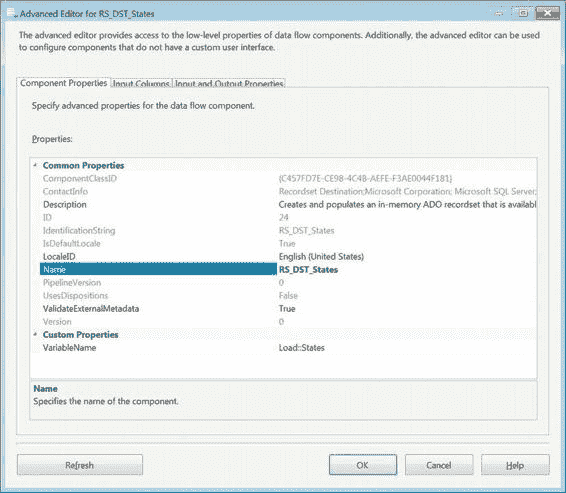
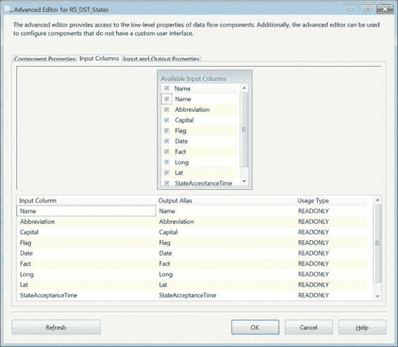
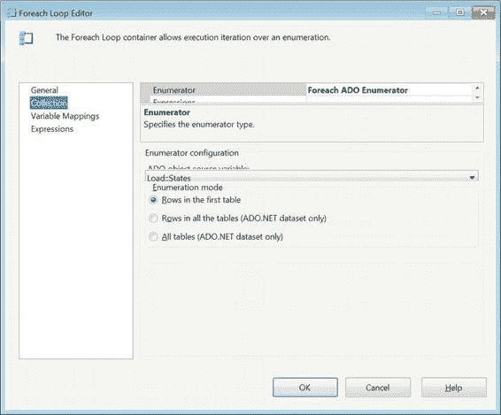
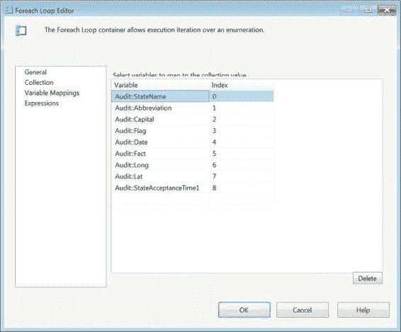
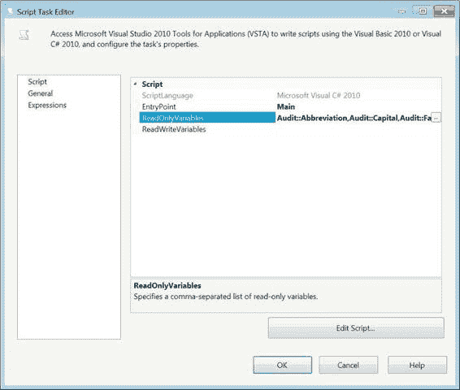
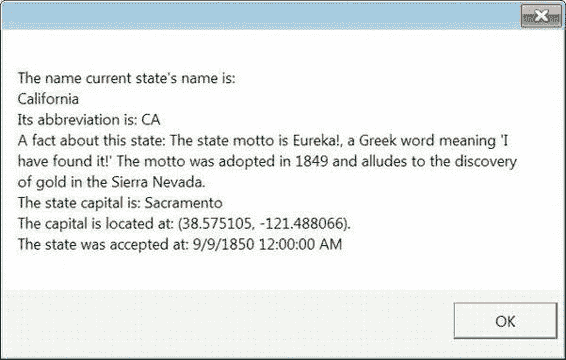
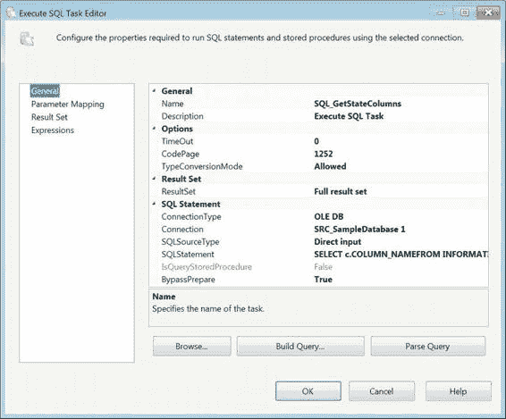

# 第 9 章 – 变量、参数与表达式

### 记录集目标

在执行完所有必需的转换后，我们需要将数据存储到某处。记录集目标允许我们将数据加载到一个`Object`数据类型变量中。此功能的工作方式类似于`Execute SQL`任务将`完整结果集`输出存储在变量中。图 9-16 展示了将数据加载到变量所需的记录集目标配置。关键部分是确定要使用哪个变量。

[www.it-ebooks.info](http://www.it-ebooks.info/)



*图 9-16. 记录集目标的配置*

> **注意：** 重用对象变量来存储数据会导致它们在加载新数据之前被清除。对象变量在加载后不会追加数据。这可以让你为不同的数据集重用同一个变量，但我们不推荐这种方法，因为你会开始丢失该变量的表格结构信息。每次加载都可能增加或删除列，使得重用该变量成为一个开发陷阱。在对象中跟踪列映射关系相当容易，尤其是对于具有大量列的实体。多次更改结构会制造出更大的复杂性。如果你在多个`Foreach 循环`容器中将该对象用作迭代器，这一点会变得尤为明显。你需要来回检查，以确保根据最新数据集的加载方式，以正确的顺序映射结果。

[www.it-ebooks.info](http://www.it-ebooks.info/)



在选择变量作为目标后，我们需要指定将要访问的列。图 9-17 展示了我们可以传递给`Foreach 循环`容器的列映射关系，以便在遍历对象时使用。在将数据集放入变量后，`Foreach 循环`容器可以读取这些值，并将其分配给其他变量，这些变量的用途是在该次迭代期间保存该值。

这与 SQL Server 中游标提供的功能非常相似。

*图 9-17. 记录集目标 — 列映射*

### Foreach 循环容器

SSIS 中的`Foreach 循环`容器可以利用`Object`数据类型变量作为其迭代器。为了加载数据，我们首先需要将数据加载到我们打算使用的变量中。我们演示了使用记录集目标加载数据。如图 9-18 所示，`Foreach 循环`容器利用`Foreach ADO`枚举器作为其迭代器。我们指定`Load::States`变量作为枚举器，因为我们用`States`数据集填充了它。

[www.it-ebooks.info](http://www.it-ebooks.info/)



*图 9-18. Foreach 循环容器 — 集合页*

定义好枚举器后，我们需要确保对象中填充的每一列都映射到一个变量。当容器循环遍历对象时，`Foreach 循环`容器会将每一列中的数据值分配给一个变量。跳过映射将导致 SSIS 抛出不友好的错误消息。容器将自动分配图 9-19 中所示的索引值，因此我们建议按照列映射到枚举器变量的相同顺序来映射变量。

[www.it-ebooks.info](http://www.it-ebooks.info/)



*图 9-19. Foreach 循环容器 — 变量映射页*

### 脚本任务

访问变量最简单的方法之一是在控制流或数据流中使用 SSIS `Script`任务。在我们的示例包`CH09_Apress_ChildPackage.dstx`中，我们将在控制流级别使用`Script`任务在消息框中显示一个字符串。图 9-20 演示了如何在`Script`任务中指定变量的访问模式。在我们的案例中，我们只想能够读取`System::PackageName`变量的值。因为我们不会修改任何现有变量的值，所以我们将`ReadWriteVariables`字段留空。

[www.it-ebooks.info](http://www.it-ebooks.info/)



*图 9-20. SCR_DisplayPackageName 的配置*

使用 Visual C#，我们只能访问图 9-20 配置中列出的变量。

代码直接放入脚本的主方法中。清单 9-2 演示了我们用于访问变量值并在运行时在消息框中显示它的 C#代码。以粗体突出显示的部分允许`Script`任务访问`Dts`中的变量集合。提取值后，我们可以根据需要以任何方式操作它。完全限定变量名周围的引号对于正确标识变量是必要的。该变量区分大小写，因此代码需要非常精确。

*清单 9-2. 变量访问器脚本*

```csharp
MessageBox.Show("The name current state's name is: " +
    Dts.Variables["Audit::StateName"].Value.ToString()+"\n"+
    "Its abbreviation is: " + Dts.Variables["Audit::Abbreviation"].Value.ToString() + "\n" +
    "A fact about this state: " + Dts.Variables["Audit::Fact"].Value.ToString() + "\n" +
    "The state capital is: " + Dts.Variables["Audit::Capital"].Value.ToString() + "\n" +
    "The capital is located at: (" + Dts.Variables["Audit::Lat"].Value.ToString() + ", " +
    Dts.Variables["Audit::Long"].Value.ToString() + ")." + "\n" +
    "The state was accepted at: "+Dts.Variables["Audit::StateAcceptanceTime1"].Value.ToString());
```

[www.it-ebooks.info](http://www.it-ebooks.info/)



使用清单 9-2 的代码，当我们执行包时，会收到一个小消息框。该代码将从对象变量中提取的值连接成一个字符串，用于填充消息框。图 9-21 显示了代码连接后的值。在关闭消息框之前，包不会继续执行。消息框关闭后，`Foreach 循环`将继续处理枚举器中的下一条记录，并以类似的消息框显示其值。

*图 9-21. 显示从系统变量派生的包名的消息框*

### 执行 SQL 任务结果集

`Execute SQL`任务允许你直接从执行的查询中存储结果集。查询可以返回标量值、包含一行的一列值、完整结果集或 XML 值。这些结果集可以存储在具有适当数据类型的变量中。在我们的示例中，我们将基于清单 9-3 所示的查询存储一个完整结果集。此查询检索`dbo.State`表中的所有列。

利用这个结果集，我们将展示一个包含在`CH09_Apress_ChildPackage.dtsx`中的快速数据剖析过程。图 9-22 展示了存储查询结果的`SQL_GetStateColumns`任务的配置。

*清单 9-3. SQL_GetStateColumns — 列名查询*

```sql
SELECT c.COLUMN_NAME
FROM INFORMATION_SCHEMA.COLUMNS c
WHERE c.TABLE_NAME = 'State';
```

[www.it-ebooks.info](http://www.it-ebooks.info/)



*图 9-22. SQL_GetStateColumns 配置*

> **注意：** 如果变量在此任务执行前包含值，这些值将被其结果覆盖。

### 源类型


