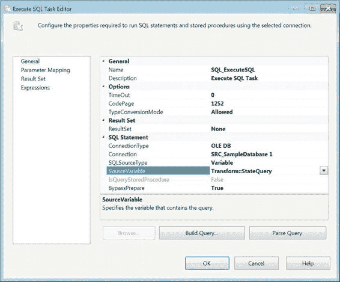
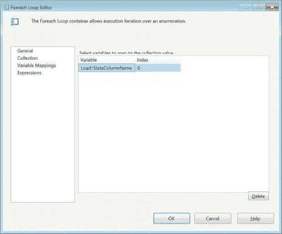
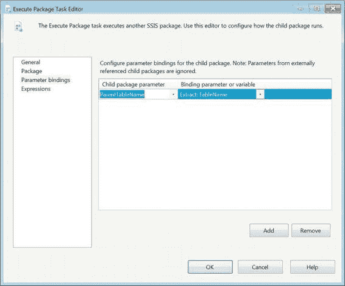

# 第 9 章 – 变量、参数与表达式

访问变量的最后一种方式并非一个具体的任务或转换，而是一种出现在多个任务中的属性。这就是源类型属性，通常允许你指定为 `直接输入`、`变量` 或 `文件`。在我们的数据剖析过程示例中，我们使用了一个执行 SQL 任务 `SQL_ExecuteSQL` 来执行存储在变量 `Transform::StateQuery` 中的查询。我们修改此变量的过程将在下面的“动态 SQL”部分进行介绍。图 9-23 展示了访问动态生成查询的 `SQL_ExecuteSQL` 任务的配置。

[www.it-ebooks.info](http://www.it-ebooks.info/)



*图 9-23. SQL_ExecuteSQL 以 Transform::StateQuery 为源*

### 动态 SQL

在我们的大多数示例中，我们只演示了读取变量值，而没有实际修改任何值。需要修改变量的最常见领域之一是生成动态 SQL 查询。在 SSIS 中，此过程通常替代游标，并运行一组数量可能变化、但具有某些结构上非常重要的相似组件的查询。如前一节所述，我们希望演示一个非常基本的数据剖析过程。我们已经向你展示了如何通过使用执行 SQL 任务将列名存储在 `Load::StateColumns` 变量中来检索我们的控制集。我们还向你展示了如何通过在另一个执行 SQL 任务上使用 `SQLSourceType` 选项来执行生成的查询。本节将向你展示如何设置变量的值，使其成为可执行的查询。

我们需要采取的第一步是在遍历所有列时提取每个列的名称。我们通过使用 Foreach 循环容器 `FELC_LoopThroughColumns` 实现了这一点。由于 `Load::StateColumns` 只有一列 `Name`，变量映射非常简单，如图 9-24 所示。此配置会逐行覆盖 `Load::StateColumnName` 的值，一次迭代一行。

[www.it-ebooks.info](http://www.it-ebooks.info/)



*图 9-24. FELC_LoopThroughColumns 变量映射*

随着变量值随对象中的每一行而变化，我们可以运行一些查询，以获得对数据有意义的洞察。对于我们的查询，我们选择对存储在 `dbo.State` 表中每个列的值执行 DISTINCT 计数。选项包括使用 `INSERT INTO` 将数据加载到表中。我们在代码示例最后一行的注释掉的 C#代码中包含了一个示例值。

执行 SQL 任务 `SQL_SQL` 将为存储在对象中的每个列名运行一个查询。通过这个特定的查询，你可以看到你每个列中的值是如何变化的。

#### 代码清单 9-4. StateQuery 赋值

```csharp
Dts.Variables["Transform::StateQuery"].Value =
"SELECT COUNT(DISTINCT " + Dts.Variables["Load::StateColumnName"].Value.ToString()
+ ") FROM dbo.State WITH (NOLOCK);";

// SELECT COUNT(DISTINCT Name) FROM dbo.State WITH (NOLOCK);
```

[www.it-ebooks.info](http://www.it-ebooks.info/)



### 传递变量

在先前版本的 SSIS 中，父-子设计模式的主要困难之一是子包对父包的依赖性。乍一看，这可能不像是一个障碍，但在某些情况下，这种依赖性会使单独对子包进行单元测试变得非常困难。随着此版本 SSIS 中引入参数，这个障碍消失了。你基本上能够为参数定义一个默认值，在正常执行时该值会被覆盖。

我们首先向子包添加一个参数，如前面的图 9-4 所示。这将为我们提供一个参数，可以像在 SSIS 表达式和脚本组件中访问变量一样访问它。如果我们预计包可能会单独执行，我们可以提供一个默认值。添加参数后，父包的执行包任务应自动检测到它。在配置执行包任务的其他属性时，可以创建一个映射，允许父值覆盖子值。`CH09_Apress_ParentPackage.dtsx` 中的映射如图 9-25 所示。

*图 9-25. 执行包任务参数绑定*

[www.it-ebooks.info](http://www.it-ebooks.info/)

### SSIS 表达式语言

SSIS 表达式语言允许你扩展流程的功能以整合变量。该语言包含一整套函数和运算符，可用于计算列、变量或表达式。这些函数返回不同的数据类型值。它们通常在表达式生成器中按输入类型分组。我们已在本章的“SSIS 数据类型”部分介绍了转换函数。函数名不区分大小写，这与表达式语言中的大多数其他标识符不同。我们建议你在使用函数时使用特定的大小写，以使代码更易于阅读。

#### 函数

数学函数接受数值作为输入，执行运算后返回数值。以下是 SSIS 中可用的数学函数：

- `ABS(«数值表达式»)` 返回输入的绝对值。
- `CEILING(«数值表达式»)` 返回大于或等于输入的最小整数。
- `EXP(«数值表达式»)` 返回以 e 为底的输入指数。
- `FLOOR(«数值表达式»)` 返回小于或等于输入的最大整数。
- `LN(«数值表达式»)` 返回输入的自然对数。
- `LOG(«数值表达式»)` 返回以 10 为底的输入对数。
- `POWER(«数值表达式», «幂»)` 返回将第一个参数提升到第二个参数指定的幂后的值。
- `ROUND(«数值表达式», «长度»)` 返回将第一个输入四舍五入到第二个参数指定长度后的值。
- `SIGN(«数值表达式»)` 返回输入的正、负或零符号。
- `SQUARE(«数值表达式»)` 返回输入值的平方。
- `SQRT(«数值表达式»)` 返回输入的平方根。

字符串函数计算字符表达式。以下是表达式生成器中可用的字符串函数：

- `CODEPOINT(«字符表达式»)` 返回输入中第一个字符的 Unicode 值。
- `FINDSTRING(«字符表达式», «字符串», «出现次数»)` 返回指定字符串在输入中第 `出现次数` 次出现的索引。索引值从 1 开始。
- `HEX(«整数表达式»)` 返回输入的十六进制字符串值。

[www.it-ebooks.info](http://www.it-ebooks.info/)

- `LEFT(«字符表达式», «数字»)` 返回一个字符串，由第一个参数开头的指定字符数组成。
- `LEN(«字符表达式»)` 返回输入的长度。
- `LOWER(«字符表达式»)` 返回一个字符串，由输入的小写字符组成。
- `LTRIM(«字符表达式»)` 返回一个字符串，去除了输入的前导空格。
- `REPLACE(«字符表达式», «搜索表达式», «替换表达式»)` 返回在原始字符表达式中将一个字符串替换为另一个字符串或空字符串后的字符表达式值。
- `REPLICATE(«字符表达式», «次数»)` 返回一个字符串，其中字符表达式重复指定的次数。


