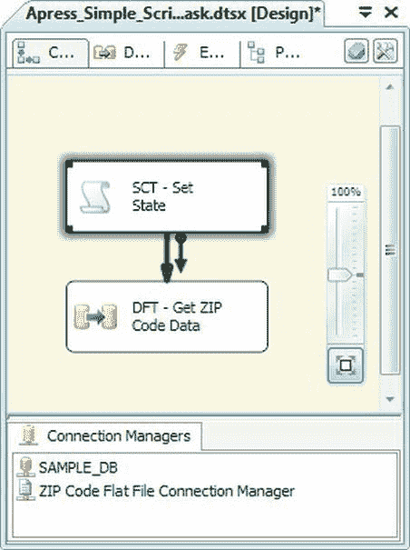
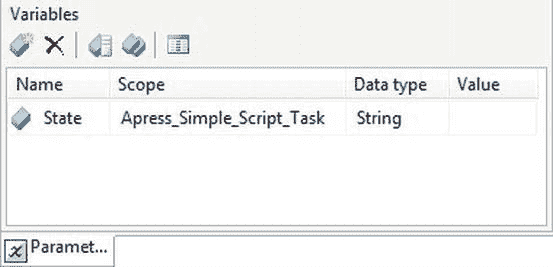
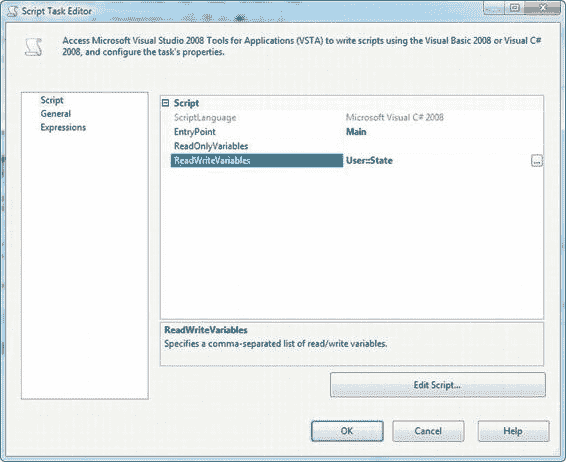
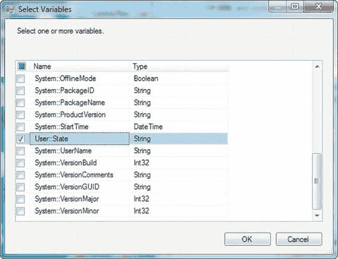

# 第 10 章 - 脚本

*你完全正确，更强大！*
——蒂姆·艾伦，《家居装饰》

SSIS 开箱即用提供了多个内置的控制流任务和数据流组件，前几章已全部描述。尽管有这些强大的工具，您仍会不可避免地遇到一些情况，需要执行内置工具包未涵盖的操作。`脚本任务`和脚本组件是两个能为您提供额外能力提升的工具。借助 `脚本任务` 和脚本组件，您可以使用 .NET 代码来增强您的 SSIS 包，并以内置组件无法实现的方式来操作和转换数据。

### 脚本任务

SSIS 提供了 20 多个内置控制流任务，执行各种功能。无论您需要通过文件传输协议 `FTP` 上传或获取文件，执行另一个包或流程，还是执行常见的 `DBA` 数据库维护任务，SSIS 控制流任务都能满足您的需求。然而，有时您需要更大的灵活性。在这种时候，您可以拿出 `脚本任务`，直接将 .NET 代码嵌入到控制流中。

SSIS 开发人员使用 `脚本任务` 最简单的任务之一是在控制流中初始化 SSIS 变量。在这个例子中，我们将把一个字符串变量设置为一个州的邮政缩写，以限制数据流中查询返回的结果。开始我们的示例，我们拖放了一个 `脚本任务` 和一个 `数据流任务` 到设计器表面，如图 10-1 所示。

[IT 电子书](http://www.it-ebooks.info/)





**图 10-1. 包含脚本任务的控制流**

然后，我们声明了一个名为 `State` 的包作用域字符串变量，如图 10-2 所示。

**图 10-2. 声明变量**

[IT 电子书](http://www.it-ebooks.info/)



此时，我们已准备好使用 `脚本任务` 来初始化我们的变量。双击 `脚本任务`，您将看到如图 10-3 所示的编辑器。

**图 10-3. 脚本任务编辑器的脚本页面**

在编辑器的 `脚本` 页面，您可以使用 `ScriptLanguage` 参数选择您首选的脚本语言。当前选项是 `Microsoft Visual C# 2008` 和 `Microsoft Visual Basic 2008`。我们更喜欢 `C#`，因此我们的脚本代码示例将使用这种 .NET 语言呈现。

您还可以为 `脚本任务` 选择 `EntryPoint`，即任务运行时将在脚本中执行的函数的名称。默认的 `EntryPoint` 函数名称是 `Main`。

您还可以选择通过弹出对话框将变量作为只读变量或读/写变量暴露给您的脚本，如图 10-4 所示。`ReadOnlyVariables` 属性允许您选择要暴露为只读的 SSIS 变量列表。您的脚本无法更改只读变量的值。`ReadWriteVariables` 属性向您的脚本暴露一组变量以供读写。您可以在脚本中更改读/写变量的值。由于我们要在脚本中更改 `User::State` 变量的值，我们已将其暴露为读/写变量。

[IT 电子书](http://www.it-ebooks.info/)



**图 10-4. 从“选择变量”对话框中选择变量**

要编写您的脚本，请单击 `编辑脚本` 按钮以打开 Visual Studio Tools for Applications (`VSTA`) 编辑器。默认情况下，`脚本任务` 生成一个名为 `ScriptMain` 的类，该类继承自 `VSTARTScriptObjectModelBase` 类。脚本中还有一些自动生成的注释，提供有关如何访问特定功能的提示。除了注释之外，生成的脚本代码如下所示：

```c#
using System;
using System.Data;
using Microsoft.SqlServer.Dts.Runtime;
using System.Windows.Forms;

namespace ST_ab23c7f2534d47459000c7bfe5e99f2e.csproj
{
    [System.AddIn.AddIn("ScriptMain", Version = "1.0", Publisher = "", Description = "")]
    public partial class ScriptMain : Microsoft.SqlServer.Dts.Tasks.ScriptTask.VSTARTScriptObjectModelBase
    {
        #region VSTA generated code
        enum ScriptResults
        {
            Success = Microsoft.SqlServer.Dts.Runtime.DTSExecResult.Success,
            Failure = Microsoft.SqlServer.Dts.Runtime.DTSExecResult.Failure
        };
        #endregion

        public void Main()
        {
            Dts.TaskResult = (int)ScriptResults.Success;
        }
    }
}
```

`Main` 函数（在上一个脚本中以粗体显示）是发生神奇作用的地方。每次 `脚本任务` 运行时都会调用此函数——这是您的代码开始的地方。我们这里的任务很简单：我们只想设置一个变量。为此，我们将修改 `Main` 函数来设置我们的变量，如下所示：
```c#
public void Main()
{
    Dts.TaskResult = (int)ScriptResults.Success;
    Dts.Variables["User::States"].Value = "LA";
}
```
编辑脚本后，单击 `保存`（磁盘图标）按钮。为了完成此示例，我们创建了一个包含 `OLE DB 源` 和 `平面文件目标` 的简单数据流，如图 10-5 所示。

**图 10-5. 将邮政编码数据从数据库表移动到平面文件**

我们在 `OLE DB 源` 组件中使用了以下查询：
```sql
SELECT ZIP, State, Town, Lat, Lon FROM dbo.ZIP WHERE State = ?;
```

[IT 电子书](http://www.it-ebooks.info/)

并将源的 `Parameter0` 值设置为 `User::State` 变量。最终结果是一个包含数据库中邮政编码的平面文件，但仅包含路易斯安那州 (`LA`) 的邮政编码。

### 高级功能


