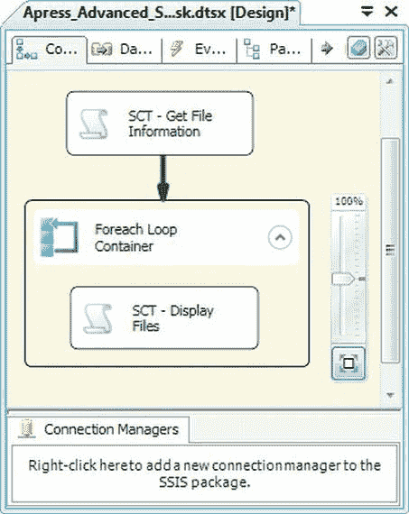
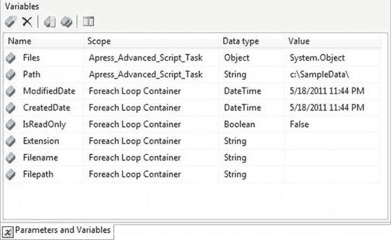
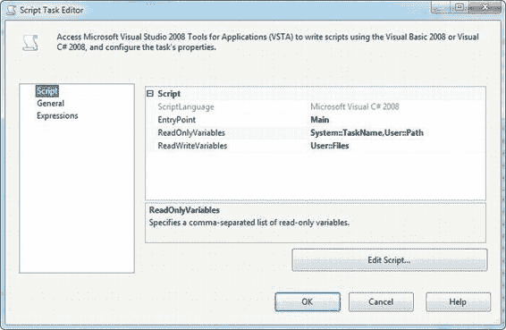

# 第 10 章：脚本

### 脚本任务概述
我们的第一个 `Script` 任务示例虽然简单，但其目的只是为了向控制流中引入 .NET 脚本的概念。`Script` 任务允许你执行从非常简单到极其复杂的处理任务，它能够实现其他标准控制流任务不总是直接支持的功能。本节将提供一个内容更充实的示例来演示其用法。

### Foreach 循环容器的限制
在这个例子中，我们想回溯参考第 5 章讨论的 `Foreach` 循环容器。

`Foreach` 循环容器有一种“`Foreach` 文件枚举器”模式，它可以为你遍历目录中的文件，并依次用文件名和/或完整限定的文件路径填充一个字符串变量。图 10-6 展示了处于 `Foreach` 文件枚举器模式下的 `Foreach` 循环容器编辑器。

*图 10-6. 处于文件枚举器模式的 Foreach 循环容器*

[www.it-ebooks.info](http://www.it-ebooks.info/)



`Foreach` 循环容器的文件枚举器模式非常有用，但它有限制——它只返回文件名和/或文件路径。文件系统中的文件附带了更多可能对处理有用的元数据。例如，每个文件都有创建日期和只读标志附加信息。如果你想处理或归档早于指定日期的文件，或者在尝试删除文件之前需要检查它是否为只读，这些信息就派上用场了。我们可以通过使用 `Script` 任务来获取这些额外信息。

### 创建示例包
为了创建我们的示例包，我们将一个 `Script` 任务拖到设计器表面，然后在其后放置一个 `Foreach` 循环容器，容器内包含另一个 `Script` 任务，如图 10-7 所示。

*图 10-7. 包含 Foreach 循环容器的脚本任务包*

我们还创建了一些包级别作用域的变量和一些 `Foreach` 循环容器级别作用域的变量。包级别的两个变量如下：

- `User::Path`：一个字符串，包含我们希望枚举文件的目录的完整路径。
- `User::Files`：一个对象，将保存文件枚举的结果，存储为一个 `ADO.NET` `DataTable` 对象。

在循环的每次迭代中，`Foreach` 循环容器级别的变量会被填充文件名、日期和其他相关信息。图 10-8 显示了我们在两个级别声明的变量。

[www.it-ebooks.info](http://www.it-ebooks.info/)



**注意：** 我们在第 9 章详细讨论了变量和变量作用域。

*图 10-8. 示例包中两个级别的变量*

将 `Script` 任务、`Foreach` 循环容器和变量添加到包中后，我们对它们进行了编辑。第一个 `Script` 任务（位于 `Foreach` 循环容器之外）需要访问我们创建的两个变量：`User::Path` 和 `User::Files`。我们还传入了一个名为 `System::TaskName` 的系统变量，它保存了当前 `Script` 任务的名称，这样我们就不必将名称硬编码到任何消息中。该 `Script` 任务只需要对 `User::Path` 和 `System::TaskName` 变量具有只读访问权限，但需要对 `User::Files` 变量具有读/写访问权限，因为任务会将其结果放入此变量。图 10-9 显示了包含这些变量的 `Script` 任务编辑器。

[www.it-ebooks.info](http://www.it-ebooks.info/)



*图 10-9. 第一个脚本任务编辑器*

### 代码示例
我们在此 `Script` 任务中创建的脚本会创建一个 `.NET` `DataTable` 对象，其中包含用于保存文件名、路径和其他文件属性的列。`DataTable` 中的每一行代表一个不同的文件。以下代码创建了 `DataTable`，用文件信息填充它，并将 `DataTable` 返回到名为 `User::Files` 的 `SSIS` 对象变量中：

```csharp
public void Main()
{
    Dts.TaskResult = (int)ScriptResults.Success;

    // Get the name of the current task
    string TaskName = Dts.Variables["System::TaskName"].Value.ToString();
    bool b = true;

    try
    {
```


