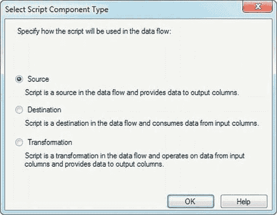
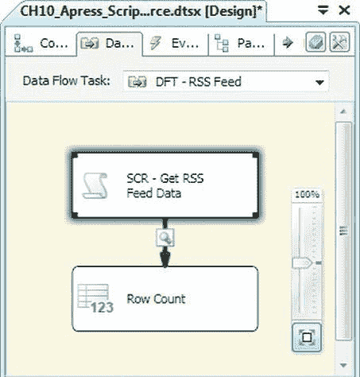
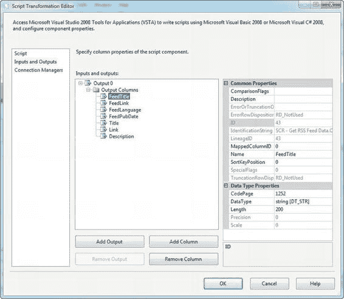

# 第十章 - 脚本编写

#### 脚本任务事件

脚本任务通过 `Dts` 对象支持多种事件和日志记录选项。敏锐的 .NET 开发人员可能已经注意到，我们在 try-catch 块的 catch 部分使用了 `Dts.Events.FireError()` 方法，而不是通常的 `throw` 语句来重新抛出异常。调用如下所示：

```
Dts.Events.FireError(-1, "SCT - Get File Information", ex.ToString(), "", 0);
```

参数如下：

- 第一个参数是名为 `errorCode` 的 `int`。这是用户为错误定义的标识符。
- 接下来是名为 `subComponent` 的 `string`。这通常设置为脚本任务的名称，以便在记录 `OnError` 事件时参考。
- 然后我们有一个名为 `description` 的 `string`，其中包含错误描述。如果使用异常的 `ToString()` 方法，你将在描述中捕获异常信息和内部异常堆栈。
- 第四个和第五个参数是名为 `helpFile` 的 `string` 和名为 `helpContext` 的 `int`。它们分别表示帮助文件的路径和该文件中某个主题的标识符（如果你有的话）。在我们的例子中，我们将其分别设置为空字符串和 0，因为我们没有配套的帮助文件。

我们也没有为组件的 `Dts.TaskResult` 属性分配 `Failure` 值。这有几个原因。首先，当你使用 `FireError()` 方法时，SSIS 会遵守脚本任务和包的 `MaximumErrorCount` 属性。设置 `Dts.TaskResult` 或使用 `throw` 语句则不会遵守 `MaximumErrorCount`，会导致脚本任务立即停止。`FireError()` 实际上会触发 `OnError` 事件，这意味着如果你为包启用了日志记录并正在捕获 `OnError` 事件，SSIS 将为你处理日志记录。

除了 `FireError()` 之外，SSIS 还公开了触发其他事件的方法：

- `FireWarning()` 触发 `OnWarning` 事件以记录警告消息。警告消息通常表示潜在问题，但不如错误消息严重。
- `FireInformation()` 触发 `OnInformation` 事件，记录信息性消息。信息性消息通常比警告消息更柔和，因为它们不暗示问题或潜在问题。
- `FireProgress()` 触发 `OnProgress` 事件，记录进度消息。当组件内取得“可衡量的进展”时，会触发 `OnProgress` 事件。简而言之，这意味着 `OnProgress` 事件是针对完成百分比触发的。
- `FireQueryCancel()` 触发 `OnQueryCancel` 事件，用于检查任务是否应停止运行。该方法返回一个 `bool` 结果：`true` 表示任务应停止运行，`false` 表示继续运行。
- `FireCustomEvent()` 触发一个自定义事件。

脚本任务的 `Dts.Log()` 方法让你可以直接将消息写入 SSIS 日志，而无需调用事件的开销。通常，你会希望使用前面提到的事件驱动方法来记录信息，因为它们遵守包和任务设置，例如 `MaximumErrorCount`。

### 示例：使用脚本任务获取文件信息

// 触发一个 OnInformation 事件，表示我们正在启动
```
Dts.Events.FireInformation(-1, TaskName, "Starting", "", 0, ref b);
```

// 定义我们的输出数据表
```
DataTable dt = new DataTable();
dt.Columns.Add("Filename", typeof(string));
dt.Columns.Add("Extension", typeof(string));
dt.Columns.Add("Filepath", typeof(string));
dt.Columns.Add("CreatedDate", typeof(DateTime));
dt.Columns.Add("ModifiedDate", typeof(DateTime));
dt.Columns.Add("IsReadOnly", typeof(Boolean));
```

// 获取文件信息并将其添加到数据表中
```
string path = Dts.Variables["User::Path"].Value.ToString();
DirectoryInfo di = new DirectoryInfo(path);
FileInfo[] fi = di.GetFiles("*.*", SearchOption.AllDirectories);
foreach (FileInfo f in fi)
{
    dt.Rows.Add(new object[] { f.Name, f.Extension, f.DirectoryName, f.CreationTime, f.LastWriteTime, f.IsReadOnly });
}
```

// 输出数据表
```
Dts.Variables["User::Files"].Value = dt;
}
catch (Exception ex)
{
// 如果发生错误，触发 OnError 事件
Dts.Events.FireError(-1, TaskName, ex.ToString(), "", 0);
}
finally
{
// 触发最终的 OnInformation 事件，表示我们已完成
Dts.Events.FireInformation(-1, TaskName, "Finished", "", 0, ref b);
}
```

> **提示：** 在任何访问外部资源（如此处的文件系统）的 .NET 代码中使用 try-catch 块是一个好习惯。如果外部资源不可访问，你可能需要在从脚本返回之前将 `TaskResult` 设置为 `Failure` 值或执行其他清理任务。

### 使用文件元数据

在我们以 `DataTable` 格式将文件列表填充到 SSIS 对象变量后，我们需要使用这些结果。为此任务，我们将 `User::Files` 变量传递到 Foreach 循环容器的 Foreach ADO Enumerator 模式中。此模式允许你遍历 ADO.NET `DataTable` 或 `DataSet` 或 ADO `Recordset` 中的行。我们已将 Foreach 循环编辑器的“集合”选项卡配置为遍历第一个表中的行，并将 ADO 对象源变量设置为 `User::Files`，如图 10-10 所示。

*图 10-10. 配置 Foreach 循环容器以遍历 .NET DataTable 中的行*

我们通过设置编辑器“变量映射”页面上的选项完成了 Foreach 循环容器的配置，如图 10-11 所示。此页面有两列，分别名为“变量”和“索引”。“索引”列保存数据表中列的基于零的索引；“变量”列保存这些列所映射到的变量。在循环的每次迭代中，列出的变量将填充数据表中每行对应列的值。

*图 10-11. 在 Foreach 循环容器中将 DataTable 列映射到 SSIS 变量*

我们在 Foreach 循环容器内放置了第二个脚本任务，并将每次循环中填充的变量传递给它，如图 10-12 所示。我们只需要读取这些变量的值，因此将它们作为只读变量传递。

*图 10-12. 在内部脚本任务中配置只读变量*

此脚本任务的脚本很简单，如下所示：

```
public void Main()
{
    Dts.TaskResult = (int)ScriptResults.Success;
    MessageBox.Show(String.Format("{0}, {1}, {2}, {3}, {4}, {5}",
        Dts.Variables["User::Filename"].Value.ToString(),
        Dts.Variables["User::Extension"].Value.ToString(),
        Dts.Variables["User::Filepath"].Value.ToString(),
        Dts.Variables["User::CreatedDate"].Value.ToString(),
        Dts.Variables["User::ModifiedDate"].Value.ToString(),
        Dts.Variables["User::IsReadOnly"].Value.ToString()));
}
```

此脚本只是获取传入的只读变量的值，并在 Windows 消息框中显示它们。结果如图 10-13 所示，是在每次迭代中显示每个文件的元数据的弹出式消息框。

*图 10-13. 在每次循环迭代中显示文件元数据*

在这个例子中，我们简化了结果，只是在弹出式消息框中显示文件元数据，但在实际应用中，你可能会使用这些元数据来备份、删除或根据某些特定标准选择要处理的文件。这里的关键点是，第一个脚本任务检索数据，并通过 Foreach 循环容器设置的变量使其可供第二个脚本任务访问。


### 脚本组件源

SSIS 允许你使用**脚本任务**向控制流中添加 .NET 代码。你也可以使用**脚本组件转换**，以其他 SSIS 内置组件原生不支持的方式，用 .NET 来操纵数据。**脚本组件转换**有三种操作模式：你可以用它来创建基于 .NET 脚本的数据源、目标和转换组件。与内置数据流组件类似，**脚本组件源**检索数据并将其推入数据流，**脚本组件目标**从数据流接收数据并将其推送到存储，而**脚本组件转换**则在数据流中操纵你的数据。

当你将脚本组件拖入数据流时，BIDS 会弹出一个菜单让你选择组件类型，如图 10-14 所示。要创建**脚本组件源**，请从弹出菜单中选择`Source`。**脚本组件源**没有输入，但至少有一个输出，并且在设计上始终是同步的。





*图 10-14. 从弹出菜单中选择脚本组件类型*

在我们的例子中，我们没有将数据从**脚本组件源**推送到输出，而是将其推送到一个`RowCount`组件，并在源的输出上启用了数据查看器。这是测试 SSIS 数据流的常用方法，因为它允许你在 ETL 过程中“实时”查看数据，而无需将其持久化到输出。我们的数据流示例如图 10-15 所示。



*图 10-15. 带有脚本组件源的数据流*

将脚本组件拖到数据流上并选择源类型后，我们必须对其进行配置。第一步是向脚本组件输出中添加列。为此，我们打开了`Script Component Editor`并转到`Inputs and Outputs`页面。在那里，我们点击`Output 0`下的`Output Columns`，并点击`Add Column`按钮七次。这些列以默认名称添加，如`Column 1`、`Column 2`等，所有列的默认数据类型均为四字节有符号整数[DT_I4]。

我们将每个列重命名，使名称更具描述性，并将每个列的数据类型更改为字符串[DT_STR]，长度为 200。唯一的例外是`Description`列，我们将其长度更改为 2000。图 10-16 显示了编辑器的`Inputs and Outputs`页面。

■ **提示：** 除了更改输出中列的名称外，你还可以更改输出本身的名称。在此示例中，我们保留了`Output 0`的默认名称。


*图 10-16. 向脚本组件输出添加列*

**脚本组件源**继承自`UserComponent`类并实现了其三个方法。当脚本组件执行时，这些方法按以下顺序调用：

1.  `PreExecute()`方法在脚本组件启动时、任何行添加到输出之前准确触发一次。
2.  `CreateNewOutputRows()`方法也针对脚本组件调用一次。正是在这个方法中，你可以向输出添加新行，通常使用某种循环。
3.  `PostExecute()`方法在脚本组件结束时、你完成向输出添加行后触发一次。此方法对于在脚本组件完成后执行任何清理任务很有用。

在我们的例子中，我们获取了 CNN 头条新闻 RSS 源。*简易信息聚合（RSS）*是一种用于聚合网络内容（如博客文章和新闻报道）的 XML 格式。在脚本组件中，我们使用 .NET 获取最新的 RSS 源文档，并将 XML 分解为行和列，然后将其放入组件的输出缓冲区中。首先，我们在`ScriptMain`类级别声明了一个 .NET `XmlDocument`对象来保存我们的 RSS 源页面，如下所示：

```csharp
[Microsoft.SqlServer.Dts.Pipeline.SSISScriptComponentEntryPointAttribute]
public class ScriptMain : UserComponent
{
    // XML Document to hold RSS feed page
    XmlDocument RssXML = null;
    bool b = true;
    string ComponentName = "";
    // Method overrides will go here...
    ...
}
```

`PreExecute()`方法首先获取脚本组件的名称，以便稍后在日志消息中使用。然后它调用`base.PreExecute()`方法。虽然调用基方法并非总是必要，但最好调用它们以确保不会错过它们提供的任何功能。接下来，我们使用 .NET 内置的`HttpWebRequest`和`HttpWebResponse`类来检索 CNN RSS 源并将其放入`RssXML`变量。

我们在这里还使用了`ComponentMetaData.FireInformation()`方法，它触发对记录调试信息有用的`OnInformation`事件。由于我们的代码依赖于我们无法控制的外部资源（即网站），我们将 Web 请求包装在`try-catch`块中。如果捕获到异常，我们使用`FireError()`方法触发`OnError`事件。数据流组件中的`FireError()`方法不会停止数据流。错误会向上传播到`Data Flow task`，此时 SSIS 根据包设置决定是否停止处理。对于此组件的预执行阶段，失败意味着由于某种原因我们没有好的 XML 数据可供处理，因此没有继续下去的意义。因此，我们通过使用`throw`语句重新抛出异常来强制硬停止。

```csharp
public override void PreExecute()
{
    // Get Name of Component
    ComponentName = this.ComponentMetaData.Name;
    // Fire OnInformation event for starting
    this.ComponentMetaData.FireInformation(-1, ComponentName, "Beginning Pre-execute", "", 0, ref b);
    // Perform base PreExecute() method
    base.PreExecute();
    try
    {
        // Fire OnInformation event for getting RSS feed data
        this.ComponentMetaData.FireInformation(-1, ComponentName, "Start - Getting RSS Feed data (Pre-execute)", "", 0, ref b);
        // Retrieve RSS feed
        HttpWebRequest req = (HttpWebRequest)HttpWebRequest.Create("http://rss.cnn.com/rss/cnn_topstories.rss");
        HttpWebResponse res = (HttpWebResponse)req.GetResponse();
        Stream str = res.GetResponseStream();
        // Put RSS feed document into XML Document
        RssXML = new XmlDocument();
        RssXML.Load(str);
        // Fire OnInformation event for getting RSS feed data
        this.ComponentMetaData.FireInformation(-1, ComponentName, "Complete - Getting RSS Feed data (Pre-execute)", "", 0, ref b);
    }
    catch (Exception ex)
    {
        // Fire OnError event if an error occurs
        this.ComponentMetaData.FireInformation(-1, ComponentName, ex.ToString(), "", 0, ref b);
        // Rethrow exception to stop processing
        throw (ex);
    }
    finally
    {
        // Fire OnInformation event for finished
        this.ComponentMetaData.FireInformation(-1, ComponentName, "Finished Pre-execute", "", 0, ref b);
    }
}
```

我们没有任何特殊的后执行处理需要执行，但我们仍然必须重写`PostExecute()`方法。在这种情况下，我们在`PostExecute()`中所做的只是调用`base.PostExecute()`方法：

```csharp
public override void PostExecute()
{
    // Perform base PostExecute() method
    base.PostExecute();
}
```


