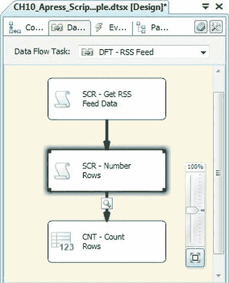
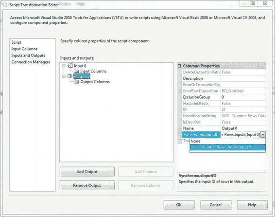
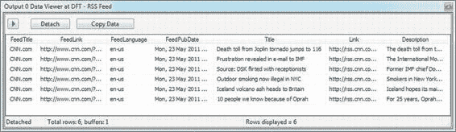
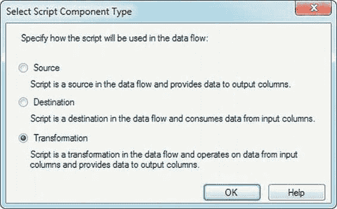

# 第十章  脚本编写

### 同步脚本组件转换

`Script Component` 同步转换具有极高的灵活性。它与 `Script Component` 源的区别在于它既有输入又有输出。本节将演示一个使用脚本组件的简单同步转换示例。在这个示例中，我们在之前程序包的基础上进行了扩展，在设计器中添加了另一个 `Script Component` 并选择了转换类型，如图 10-18 所示。这个新的 `Script Component` 将执行一个虽简单但非常常用的功能，而这个功能在标准组件中并未提供。它将为我们数据流中的列进行编号。

*图 10-18. 选择转换脚本组件类型*

我们将新的 `Script Component` 添加到设计器后，将数据流引导通过它，如图 10-19 所示。



*图 10-19. 将 Script Component 同步转换添加到数据流中*

### 同步还是异步？

我们在第八章讨论了同步和异步转换的区别。`Script Component` 允许你创建这两种类型的转换。默认情况下，`Script Component` 转换是同步的，我们的示例也是同步的。

决定 `Script Component` 是同步还是异步的设置是 `SynchronousInputID`，可以在编辑器的 **输入和输出** 页面找到。当组件的此属性设置为输入名称时（默认为 `Input 0`），组件是同步的。当它设置为 `None` 时，组件是异步的。下图展示了如何设置组件的 `SynchronousInputID` 属性。



*图 10-20. 设置脚本组件的 SynchronousInputID*

```csharp
Output0Buffer.FeedTitle = feed_title;
Output0Buffer.FeedLink = feed_link;
Output0Buffer.FeedLanguage = feed_language;
Output0Buffer.FeedPubDate = feed_pubDate;
Output0Buffer.Title = title;
Output0Buffer.Link = link;
Output0Buffer.Description = description;

// 增加行计数器，记录进度
CurrentRowCount++;
CurrentPercent = CurrentRowCount * 100 / TotalRows;

// 每当百分比变化时记录进度
if (LastPercent != CurrentPercent)
{
    // 触发 OnProgress 事件
    this.ComponentMetaData.FireProgress(string.Format("已处理 {0} 行，共 {1} 行。", CurrentRowCount, TotalRows), CurrentPercent, CurrentRowCount, 0, ComponentName, ref b);
    // 更新完成百分比
    LastPercent = CurrentPercent;
}
}
}
catch (Exception ex)
{
    // 如果发生错误，则触发 OnError 事件
    this.ComponentMetaData.FireInformation(-1, ComponentName, ex.ToString(), "", 0, ref b);
}
finally
{
    // 执行基类的 CreateNewOutputRows() 方法
    base.CreateNewOutputRows();
    // 行结束
    Output0Buffer.SetEndOfRowset();
    // 触发起始的 OnInformation 事件
    this.ComponentMetaData.FireInformation(-1, ComponentName, "完成 - 创建新输出行", "", 0, ref b);
}
}
```

**注意：** 我们在这个示例中使用的 .NET `SelectNodes()` 和 `SelectSingleNode()` 方法接受一个 `XPath` 表达式并返回 XML 节点。`XPath` 是一种允许你从 XML 文档中定位和检索单个节点或节点集合的语言。详细讨论 `XPath` 超出了本书的范围。

不过，如果你想了解更多关于这项技术的细节，请查阅 .NET `XPath` 参考手册：[`msdn.microsoft.com/en-us/library/ms256115.aspx`](http://msdn.microsoft.com/en-us/library/ms256115.aspx)。

当这个程序包执行时，数据查看器会显示结果——CNN 头条新闻 RSS 源的内容，如图 10-17 所示。请注意，由于 CNN 会不断更新其新闻源，你的结果内容可能与图中所示有所不同。





*图 10-17. 数据查看器中的 RSS 源内容*


