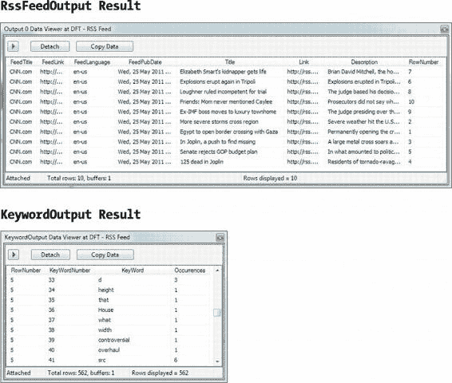
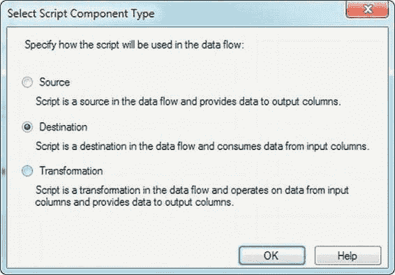
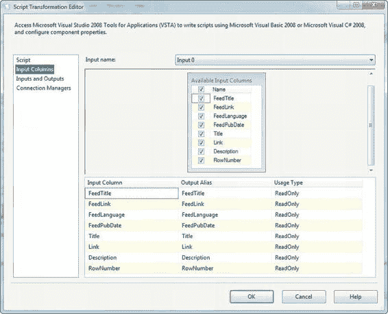
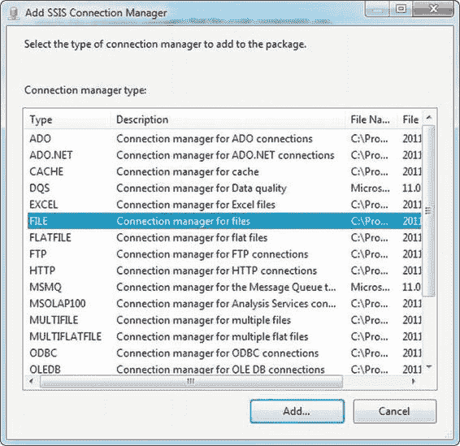
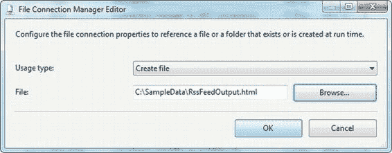
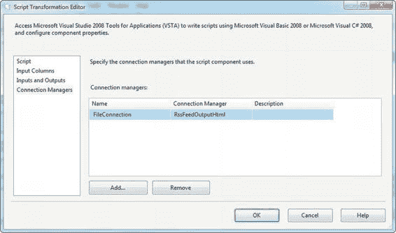

# 第 10 章

```csharp
StringBuilder sb = new StringBuilder(2200);
foreach (char c in Row.Description)
{
    if (Char.IsLetterOrDigit(c) || c == ' ')
        sb.Append(c);
    else
        sb.Append(' ');
}
// Split the clean string
string[] words = Regex.Split(sb.ToString(), " ");
int i = 1;
// Loop iterate keywords and count occurrences; store in hash table
Hashtable occurrence = new Hashtable(100);
foreach (string keyword in words)
{
    if (occurrence.ContainsKey(keyword))
        occurrence[keyword] = ((int)occurrence[keyword]) + 1;
    else
        occurrence.Add(keyword, 1);
}
// Send results stored in hash table out to second output
foreach (DictionaryEntry d in occurrence)
{
    if (d.Key != "")
    {
        KeywordOutputBuffer.AddRow();
        KeywordOutputBuffer.RowNumber = Row.RowNumber;
        KeywordOutputBuffer.KeyWordNumber = i;
        KeywordOutputBuffer.KeyWord = (string)d.Key;
        KeywordOutputBuffer.Occurrences = (int)d.Value;
        i++;
    }
}
}
catch (Exception ex)
{
    this.ComponentMetaData.FireError(-1, ComponentName, ex.ToString(), "", 0, out b);
}
}
```

图 10-27 显示了来自异步脚本组件两个输出的示例结果。

[www.it-ebooks.info](http://www.it-ebooks.info/)



**图 10-27. 异步脚本组件两个输出的示例结果**

### 脚本组件目的地

你可以创建的最后一种脚本组件类型是目的地。在我们的示例中，我们将创建`脚本组件`目的地，它们在输出文件中以 HTML 表格格式输出先前示例的结果。首先，我们用脚本组件替换了先前示例中的`行计数`组件。

当我们将脚本组件添加到数据流时，我们从弹出菜单中选择了`目的地`选项，如图 10-28 所示。

[www.it-ebooks.info](http://www.it-ebooks.info/)





**图 10-28. 选择`目的地`脚本组件类型**

接下来，我们打开每个组件的编辑器，并在`输入列`页面上选择了所有列。第一个脚本组件的输入列如图 10-29 所示。

**图 10-29. 在目的地脚本组件上选择输入列**

[www.it-ebooks.info](http://www.it-ebooks.info/)



现在，如我们之前所解释的，这个目的地脚本组件将接收列作为输入，然后将它们输出为 HTML 文件。要实现这一点，我们需要定义一个输出文件。我们在编辑器的`连接管理器`页面上定义了一个`文件连接管理器`。我们将其命名为`FileConnection`，并从`连接管理器`下拉菜单中创建了一个新连接。此选项会显示`添加 SSIS 连接管理器`对话框，如图 10-30 所示。

**图 10-30. 从`添加 SSIS 连接管理器`菜单中选择`文件`连接管理器**

在我们选择创建`文件`连接管理器后，我们通过从下拉菜单中选择`创建文件`并输入文件的完整路径来配置它，如图 10-31 所示。

[www.it-ebooks.info](http://www.it-ebooks.info/)





**图 10-31. 选择目标文件的名称**

完成连接管理器的配置后，编辑器如图 10-32 所示。

**图 10-32. 将连接管理器分配给脚本组件**

配置好脚本组件后，我们编辑了脚本。`ScriptMain`类的主体（脚本的默认入口点）如下所示：

```csharp
[Microsoft.SqlServer.Dts.Pipeline.SSISScriptComponentEntryPointAttribute]
public class ScriptMain : UserComponent
{
    string filename;
    [www.it-ebooks.info](http://www.it-ebooks.info/)
    TextWriter outputfile;
    bool headerout = false;
    // Method overrides go here ...
    ...
}
```

我们在类级别声明了一些变量，用于保存输出 HTML 文件的名称、一个用于写入目标文件的`TextWriter`，以及一个`bool`变量，该变量告诉我们是否已经向 HTML 文件写入了标题。我们将在本节稍后详细讨论这一点。


