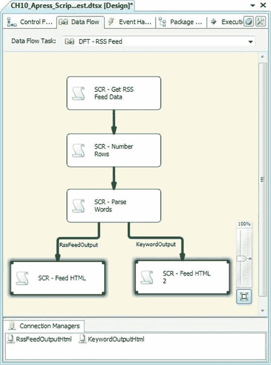
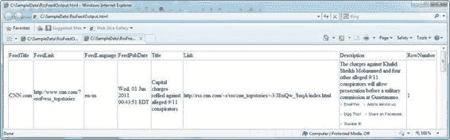

# 第 10 章 脚本编写

在 BIDS 的包设计阶段以及包运行时调用的第一个方法是`AcquireConnections()`。我们使用此方法从`FileConnection`连接管理器获取目标文件的完整路径。

```
public override void AcquireConnections(object Transaction)

{

base.AcquireConnections(Transaction);

IDTSConnectionManager100 connmanager = this.Connections.FileConnection;

filename = (string)connmanager.AcquireConnection(null);

}
```

我们的下一个方法是`PreExecute()`和`PostExecute()`。这些方法在包执行开始和结束时被调用。在`PreExecute()`方法中，我们打开输出文件以供写入。在`PostExecute()`方法中，我们将 HTML 表格和页面的结束标签写入文件，然后刷新并释放`TextWriter`对象。

```
public override void PreExecute()

{

base.PreExecute();

outputfile = new StreamWriter(filename, false);

}

public override void PostExecute()

{

base.PostExecute();

outputfile.Write("</table></body></html>");

outputfile.Flush();

outputfile.Dispose();

}
```

正如我们在之前的组件中展示的那样，脚本组件通过`ProcessInputRow()`方法中的缓冲区对象按名称公开输入列。例如，我们可以通过类似以下的语法访问`FeedTitle`列：

`string title = Row.FeedTitle;`

然而，在这个例子中，我们希望解决方案更巧妙一些。部分原因是我们需要创建两次相同的目标脚本组件（异步转换脚本组件的每个输出各一次），我们不想将列名硬编码到组件中。

我们更愿意直接复制和粘贴代码。这意味着无论输入列元数据如何，我们都需要输出每一个输入列。为此，我们需要引入脚本组件的一个新方法，即`ProcessInput()`方法：

[www.it-ebooks.info](http://www.it-ebooks.info/)

```
public override void ProcessInput(int InputID, string InputName, PipelineBuffer Buffer, OutputNameMap OutputMap)

{

if (!headerout)

{

outputfile.Write("<html>\n<body>\n<table border=\"1\">\n<tr>"); foreach (IDTSInputColumn100 column in

this.ComponentMetaData.InputCollection[0].InputColumnCollection)

{

outputfile.Write("<th>{0}</th>", column.Name);

}

outputfile.Write("</tr>");

headerout = true;

}

while (Buffer.NextRow())

{

outputfile.Write("<tr>");

for (int i = 0; i < Buffer.ColumnCount; i++)

{

outputfile.Write(string.Format("<td>{0}</td>", Buffer[i].ToString()));

}

outputfile.Write("</tr>");

}

}
```

`ProcessInput()`方法（注意此方法名称上没有输入名称前缀）使我们能够直接访问`ComponentMetadata`和`PipelineBuffer`。这意味着我们可以获取用于写入表格标题行的列名，以及每一行的每一列的内容，所有这些都可以通过索引器（本质上是数组下标）访问。

我们实现的第一步是检查是否已写出 HTML 表格标题。

如果没有，我们就遍历`InputColumnCollection`中的输入列（`IDTSInputColumn`）。我们获取这些列的名称并将其写入 HTML 表格标题。我们还会设置一个标志，指示标题已写入，这样就不会再次写入。这很重要，因为 SSIS 运行时可能会多次调用`ProcessInput()`方法。最后，我们使用`Buffer.NextRow()`方法遍历缓冲区行。在这个循环中，我们遍历输入缓冲区列，并将值作为 HTML 表格数据元素输出。

我们复制并粘贴了目标脚本组件，并将副本放在`KeywordOutput`的末尾，以生成第二个 HTML 文件。结果如图 10-33 所示。

[www.it-ebooks.info](http://www.it-ebooks.info/)



*图 10-33. 包含两个目标脚本组件的 SSIS 包*

我们的目标脚本组件的最终结果是几个 HTML 文件，数据流列数据保存在 HTML 文件中，如图 10-34 所示。

[www.it-ebooks.info](http://www.it-ebooks.info/)




