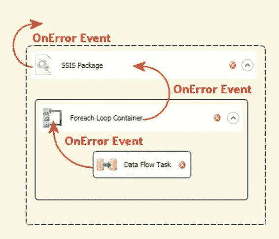

# 第 11 章  事件与错误处理

...当任务失败时

`OnVariableValueChanged`

...当变量值发生变化时（当其 `RaiseChangedEvent` 属性设置为 `True` 时）

`OnWarning`

...当发生警告时

表 11-1 中列出的事件可在任务、容器和包级别使用——但“诊断”事件除外，它仅在包级别可用。这些事件会*冒泡*406

[www.it-ebooks.info](http://www.it-ebooks.info/)

（除了诊断日志事件），或者说会**向上**传播，从最低级别的任务开始，通过容纳它们的容器，最终传播到包级别。

图 11-1 展示了一个在“数据流”任务级别触发的 `OnError` 事件。该事件通过一个“Foreach”循环容器向上传播，该容器继而将其触发至包级别。包会再次触发该事件。每个级别都有自己的 `OnError` 事件处理程序，尽管您不必为所有（或任何）事件处理程序实现代码。

*图 11-1. SSIS 包中的 OnError 事件传播*

### 日志事件

SSIS 支持多个特定于任务的日志事件。除了稍后会讨论到的两个例外，这些日志事件被指定用于在任务级别记录额外信息。这些日志事件没有事件处理程序，也不能传播到容器和包级别。

“数据流”任务可以说是 SSIS 中最重要的任务。正如我们在前几章所讨论的，数据流提供了检索、转换和输出数据的功能。

由于其突出性以及您可以创建的数据流的复杂性，数据流任务公开了多个特定于任务的日志事件来帮助您排查和优化数据移动与操作，这不足为奇。这些日志事件列在表 11-2 中。

[www.it-ebooks.info](http://www.it-ebooks.info/)

#### 表 11-2. 数据流任务日志事件

| **事件名称** | **任务** | **触发时机...** |
| :--- | :--- | :--- |
| `BufferSizeTuning` | 数据流任务 | ...当数据流在执行期间更改缓冲区大小时 |
| `PipelineComponentTime` | 数据流任务 | ...返回关于每个数据流组件验证和执行的信息 |
| `PipelineExecutionPlan` | 数据流任务 | ...返回数据流执行计划 |
| `PipelineExecutionTrees` | 数据流任务 | ...返回调度程序在创建数据计划时所依据的输入信息 |
| `PipelineInitialization` | 数据流任务 | ...返回数据流初始化信息 |
| `PiplineBufferLeak` | 数据流任务 | ...当数据流执行后有缓冲区未被释放时 |

数据准备任务包括“文件系统”任务、“FTP”任务、“Web 服务”任务和“数据剖析”任务。这些任务支持表 11-3 中列出的特定于任务的日志事件。

#### 表 11-3. 数据准备任务日志事件

| **事件名称** | **任务** | **触发时机...** |
| :--- | :--- | :--- |
| `DataProfilingTaskTrace` | 数据剖析任务 | ...提供关于任务状态的描述性信息，例如请求和查询的开始与结束 |
| `FileSystemOperation` | 文件系统任务 | ...记录文件系统操作的开始；包括源和目标信息 |
| `FTPConnectingToServer` | FTP 任务 | ...报告开始连接到 FTP 服务器 |
| `FTPOperation` | FTP 任务 | ...记录执行的 FTP 操作的开始和类型 |
| `WSTaskBegin` | Web 服务任务 | ...记录开始访问 Web 服务 |
| `WSTaskEnd` | Web 服务任务 | ...记录 Web 服务方法完成 |
| `WSTaskInfo` | Web 服务任务 | ...记录关于任务的额外信息 |
| `XMLOperation` | XML 任务 | ...记录关于所执行 XML 操作的信息 |

工作流任务组包括“执行包”任务、“执行进程”任务、“消息队列”任务、“发送邮件”任务、“WMI 数据读取器”任务和“WMI 事件查看器”任务。这些任务支持表 11-4 中列出的日志事件。

