# 第 11 章：事件与错误处理

#### 表 11-4. 工作流任务日志事件

| **事件名称** | **任务** | **触发时机...** |
| --- | --- | --- |
| `ExecuteProcessExecutingProcess` | 执行进程任务 | ...记录正在运行的可执行任务的名称、位置以及退出可执行文件的信息 |
| `ExecuteProcessVariableRouting` | 执行进程任务 | ...记录标准输入、标准输出和标准错误输出条目 |
| `MSMQAfterOpen` | 消息队列任务 | ...在消息队列打开之后 |
| `MSMQBeforeOpen` | 消息队列任务 | ...在消息队列打开之前 |
| `MSMQBeginReceive` | 消息队列任务 | ...在接收消息之前 |
| `MSMQBeginSend` | 消息队列任务 | ...在发送消息之前 |
| `MSMQEndReceive` | 消息队列任务 | ...在接收消息之后 |
| `MSMQEndSend` | 消息队列任务 | ...在发送消息之后 |
| `MSMQTaskInfo` | 消息队列任务 | ...记录有关任务的信息 |
| `MSMQTaskTimeOut` | 消息队列任务 | ...如果任务超时 |
| `SendMailTaskBegin` | 发送邮件任务 | ...当开始发送电子邮件时 |
| `SendMailTaskEnd` | 发送邮件任务 | ...当完成电子邮件发送时 |
| `SendMailTaskInfo` | 发送邮件任务 | ...记录有关任务的附加信息 |
| `WMIDataReaderGettingWMIData` | WMI 数据读取器任务 | ...指示 WMI 数据读取已开始 |
| `WMIDataReaderOperation` | WMI 数据读取器任务 | ...记录已运行的 WMI 查询 |
| `WMIEventWatcherEventOccurred` | WMI 事件查看器任务 | ...当受监视的事件发生时 |
| `WMIEventWatcherEventTimedout` | WMI 事件查看器任务 | ...如果任务超时 |
| `WMIEventWatcherWatchingForWMIEvents` | WMI 事件查看器任务 | ...指示 WMI 查询语言 (`WQL`) 查询的开始，包括实际查询文本 |

**提示：** 执行包任务没有任何特定于任务的日志记录事件。但是，子包会将日志详细信息转发到父包，父包可能会记录这些详细信息。

SQL Server 任务组包括大容量插入任务、执行 SQL 任务、传输数据库任务、传输错误消息任务、传输作业任务、传输登录任务、传输存储过程任务和传输 SQL Server 对象任务。表 11-5 列出了这些任务支持的特定于任务的日志记录事件。

#### 表 11-5. SQL Server 任务日志事件

| **事件名称** | **任务** | **触发时机...** |
| --- | --- | --- |
| `BulkInsertBegin` | 大容量插入任务 | ...表示大容量插入操作开始 |
| `BulkInsertEnd` | 大容量插入任务 | ...表示大容量插入操作结束 |
| `BulkInsertTaskInfo` | 大容量插入任务 | ...提供有关大容量插入操作的附加信息 |
| `DestSQLServer` | 传输数据库任务 | ...记录目标 SQL Server 的名称 |
| `ExecuteSQLExecutingQuery` | 执行 SQL 任务 | ...提供有关正在执行的 SQL 查询的信息 |
| `SourceDB` | 传输数据库任务 | ...记录源数据库的名称 |
| `SourceSQLServer` | 传输数据库任务 | ...记录源 SQL Server 的名称 |
| `TransferErrorMessagesTaskFinishedTransferringObjects` | 传输错误消息任务 | ...记录传输任务的结束 |
| `TransferErrorMessagesTaskStartTransferringObjects` | 传输错误消息任务 | ...记录传输任务的开始 |
| `TransferJobsTaskFinishedTransferringObjects` | 传输作业任务 | ...记录作业传输的结束 |
| `TransferJobsTaskStartTransferringObjects` | 传输作业任务 | ...记录作业传输的开始 |
| `TransferLoginsTaskFinishedTransferringObjects` | 传输登录任务 | ...记录登录传输的结束 |
| `TransferLoginsTaskStartTransferringObjects` | 传输登录任务 | ...记录登录传输的开始 |
| `TransferSqlServerTaskFinishedTransferringObjects` | 传输 SQL Server 对象任务 | ...记录传输任务的结束 |


### 脚本任务与日志提供程序

### 脚本任务组

脚本任务组仅包含一个任务，即脚本任务。此任务组提供的特定任务日志事件如表 11-6 所示。

*表 11-6. 脚本任务日志事件*

| 事件名称 | 任务 | 触发时机... |
| :--- | :--- | :--- |
| `ScriptTaskLogEntry` | 脚本任务 | ...响应 `Dts.Log()` 方法调用时 |

#### 日志提供程序

在 SSIS 术语中，*日志提供程序*是一种用于持久化存储包执行详细信息的组件。

SSIS 将您选择的日志事件记录到您在包中选定的日志提供程序。SSIS 提供了多种内置日志提供程序，以覆盖最常用的日志记录类型。通过在 BIDS 中右键单击控制流中的空白区域并选择 **日志记录**，可以访问如图 11-2 所示的日志记录选项来选择这些日志提供程序。

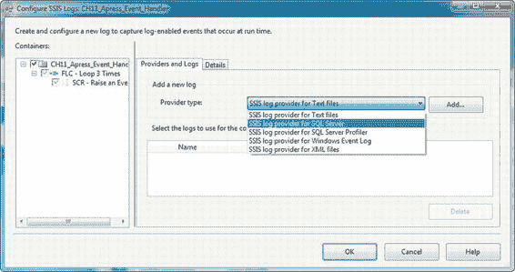

*图 11-2. 在 SSIS 包中选择日志提供程序*

容器和任务在编辑器的左侧树视图中列出。**提供程序和日志**选项卡允许您配置相应的日志提供程序。SSIS 提供的内置日志提供程序列于表 11-7 中。其中，SQL Server 提供程序、文本文件提供程序和 Windows 事件日志提供程序是最常用的。

*表 11-7. SSIS 内置日志提供程序*

| 日志提供程序 | 描述 |
| :--- | :--- |
| `SSIS 日志提供程序（文本文件）` | 记录到逗号分隔值 (CSV) 日志文件 |
| `SSIS 日志提供程序（SQL Server）` | 记录到 SQL Server 数据库中的 `dbo.sysssislog` 表 |
| `SSIS 日志提供程序（SQL Server Profiler）` | 记录到 SQL Server Profiler 跟踪文件（仅在 32 位模式下可用） |
| `SSIS 日志提供程序（Windows 事件日志）` | 记录到 Windows 事件日志的应用程序日志 |
| `SSIS 日志提供程序（XML 文件）` | 记录到 XML 文件 |

选择日志提供程序后，其中许多需要您在 **配置** 列中选择一个连接。对于 SQL Server 提供程序，您需要选择一个 OLE DB 连接管理器。文本文件、XML 文件和 SQL Server Profiler 提供程序需要一个文件连接。Windows 事件日志提供程序不需要连接。在图 11-3 中，我们选择了 SQL Server 日志提供程序，并使用了一个名为 `LOG` 的 OLE DB 连接管理器。

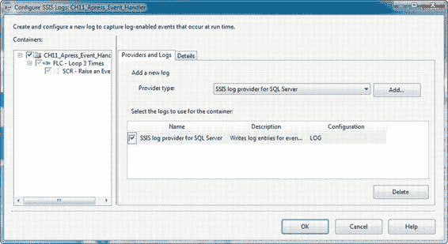

*图 11-3. 为 SQL Server 配置 SSIS 日志提供程序*

在编辑器的 **详细信息** 选项卡中，您可以选择要记录的事件，如图 11-4 所示。您可以为包以及各个容器和任务选择不同的事件进行记录，也可以选择为包中的所有内容记录相同的事件。

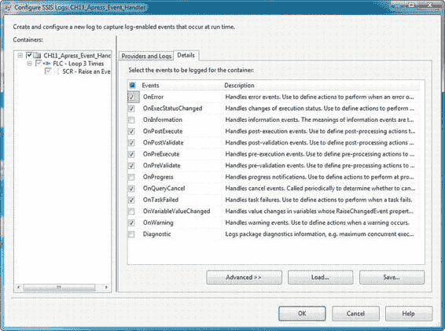

*图 11-4. 在详细信息选项卡中选择要记录的事件*

通过单击 **高级** 按钮，您甚至可以选择记录每个事件的哪些元素。

一般来说，除非您有某个事件记录了非常大的 `MessageText` 或 `DataBytes` 条目等情况，否则您可能不需要更改默认设置（记录所有元素）。图 11-5 显示了详细信息编辑器的高级选项。

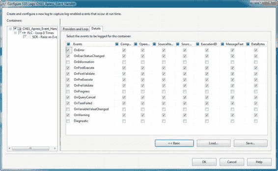

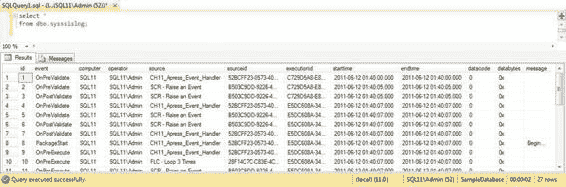

*图 11-5. 日志记录详细信息编辑器的高级选项*

图 11-6 显示了由 SQL Server 日志提供程序保存到 `dbo.sysssislog` 表中的日志条目示例。记录的信息包括所记录事件的名称；触发事件的包、容器或任务的名称；开始和结束时间；以及事件的描述性消息。

*图 11-6. SSIS 日志条目示例*

当您在 BIDS 中运行 SSIS 包时，包触发的事件可以在 **进度** 选项卡上查看，如图 11-7 所示。进度选项卡在包运行时实时更新，这对于包测试和调试非常有用。

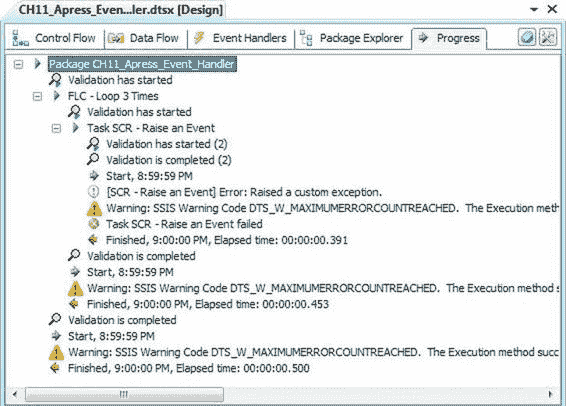

*图 11-7. BIDS 中的 SSIS 进度选项卡*

### 选择要记录的事件

您可以在 SSIS 包中记录数十个事件，但记录所有事件并不一定是最好的主意。日志记录需要时间并占用服务器资源。记录太多事件可能会减慢 SSIS 包的运行速度，并导致日志膨胀，使得难以查找特定事件。您选择记录哪些事件取决于您的环境：通常，在开发或测试环境中，您需要比在生产环境中记录更详细的事件。

以 `OnInformation` 和 `OnProgress` 事件为例。这些事件发生频繁——`OnProgress` 每个任务最多可触发 100 次。将该任务包装在循环容器中，每次包执行可能会记录数千个此事件实例。虽然 `OnInformation` 和 `OnProgress` 在调试场景中很有用，但它们对于生产环境来说通常是过犹不及的。

有些事件，例如 `OnPreExecute` 和 `OnPostExecute`，对记录的信息增加的价值不大，但它们不会像某些其他事件那样产生大量的日志活动。我们在每个环境中记录的主要事件包括 `OnError`、`OnWarning`、`OnTaskFailed` 和 `OnQueryCancel`。这些事件为您提供了开始对 SSIS 包进行故障排除所需的最起码信息。

### 脚本事件

SSIS 允许您从脚本任务和脚本组件中触发事件。这两种选择都为您提供了向包中添加上下文、特定于任务的错误消息以及其他调试和性能信息的机会。我们在本节讨论从脚本触发事件。

在您的 .NET 脚本代码中，您可以（通常也应该）在代码中使用 `try-catch` 异常处理。如果您需要在组件内引发 SSIS 错误，您将需要使用以下各节介绍的事件。

#### 脚本任务事件

您可以在脚本任务中使用 `Dts.Log()` 方法触发日志事件。这些日志事件类似于内置日志事件，因为它们被发送到您的日志提供程序，但没有关联的事件处理程序。它们在您的日志记录详细信息中以 `ScriptTaskLogEntry` 事件被捕获，对于向日志发送用户定义的信息性消息非常有用。

`Dts.Events` 对象还提供了多种 **Fire** 方法来触发关联的事件，这些事件实际上可以有关联的事件处理程序。这些方法列于表 11-8 中。

*表 11-8. Dts.Events 事件触发方法*

| 方法 | 触发... |
| :--- | :--- |
| `Dts.Events.FireCustomEvent()` | ...用户定义的自定义事件 |
| `Dts.Events.FireError()` | ...`OnError` 事件，指示包中存在错误状况 |
| `Dts.Events.FireInformation()` | ...`OnInformation` 事件，发送信息性消息 |
| `Dts.Events.FireProgress()` | ...`OnProgress` 事件，指示任务进度，在长时间运行的任务中很有用 |
| `Dts.Events.FireQueryCancel()` | ...`OnQueryCancel` 事件，检查查询取消状态以确定是否应停止查询 |
| `Dts.Events.FireWarning()` | ...`OnWarning` 事件，指示警告（其严重程度低于错误状况） |


## 第 11 章：事件与错误处理

这些方法大多数会触发预定义的标准事件，例如 `OnError` 和 `OnProgress`。而 `FireCustomEvent()` 方法则用于触发自定义事件。其缺点在于，`脚本任务` 本身并未提供在任务内部注册自定义事件的机制，因此你无法为其创建事件处理程序。你也无法从包的日志详细信息中的事件列表里选择它。你能做的最佳选择是为 `脚本任务` 开启所有事件的日志记录，这也会导致你的自定义事件被记录下来。如果你决定甚至不记录一个事件，SSIS 也不会记录你的自定义事件。

[www.it-ebooks.info](http://www.it-ebooks.info/)

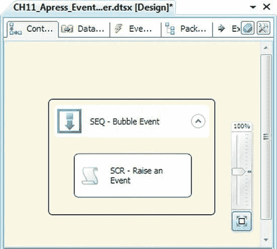

`脚本任务` 还公开了 `Dts.Events.FireBreakpointHit()` 方法，但此事件是 SSIS 和 BIDS 基础结构内部使用的，并非设计为直接从你的代码中使用。

为了演示 `脚本任务` 的事件触发，我们组合了图 11-8 所示的示例包。

##### 图 11-8：演示脚本任务事件的示例包

在此包中，我们有一个包含 `脚本任务` 的 `序列` 容器。在 `脚本任务` 中，我们使用 `Dts.Log()` 生成日志事件，并使用 `Dts.Events.FireError()` 触发 `OnError` 事件。示例脚本如下：

```
public void Main()
{
    Dts.TaskResult = (int)ScriptResults.Success;
    Dts.Log("We're about to throw an error.", -1, new byte[0]);
    Dts.Events.FireError(-1, "SCR - Raise an Event", "Raised a custom exception.", "", 0);
}
```

`Dts.Log()` 方法接受三个参数：要记录的字符串消息、一个整数数据代码值，以及一个表示要记录的二进制数据字节的字节数组。`Dts.Events.FireError()` 方法接受五个参数：一个整数错误代码、一个字符串子组件名称、一个字符串错误描述、一个帮助文件名和一个整数帮助上下文值。当没有帮助文件或帮助上下文时，只需对帮助文件名使用空字符串，对帮助上下文使用 0。运行时，此包会因错误而失败，如图 11-9 所示。

[www.it-ebooks.info](http://www.it-ebooks.info/)

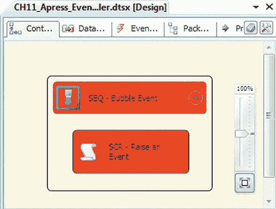
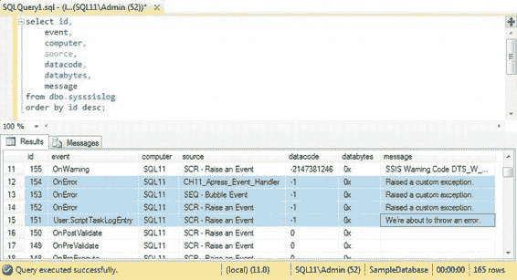

##### 图 11-9：示例包出错

示例包引发的事件可以在日志中查看，如图 11-10 所示。请注意，`User:ScriptTaskLogEntry` 包含通过调用 `Dts.Log()` 记录的数据。另请注意，`OnError` 事件被分别记录了三次：一次由 `脚本任务` 记录，然后由 `序列` 容器记录，再由包记录。这是由于本章前面讨论的事件冒泡机制所致。

##### 图 11-10：包失败后查看日志

[www.it-ebooks.info](http://www.it-ebooks.info/)

#### 脚本组件事件

数据流中的 `脚本组件` 也允许你触发事件。在 `脚本组件` 内，你可以使用 `Log()` 方法记录条目。这相当于 `脚本任务` 的 `Dts.Log()` 方法。与 `Dts.Event` 对象类似，`ComponentMetaData` 对象公开了几个 `Fire` 方法来触发事件。这些方法列于表 11-9 中。

##### 表 11-9：脚本组件事件触发方法

| 方法 | 触发... |
| :--- | :--- |
| `ComponentMetaData.FireCustomEvent()` | ... 一个自定义事件 |
| `ComponentMetaData.FireError()` | ... 一个 `OnError` 事件 |
| `ComponentMetaData.FireInformation()` | ... 一个 `OnInformation` 事件 |
| `ComponentMetaData.FireProgress()` | ... 一个 `OnProgress` 事件 |
| `ComponentMetaData.FireWarning()` | ... 一个 `OnWarning` 事件 |

##### FIREERROR() 与 MAXIMUMERRORCOUNT

`脚本组件` 事件方法在大多数方面与 `脚本任务` 事件方法类似。在组件中引发的事件会被传递给所属的 `数据流任务`。但有一个很大的区别。当你在 `脚本任务` 上调用 `FireError()` 方法时，该方法会立即计入任务的 `MaximumErrorCount` 属性、包含该任务的任何容器以及包本身。如果你达到了 `MaximumErrorCount` 值，包将立即停止。

在 `脚本组件` 中，`FireError()` 方法会立即触发一个 `OnError` 事件，该事件会向上冒泡到更高级别。然而，当在组件级别触发时，`FireError()` 方法不会立即计入你的 `MaximumErrorCount`。相反，即使发生错误事件，数据流仍会继续移动数据。你在 `脚本组件` 中引发的 `OnError` 事件会被累积起来，并在数据流完成处理后计入 `MaximumErrorCount` 属性。

如果你在数据流中遇到希望立即停止处理的错误，请使用 .NET 的 `throw` 方法。例如，一个无法连接到外部数据存储的 `脚本组件` 源可能会立即停止处理。

在图 11-11 所示的示例中，我们创建了一个包含 `序列` 容器中 `数据流任务` 的简单包。然后，我们在数据流中添加了一个 `脚本组件` 源和一个 `脚本组件` 目标。`脚本组件` 源记录了两条消息，分别在 `PreExecute()` 和 `PostExecute()` 方法中，并在 `CreateNewOutputRows()` 方法中触发了一个 `OnError` 事件，如下所示：

[www.it-ebooks.info](http://www.it-ebooks.info/)

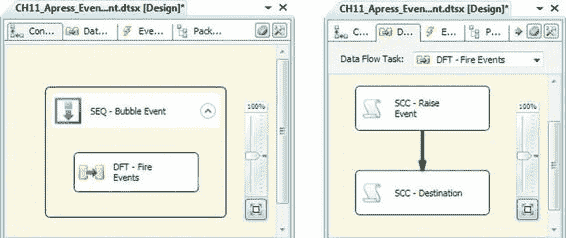

```
public override void PreExecute()
{
    base.PreExecute();
    this.Log("Logging the first sample message.", -1, new byte[0]);
}

public override void PostExecute()
{
    base.PostExecute();
    this.Log("Logging the second sample message.", -1, new byte[0]);
}

public override void CreateNewOutputRows()
{
    bool b = false;
    this.ComponentMetaData.FireError
    (
        -1,
        this.ComponentMetaData.Name,
        "Firing an OnError event.",
        "",
        0,
        out b
    );
}
```

##### 图 11-11：在脚本组件中引发事件

快速查询 SSIS 日志显示，两条日志条目和 `OnError` 事件均按正确顺序记录。图 11-12 显示了记录到 `dbo.sysssislog` 表的结果。

[www.it-ebooks.info](http://www.it-ebooks.info/)

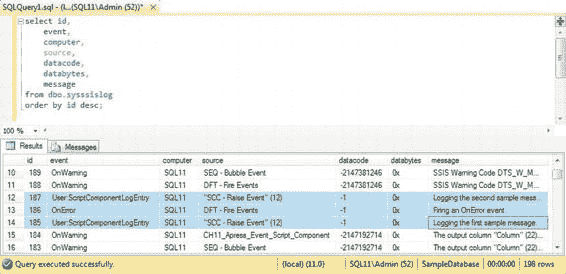
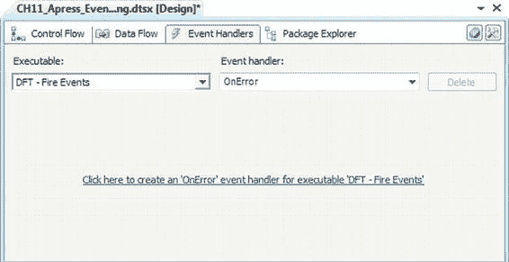

##### 图 11-12：脚本组件日志条目的结果

### 事件处理程序

事件处理程序是控制流的容器，它们响应 SSIS 事件而执行。一般来说，名称以 `On` 开头的 SSIS 内置事件（如 `OnError` 和 `OnWarning`）都可以有关联的事件处理程序。对于我们的示例，我们扩展了前面的示例以包含 `OnError` 事件处理程序。

我们通过在设计界面上高亮显示 `数据流任务` 并在 BIDS 中选择 `事件处理程序` 选项卡，为 `数据流任务` 创建了一个事件处理程序。然后，我们从 `事件处理程序` 下拉列表中选择 `OnError` 事件。系统显示了图 11-13 所示的窗口。

#### 图 11-13：向任务添加事件处理程序

[www.it-ebooks.info](http://www.it-ebooks.info/)

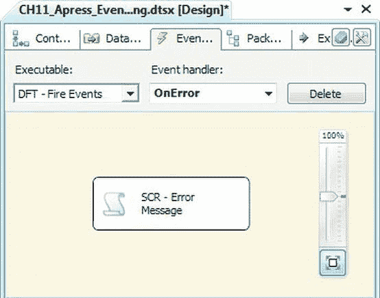

在此屏幕，我们点击了蓝色链接。BIDS 为我们创建了一个容器来保存与该事件关联的控制流。在我们的示例中，控制流是在 `OnError` 事件上创建的。我们向事件处理程序添加了一个 `脚本任务`，该任务仅显示消息 *Task Error Raised*。完成的 `OnError` 事件处理程序如图 11-14 所示。

#### 图 11-14：完成的 OnError 事件处理程序


