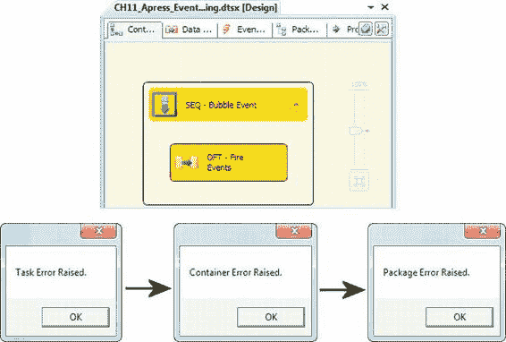

# 第 11 章 事件与错误处理

然后我们重复此过程，为`Sequence`容器和包本身创建`OnError`事件处理程序。当示例包运行时，它在`Data Flow`任务级别引发了一个`OnError`事件，该事件随后向上冒泡至`Sequence`容器和包级别。随着事件向上冒泡，每一级的事件处理程序都显示了一个消息框，其顺序如图 11-15 所示。

[www.it-ebooks.info](http://www.it-ebooks.info/)

**图 11-15. 演示包中的 OnError 事件冒泡**

在此示例中，我们使用了.NET 的`MessageBox.Show()`方法来演示 SSIS 中的事件处理程序和事件冒泡。你的事件处理程序可以更加复杂，并可能包含大量逻辑。例如，通常使用事件处理程序来实施定制的审计和日志记录过程，或发送电子邮件以向管理员警报错误状况。

> **注意：** .NET 的`MessageBox.Show()`方法在调试和故障排除 SSIS 包时非常方便。但是，在将包部署到生产环境时，请务必移除这些方法调用。如果你的包在自动化作业中尝试显示消息框，没有人能够点击`OK`按钮，你的包可能会停止响应。

### 本章小结

本章介绍了 SSIS 事件和错误处理，包括事件冒泡，以及用于触发事件的`Script`任务和脚本组件方法。你了解了可以触发的不同事件类型及其各自的目的。在下一章中，你将考虑如何将数据画像和数据清洗集成到你的 ETL 流程中。

[www.it-ebooks.info](http://www.it-ebooks.info/)

