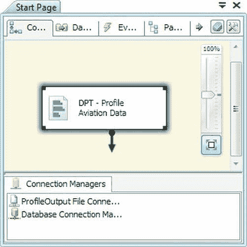
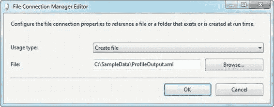

# 第 12 章 数据画像与清洗

我的数据分布是否符合预期？回答这个问题需要行业及业务特定的领域知识。例如，你可能期望库存中大多数商品的价格在 20 至 50 美元之间。数据分析可能显示，库存中的大部分商品定价实际低于 20 美元，这可能指向（1）对业务的初始假设错误，或（2）数据质量问题。

我的源数据如何与其他系统的数据对齐？考虑参考数据，如美国州代码。任何给定的源系统都可能使用几种类型的代码：双字符邮政服务代码，如 AL、DE 和 NY；两位数的 FIPS（联邦信息处理标准）数字代码，如 01、02、03；甚至整数代理键。回答这个问题将使你能够识别关键属性中的差异，并对齐关键属性中的值。

我的业务键是什么？成功的数据集成项目（如 BI 项目）需要识别源数据中的业务键。数据仓库更新和数据集市缓慢变化维度（SCD）处理依赖于对源数据业务键的了解。

回答这些问题可能需要分析单列或列组。例如，大多数工业化国家都实施邮政编码系统以方便邮件投递。邮政编码的格式和有效字符因国家而异。美国的邮政编码（也称为区域改善计划或 ZIP 代码）由五位或九位数字组成，例如 90071 或 10104-0899。在加拿大，邮政代码由六个字母数字字符组成——例如，K1P 1J9。你可能需要结合分析源数据中的国家和邮政编码，以验证邮政编码格式是否正确。

除了回答有关源数据质量和一致性的问题外，你还可以提取有关源数据库中关系的信息。许多遗留源数据库似乎有一个共同点，即缺乏引用完整性和检查约束。再加上完全缺乏文档记录，这些源系统就像复杂的谜题，通常需要你自己建立表之间的关系。

## 数据画像任务

`数据画像任务`是获取源数据统计信息的有效方法。其主要功能在许多方面与市场上其他数据画像软件包相当。`数据画像任务`获取指定的源数据，根据你指定的准则进行分析，并将结果输出到 XML 文件。`数据画像任务`如图 12-1 所示。

[www.it-ebooks.info](http://www.it-ebooks.info/)

